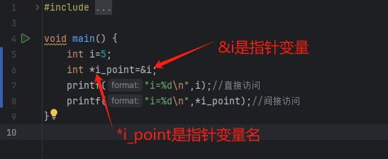
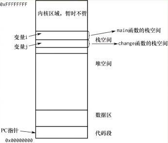

**注:大标题按课程来，会出现大标题重复，小标题从上到下不受大标题控制**

# 一.C语言基础

## 数据类型（常量-变量（整型，浮点型，字符型））

1.数据类型分为基本类型，构造类型，指针类型和空类型

2.基本类型分为整形，浮点型和字符型

3.常量，程序运行过程中不会发生改变的量（<font color="red" size="5">字符型常量只能用单引号，中间有且仅有一个字符，字符串串常量用双引号引起，中间至少放一个字符</font>）

4.变量，代表内存中具有特定属性的存储单元，它用来存储数据，在成勋运行过程中是可以改变的。变量命名规范，只允许存在字母，数字，下划线即_，并且不能以数字开头，不能和C语言中的关键字同名

5.基础变量分为整型，浮点型，字符型，在C语言中int类型占4字节，float占4字节,char占一个字节，sizeof(i)可以用来查看变量的空间大小

6.在考研中浮点型会考到指数形式  示例：3e2表示3的10的2次方，结果是300，e可以为正也可以为负，如果是-2则是0.03

7.符号常量

eg.

```
#include <stdio.h>

#define PIE 3+2
int main() {
	int i=PIE*2;
    printf("i=%d\n",i);
    return 0;
}
```

ie.

```
D:\CLionProjects\C\cmake-build-debug-mingw\C.exe
i=7

Process finished with exit code 0
```

结论：符号常量是直接将符号常量的值替换到公式中

8.转义字符实际上是2个字符，\n换行,\b退格,\\反斜杠

9.%d带符号的整型,%f浮点型,%c字符,%s字符串,%u无符号的整型,%o无符号8进制数,%p指针，%%是%符号和前面的转义字符反斜杠类似。

<font color="red" size="5">%x无符号16进制数(输出小写字母),%X无符号16进制数(输出大写字母),注意：转义字符无二进制输出</font>

<font color="purple" size="5">拓展：整型格式控制%3d,令输出字符占3个字节，即使没有三个字节也是,如果超出那就超出,默认是右对齐,-3d表示左对齐,整型格式控制%5.2f,输出总共占5个字符，小数点后两位</font>

10.在C的ACSII字符编码中，大写字符比小写字符小<font color="red" size="5">32</font>，A是65，a是97

11.C中没有字符串常量，所以用数组表示，任何字符串常量的占用空间都是字符串的位数+1,因为它还有一个<font color="red" size="5">-0</font>字符

12.在数学运算中，左右操作数数据类型相同，结果为原类型,所以5/2=2

13.I/O 标准缓冲区 Input和Output

# <font color="red">二.进制转换（重点中的重点，必须熟练掌握）</font>

14.10进制，2进制，8进制，16进制

<font color="red" size="5">2进制</font>

<font color="purple" size="5">在计算机中1字节为8位，1位即2进制的1位，它存储0和1。位：bit，字节：byte</font>

<font color="purple" size="5">即1byte=8bit,1KB=1024byte,1MB=1024KB,1GB=1024MB</font>

<font color="purple" size="5">int类型为4字节，即32位,最高位为符号位，0为正数，1为负数</font>

<font color="purple" size="5">进制转换，10进制转2进制，8进制，16进制用短除法可以直接转</font>

<font color="purple" size="5">10进制</font>

```
123
```

<font color="purple" size="5">2进制</font>

```
0000 0000 0000 0000 0000 0000 0111 1011
```

<font color="red" size="5">2进制转8进制则是把2进制三个一列的转</font>

<font color="purple" size="5">2进制</font>

```
0000 0000 0000 0000 0000 000 001 111 011
```

<font color="purple" size="5">8进制</font>

```
173
```

<font color="red" size="5">2进制转16进制则是把2进制四个一列的转</font>

<font color="purple" size="5">2进制</font>

```
0000 0000 0000 0000 0000 0000 0111 1011
```

<font color="purple" size="5">16进制（16进制中，10=a,11=b,12=c,13=d,14=e,15=f）</font>

```
7b
```

<font color="red" size="5">断点用取地址符可以看内存，内存是以16进制存储</font>

<font color="red" size="5">7b在内存表示为7b 00 00 00,与常识相反。因为市面上的CPU采用了小端存储的方式进行数据存储，因此低位在前，高位在后（单个字节是一个整体，7b不会变成b7）;</font>

<font color="red" size="5">C语言赋值只能赋值10进制，8进制和16进制，不能赋值2进制。例如，int i=123(10进制),int j=0173(8进制)，int k=0x7b(16进制)</font>

# 三.scanf及其注意事项

15.C的输入输出是通过标准函数库实现的，没有关键字.scanf("%d",&i);用%d控制类型，必须要取地址符，把对应内容放入I这个变量的地址，所以，必须要取地址符

<font color="red" size="5">scanf函数读取字符放在另一个scanf后面时，第一个读出来了，第二个直接跳了是因为你输入的时候，不止输入了你输入的数，还有一个\n，它留在了标准输入缓冲区的\n被后面的scanf读取了</font>

<font color="red" size="5">如何避免,用fflush(stdin);函数清空标准输入缓冲区，stdin表示标准输入缓冲区</font>

<font color="red" size="5">多种不同类型输入时，在%c前加一个空格可以完美解决问题</font>

# 四.算术运算符与关系运算符

16.运算符分类

<font color="red" size="5">（1）算术运算符（+ - * /  %）</font>

<font color="red" size="5">（2）关系运算符（> < == >= <= !=）</font>

<font color="red" size="5">（3）逻辑运算符（！ && ||）</font>

<font color="red" size="5">（4）位运算符（<< >> ~ | ^ &）</font>

<font color="red" size="5">（5）赋值运算符（=及其拓展赋值运算符）</font>

<font color="red" size="5">（6）条件运算符（?:）</font>

<font color="red" size="5">（7）逗号运算符（,）</font>

<font color="red" size="5">（8）指针运算符（*和&）</font>

<font color="red" size="5">（9）求字节运算符（sizeof）</font>

<font color="red" size="5">（10）强制类型转换运算符（(类型)）</font>

<font color="red" size="5">（11）分量运算符（. ->）</font>

<font color="red" size="5">（12）下标运算符（[ ]）</font>

<font color="red" size="5">（13）其他（如函数调用运算符( )）</font>

17.算术运算符及算术表达式

算术运算符乘除取余的优先级是高于加减的，取余运算不能用于浮点数，只能用于整型数，<font size="5" color="red">当操作符的两个操作数都是整型时执行整型运算，其他情况执行浮点型运算</font>，由算术运算符组成的式子被称为算术表达式

eg.

```
#include <stdio.h>

#define PIE 3+2
int main() {
    int result=4+5*2-6/3+10%4;
    printf("result=%d\n",result);
    return 0;
}
```

ie.

```
D:\CLionProjects\C\cmake-build-debug-mingw\C.exe
result=14

Process finished with exit code 0
```

18.关系运算符及关系表达式

关系表达式的结果只有真假(true and false),0代表false，!0代表true,关系运算符的优先级低于算术运算符

eg.

```
int main() {
    int a;
    while (scanf("%d",&a)){
        if(3<a&&a<10){
            printf("a在3和10之间\n");
        }
        else{
            printf("a不在3和10之间\n");
        }
    }
}
```

ie.

```
D:\CLionProjects\C\cmake-build-debug-mingw\C.exe
1
a不在3和10之间
3
a不在3和10之间
4
a在3和10之间
```

eg.

```
#include <stdio.h>

#define PIE 3+2
int main() {
    int a;
    while (scanf("%d",&a)){
        if(3<a<10){
            printf("a在3和10之间\n");
        }
        else{
            printf("a不在3和10之间\n");
        }
    }
}
```

ie.

```
D:\CLionProjects\C\cmake-build-debug-mingw\C.exe
1
a在3和10之间
2
a在3和10之间
3
a在3和10之间
```

<font color="red" size="5">错误执行原因:先执行3<a,结果无论是0还是1永远小于10，所以永远不可能执行到else</font>

# 五.逻辑运算符，赋值运算符与求字节运算符

19.在C语言中，单&为取地址符，双&&为逻辑与，！非，||或。<font size="5" color="red">！的优先级高于算术运算符，&&和||的优先级低于关系运算符，逻辑表达式的值只有真和假与关系表达式一致</font>

eg.

```
#include <stdio.h>

#define PIE 3+2
int main() {
    int j=0;
    for (int i = 1; i < 400; ++i) {
        if(i%4==0&&i%100!=0||i%400==0){
            printf("%d ",i);
            j++;
        }
        if(j==10){
            printf("\n");
            j=0;
        }
    }
}
```

ie.

```
D:\CLionProjects\C\cmake-build-debug-mingw\C.exe
4 8 12 16 20 24 28 32 36 40 
44 48 52 56 60 64 68 72 76 80 
84 88 92 96 104 108 112 116 120 124 
128 132 136 140 144 148 152 156 160 164 
168 172 176 180 184 188 192 196 204 208 
212 216 220 224 228 232 236 240 244 248 
252 256 260 264 268 272 276 280 284 288 
292 296 304 308 312 316 320 324 328 332 
336 340 344 348 352 356 360 364 368 372 
376 380 384 388 392 396 
Process finished with exit code 0
```

20.<font size="5" color="red">短路运算</font>

<font size="5" color="red">逻辑与短路运算:通过表达式的左值来判断是否执行右值</font>

eg.

```
#include <stdio.h>

#define PIE 3+2
int main() {
    int i=0;
    i&& printf("you can't see me\n");
    int j=1;
    j&& printf("you can see me\n");

}
```

ie.

```
D:\CLionProjects\C\cmake-build-debug-mingw\C.exe
you can see me

Process finished with exit code 0
```

<font size="5" color="red">逻辑或短路运算:与逻辑与短路运算相反</font>

eg.

```
#include <stdio.h>

#define PIE 3+2
int main() {
    int i=0;
    i|| printf("you can't see me\n");
    int j=1;
    j|| printf("you can see me\n");

}
```

ie.

```
D:\CLionProjects\C\cmake-build-debug-mingw\C.exe
you can't see me

Process finished with exit code 0
```

## 求字节运算符sizeof

21.sizeof用于求取常量或变量所占空间大小，<font size="5" color="red">sizeof不是函数，是符号，优先级较高，为2</font>

eg.

```
#include <stdio.h>

#define PIE 3+2
int main() {
    int i=0;
    printf("i sizeof is %d\n",sizeof(i));

    double j=123456787.001;
    printf("j sizeof is %d\n",sizeof(j));

    char c='1';
    printf("c  sizeof is %d\n",sizeof(c));

}
```

ie.

```
D:\CLionProjects\C\cmake-build-debug-mingw\C.exe
i sizeof is 4
j sizeof is 8
c  sizeof is 1

Process finished with exit code 0
```

# 六.if-else

22.<font size="5" color="red">算术运算符的优先级高于关系运算符，关系运算符的优先级高于逻辑与和逻辑或运算符，相同优先级的运算符从左至右进行结合(考研中运用到最多的就是算术运算符，关系运算符和逻辑运算符)</font>

23.双目运算符，拥有左操作数和右操作数，逻辑非！是单目运算符

eg.

```
#include <stdio.h>

#define PIE 3+2
int main() {
    for (int i = -5; i < 5; ++i) {
        if(i>0){
            printf("%d is bigger then 0\n",i);
        }else if(i<0){
            printf("%d is not bigger then 0\n",i);
        }
    }
    return 0;
}
```

ie.

```
D:\CLionProjects\C\cmake-build-debug-mingw\C.exe
-5 is not bigger then 0
-4 is not bigger then 0
-3 is not bigger then 0
-2 is not bigger then 0
-1 is not bigger then 0
1 is bigger then 0
2 is bigger then 0
3 is bigger then 0
4 is bigger then 0

Process finished with exit code 0
```

# 七.循环

24.while是当型循环先判断表达式，后执行循环语句

eg.

```
#include <stdio.h>

#define PIE 3+2
int main() {
    int i=1;
    int sum=0;
    while (i<=100){
        sum+=i;
        i++;
    }
    printf("%d",sum);
    return 0;
}
```

ie.

```
D:\CLionProjects\C\cmake-build-debug-mingw\C.exe
5050
Process finished with exit code 0
```

25.for循环

for(表达式1;表达式2;表达式3)语句

<font color="purple" size="5">(1)先求解表达式1</font>

<font color="purple" size="5">(2)求解表达式2，若其值为真，则执行for语句中指定的内嵌语句，后执行第(3)步，若其值为假，则结束循环，转到第(5)步</font>

<font color="purple" size="5">(3)求解表达式3</font>

<font color="purple" size="5">(4)转回第(2)步继续执行</font>

<font color="purple" size="5">(5)循环结束，执行for语句下面的语句</font>

eg.

```
#include <stdio.h>

#define PIE 3+2
int main() {
    int sum=0;
    for (int i = 1; i <=100 ; ++i) {
        sum+=i;
    }
    printf("%d",sum);
    return 0;
}
```

ie.

```
D:\CLionProjects\C\cmake-build-debug-mingw\C.exe
5050
Process finished with exit code 0
```

26.continue语句:跳过continue下的所有语句，直接执行表达式3<font size="5" color="red">跳过本次循环，while使用时请慎重，小心没执行i++,for循环请随意</font>

eg.

```
#include <stdio.h>

#define PIE 3+2
int main() {
    int sum=0;
    for (int i = 1; i <=100 ; ++i) {
        if(i%2==0)
            continue;
        sum+=i;
    }
    printf("%d",sum);
    return 0;
}
```

ie.

```
D:\CLionProjects\C\cmake-build-debug-mingw\C.exe
2500
Process finished with exit code 0
```

26.break语句:直接结束循环

eg.

```
#include <stdio.h>

#define PIE 3+2
int main() {
    int sum=0;
    for (int i = 1; i <=100 ; ++i) {
        if(sum>2000)
            break;
        sum+=i;
    }
    printf("%d",sum);
    return 0;
}
```

ie.

```
D:\CLionProjects\C\cmake-build-debug-mingw\C.exe
2016
Process finished with exit code 0
```

<font size="5" color="green">例题一：求取10000以内所有的对称数及其个数</font>

eg.

```
#include <stdio.h>

void main() {
    int forNum=0;
    int totalNum=0;
    for (int i = 10; i < 10000; ++i) {
        //用于存取翻转数
        int b=0;
        //用于存取每个数位上的数
        int j=0;
        //用于存取数的位数
        int forCount=1;
        //求i翻转数的零时变量
        int back_i=i;
        //求i数位的零时变量
        int for_i=i;
        //求i的位数
        while (for_i){
            j=for_i%10;
            for_i=for_i/10;
            forCount=forCount*10;
        }
        forCount=forCount/10;
        //求i的翻转数
        while (back_i){
            j=back_i%10;
            b=j*forCount+b;
            back_i=back_i/10;
            forCount=forCount/10;
        }
        //比较i与翻转数,如果相等则打印
        if(b==i){
            printf("b=%d ",b);
            forNum++;
            totalNum++;
        }
        //打印美观，每9个换一行
        if(forNum==9){
            printf("\n");
            forNum=0;
        }
    }
    printf("total %d in 10000",totalNum);
}
```

ie.

```
D:\CLionProjects\C\cmake-build-debug-mingw\C.exe
b=11 b=22 b=33 b=44 b=55 b=66 b=77 b=88 b=99 
b=101 b=111 b=121 b=131 b=141 b=151 b=161 b=171 b=181 
b=191 b=202 b=212 b=222 b=232 b=242 b=252 b=262 b=272 
b=282 b=292 b=303 b=313 b=323 b=333 b=343 b=353 b=363 
b=373 b=383 b=393 b=404 b=414 b=424 b=434 b=444 b=454 
b=464 b=474 b=484 b=494 b=505 b=515 b=525 b=535 b=545 
b=555 b=565 b=575 b=585 b=595 b=606 b=616 b=626 b=636 
b=646 b=656 b=666 b=676 b=686 b=696 b=707 b=717 b=727 
b=737 b=747 b=757 b=767 b=777 b=787 b=797 b=808 b=818 
b=828 b=838 b=848 b=858 b=868 b=878 b=888 b=898 b=909 
b=919 b=929 b=939 b=949 b=959 b=969 b=979 b=989 b=999 
b=1001 b=1111 b=1221 b=1331 b=1441 b=1551 b=1661 b=1771 b=1881 
b=1991 b=2002 b=2112 b=2222 b=2332 b=2442 b=2552 b=2662 b=2772 
b=2882 b=2992 b=3003 b=3113 b=3223 b=3333 b=3443 b=3553 b=3663 
b=3773 b=3883 b=3993 b=4004 b=4114 b=4224 b=4334 b=4444 b=4554 
b=4664 b=4774 b=4884 b=4994 b=5005 b=5115 b=5225 b=5335 b=5445 
b=5555 b=5665 b=5775 b=5885 b=5995 b=6006 b=6116 b=6226 b=6336 
b=6446 b=6556 b=6666 b=6776 b=6886 b=6996 b=7007 b=7117 b=7227 
b=7337 b=7447 b=7557 b=7667 b=7777 b=7887 b=7997 b=8008 b=8118 
b=8228 b=8338 b=8448 b=8558 b=8668 b=8778 b=8888 b=8998 b=9009 
b=9119 b=9229 b=9339 b=9449 b=9559 b=9669 b=9779 b=9889 b=9999 
total 189 in 10000
Process finished with exit code 18
```

<font size="5" color="green">例题二：张三有一张100元的钞票，现在张三要去干瞪眼，需要将这100的整钞票，换成零钱，因为现可以兑换10元，5元，2元1元四种钞票，规定每种钞票必须有一张，请问一共有多少种换法，并列举出这些换法</font>

eg.

```
#include <stdio.h>

void main() {
    int a,b,c,d;
    int total;
    for (int a = 1; a <= 10; ++a) {
        for (int b = 1; b <= 20; ++b) {
            for (int c = 1; c <= 40; ++c) {
                for (int d = 1; d <= 40; ++d) {
                    if(a+b+c+d==40&&10*a+5*b+2*c+d==100){
                        printf("%d张10元,%d张5元,%d张2元,%d张1元\n",a,b,c,d);
                        total++;
                    }
                }
            }
        }
    }
    printf("共有%d种方法",total);
}
```

ie.

```
D:\CLionProjects\C\cmake-build-debug-mingw\C.exe
1张10元,5张5元,31张2元,3张1元
1张10元,6张5元,27张2元,6张1元
1张10元,7张5元,23张2元,9张1元
1张10元,8张5元,19张2元,12张1元
1张10元,9张5元,15张2元,15张1元
1张10元,10张5元,11张2元,18张1元
1张10元,11张5元,7张2元,21张1元
1张10元,12张5元,3张2元,24张1元
2张10元,2张5元,34张2元,2张1元
2张10元,3张5元,30张2元,5张1元
2张10元,4张5元,26张2元,8张1元
2张10元,5张5元,22张2元,11张1元
2张10元,6张5元,18张2元,14张1元
2张10元,7张5元,14张2元,17张1元
2张10元,8张5元,10张2元,20张1元
2张10元,9张5元,6张2元,23张1元
2张10元,10张5元,2张2元,26张1元
3张10元,1张5元,29张2元,7张1元
3张10元,2张5元,25张2元,10张1元
3张10元,3张5元,21张2元,13张1元
3张10元,4张5元,17张2元,16张1元
3张10元,5张5元,13张2元,19张1元
3张10元,6张5元,9张2元,22张1元
3张10元,7张5元,5张2元,25张1元
3张10元,8张5元,1张2元,28张1元
4张10元,1张5元,20张2元,15张1元
4张10元,2张5元,16张2元,18张1元
4张10元,3张5元,12张2元,21张1元
4张10元,4张5元,8张2元,24张1元
4张10元,5张5元,4张2元,27张1元
5张10元,1张5元,11张2元,23张1元
5张10元,2张5元,7张2元,26张1元
5张10元,3张5元,3张2元,29张1元
6张10元,1张5元,2张2元,31张1元
共有34种方法
Process finished with exit code 12
```

<font size="5" color="red">注意:考研不要想太多，不要想着代码的美观性，效率，是否优雅，关键是如何把题目以正常结果输出，不要想太多耽误了时间，得不偿失</font>

# 八.数组

27.数组特点:具有相同的数据类型，使用过程中需保留原始数据

28.一维数组的定义格式:

```
类型说明符 数组名 [常量表达式];
```

eg.

```
int a[10];
```

29.规则:

<font color="red" size="5">(1)数组名的命名规则和变量名的相同，即遵循标识符命名规则</font>

<font color="red" size="5">(2)在定义数组时，需要指定数组中的元素的个数，方括号中的常量表达式用来表示元素的个数，即数组长度</font>

<font color="red" size="5">(3)常量表达式中可以包含常量和符号常量，但不能包含变量。也就是说，C语言不允许对数组的大小做动态定义，即数组的大小不依赖于程序运行过程中变量的值</font>

30.数组的访问越界

<font color="red" size="5">C/C++在考虑到运行性能的问题，不会判断下标访问越界行为一直存在，编译器并不会只能报错，只能人为手动避免</font>

eg.

```
#include <stdio.h>

void main() {
    int a[10]={0,1,2,3,4,5,6,7,8,9};
    int j=20;
    int i=10;
    a[10]=30;
    a[11]=40;
    printf("%d\n",i);
}
```

ie.

```
D:\CLionProjects\C\cmake-build-debug-mingw\C.exe
30

Process finished with exit code 3
```

<font color="red" size="5">31.数组名传递到子函数后，子函数的形参接收的是数组的起始地址，因此不能把数组的长度传递给子函数</font>

32.字符数组初始化

eg.

```
#include <stdio.h>

void main() {
    char c[10]="Iamhappy";
}
```

<font color="red" size="5">注:由于字符串数组会存一个结束符\0，所以数组长度至少比字符串长度大一位，否则会访问越界</font>

33.字符串输出

tureEg.

```
#include <stdio.h>

void main() {
    char c[11]="I am happy";
    printf("%s\n",c);
}
```

tureIe.

```
D:\CLionProjects\C\cmake-build-debug-mingw\C.exe
I am happy

Process finished with exit code 11
```

falseEg.

```
#include <stdio.h>

void main() {
    char c[10]="I am happy";
    printf("%s\n",c);
}
```

falseIe.

```
D:\CLionProjects\C\cmake-build-debug-mingw\C.exe
I am happy厉餇

Process finished with exit code 16
```

34.字符串输入

eg.

```
#include <stdio.h>

void main() {
    char c[11];
    scanf("%s",c);
}
```

<font color="red" size="5">注:字符串数组名c中存储了数组的起始地址，因此不需要取地址符</font>

35.gets函数与puts函数

gets函数类似于scanf函数，用于读取字符串标准输入

puts函数类似于printf函数，用于字符串标准输出,puts内只能放字符数组名

gets函数的格式如下:

```
char *gets(char *str);
```

puts函数的格式如下:

```
int puts(char *str);
```

eg.

```
#include <stdio.h>

void main() {
    char c[20];
    gets(c);
    puts(c);//puts(c);等价于printf("%s\n",c);
}
```

ie.

```
D:\CLionProjects\C\cmake-build-debug-mingw\C.exe
how are you
how are you

Process finished with exit code 12
```

36.字符串操作函数

strlen函数用于统计字符串的长度，strcpy函数用于将某个字符串复制到字符数组中，strcmp函数用于比较两个字符串的大小，strcat函数用于将两个字符串连接到一起。<font size="5" color="red">（注:初试的时候基本上不会考字符串的操作，主要用途是在复试上）</font>

eg.

```
#include <stdio.h>
#include <string.h>

void main() {
    char c[20];
    char d[100]="hello";
    gets(c);
    puts(c);
    int c_len=strlen(c);
    printf("c_len=%d\n",c_len);
}
```

ie.

```
D:\CLionProjects\C\cmake-build-debug-mingw\C.exe
world for me
world for me
c_len=12

Process finished with exit code 9
```

eg.

```
#include <stdio.h>
#include <string.h>

void main() {
    char c[20]="world";
    char d[100]="hello";
    strcat(d,c);
    puts(d);
}
```

ie.

```
D:\CLionProjects\C\cmake-build-debug-mingw\C.exe
helloworld

Process finished with exit code 0
```

eg.

```
#include <stdio.h>
#include <string.h>

void main() {
    char c[20]="world";
    char d[100]="hello";
    strcat(d,c);
    puts(d);
    strcpy(d,c);
    puts(d);
}
```

ie.

```
D:\CLionProjects\C\cmake-build-debug-mingw\C.exe
helloworld
world

Process finished with exit code 0
```

eg.

```
#include <stdio.h>
#include <string.h>

void main() {
    char c[20]="world";
    char d[100]="hello";
    printf("c?d %d\n", strcmp(c,d));

}
```

ie.

```
D:\CLionProjects\C\cmake-build-debug-mingw\C.exe
c?d 1

Process finished with exit code 6
```

<font size="5" color="red">注:strcmp比较大小如果两值相等返回0，左值大于右值返回1，右值大于左值返回-1，strcmp比较大小是比较ASCII码的大小，不是比较字符长度大小</font>

eg.反转字符串hello world

```
#include <stdio.h>
#include <string.h>

void main() {
    char c[100]="hello world";
    char d[100]={0};
    for (int i=0,j= strlen(c)-1;i< strlen(c);i++,j--) {
        d[j]=c[i];
    }
    puts(d);
}
```

ie.

```
D:\CLionProjects\C\cmake-build-debug-mingw\C.exe
dlrow olleh

Process finished with exit code 0
```

37.地址:内存区域的每个字节都对应一个编号，这个编号就是地址。

38.<font size="5" color="red">直接访问与间接访问:按变量地址存取变量值的方式称为“直接访问”，另一种取变量值的方式称为“间接访问”，在C语言中，指针变量是一种特殊的变量，它用来存放变量地址</font> 

39.指针与指针变量是两个概念，一个变量的地址称为该变量的指针

40.取地址操作符为&，也称<font size="5" color="red">引用</font>，取值操作符为*,也称<font size="5" color="red">解引用</font>

eg.

```
#include <stdio.h>
#include <string.h>

void main() {
    int i=5;
    int *i_point=&i;
    printf("i=%d\n",i);//直接访问
    printf("i=%d\n",*i_point);//间接访问
}
```

ie.

```
D:\CLionProjects\C\cmake-build-debug-mingw\C.exe
i=5
i=5

Process finished with exit code 4
```



41.指针的使用场景:<font size="5" color="red">指针的使用场景通常只有两个，传递和偏移</font>

42.<font size="5" color="red">进程地址空间：</font>



<font size="5" color="red">代码未运行时称为程序，运行时称为进程</font>

eg.

```
#include <stdio.h>
#include <string.h>

void change(int *j){
    *j=10;
}
void main() {
    int i=5;
    printf("i=%d\n",i);
    printf("i_p=%p\n",&i);
    change(&i);
    printf("i=%d\n",i);
    printf("i_p=%p\n",&i);
}
```

ie.

```
D:\CLionProjects\C\cmake-build-debug-mingw\C.exe
i=5
i_p=000000d5ba1ff7dc
i=10
i_p=000000d5ba1ff7dc

Process finished with exit code 21
```

43.对于指针的加减称为<font size="5" color="red">指针的偏移</font>，加就是向后偏移，减就是向前偏移。

44.在数组中，指针偏移的长度是其基类型的长度,例如int a[5]就偏移sizeof(int)，这样通过*(p+1)就可以得到元素a[1]

eg.利用指针偏移正序和逆序输出数组变量

```
#include <stdio.h>
#include <string.h>

#define N 5
void change(int *j){
    *j=10;
}
void main() {
    int a[N]={1,2,3,4,5};
    int *p;
    int i;
    p=a;
    for (i = 0; i <N ; ++i) {
        printf("%3d",*(p+i));
    }
    printf("\n=========================\n");
    p=&a[N-1];
    for (i = 0; i <N ; i++) {
        printf("%3d",*(p-i));
    }
}
```

ie.

```
D:\CLionProjects\C\cmake-build-debug-mingw\C.exe
  1  2  3  4  5
=========================
  5  4  3  2  1
Process finished with exit code 3
```

eg.指针传递

```
#include <stdio.h>
#include <string.h>

#define N 5
void change(char *d){
    *d='H';
    d[1]='E';
    *(d+2)='L';

}
void main() {
    char c[10]="hello";
    change(c);
    puts(c);
}
```

ie.

```
D:\CLionProjects\C\cmake-build-debug-mingw\C.exe
HELlo

Process finished with exit code 0
```

45.C语言的数组长度固定是因为其定义的变量都在<font size="5" color="red">栈空间</font>中，而栈空间的大小在编译时是确定的。如果使用的空间大小不确定，那么就要使用<font size="5" color="red">堆空间</font>

eg.<font size="5" color="red">动态内存申请</font>

```
#include <stdio.h>
#include <string.h>
#include <stdlib.h> //malloc使用的头文件

void main() {
    int size;//size代表我们要申请多大字节的空间
    char *p;//void*类型的指针不能偏移，因此不会定义无类型指针
    scanf("%d",&size);//输入要申请的空间大小
    p=(char *)malloc(size);//malloc返回的void*代表无类型指针
    p[0]='H';
    p[1]='O';
    p[2]='W';
    p[3]='\0';
    puts(p);
    strcpy(p,"malloc success");
    puts(p);
    free(p);//释放申请的空间(根据代码规范，申请了堆空间，使用完后就必须释放)
    printf("free success\n");
}
```

ie.

```
D:\CLionProjects\C\cmake-build-debug-mingw\C.exe
20
HOW
malloc success

Process finished with exit code 0
```

46.<font size="5" color="red">栈是计算机系统提供的数据结构，计算机会在底层对栈提供支持，分配专门的寄存器放栈的地址，压栈操作、出栈操作都有专门的指令执行，这就决定了栈的效率比较高；堆则是C/C++函数库提供的数据结构，他的机制很复杂，例如为了分配一块内存，函数库会按照一定的算法在堆内存中搜索可用的足够大小的空间，如果没有足够大小的空间，那么就可能调用系统功能去增加程序数据段的内存空间，这样就有机会分到足够大小的内存然后返回。显然，堆的效率比栈低得多。</font>

eg.堆和栈的差异

```
#include <stdio.h>
#include <string.h>
#include <stdlib.h>

char* print_stack(){
    char c[100]="I am print_stack func";
    char *p;
    p=c;
    puts(p);
    return p;
}
char* print_malloc(){//堆空间在整个进程中一直有效，不因为函数结束而消亡
    char *p=(char *) malloc(100);
    strcpy(p,"I am print malloc func");
    puts(p);
    return p;
}
void main() {
    char *p;
    p=print_stack();
    puts(p);
    p=print_malloc();
    puts(p);
    free(p);//只用free，堆空间才会释放
}
```

ie.

```
D:\CLionProjects\C\cmake-build-debug-mingw\C.exe
I am print_stack func
��������5�S�
I am print malloc func
I am print malloc func

Process finished with exit code 0
```

47.函数的概念

(1)一个C程序由一个或多个程序模块组成，每个程序模块作为一个源程序文件。对于较大的程序，通常将程序内容分别放在若干源文件中，再由若干源程序文件组成一个C程序。这样处理便于<font size="5" color="red">分别编写、分别编译，进而提高调试效率（复试有用）</font>一个源程序文件可以为多个C程序共用

(2)一个源程序文件由一个或多个函数及其他有关内容(如命令行，数据定义等)组成。一个源程序文件时一个编译单位，在程序编译时是以源程序文件为单位而不是以函数为单位进行编译的

(3)C程序的执行是从main函数开始的，如果在main函数中调用其他函数，那么在调用后会返回到main函数中，在main函数中结束整个程序的运行

(4)所有函数是平行的，即在定义函数时是分别进行的，并且互相独立的，一个函数并不从属于另一个函数，即<font size="5" color="red">函数不能嵌套定义（函数内不能定义函数）</font>。函数间可以互相调用，但是不能调用main函数。

48.函数的声明与定义差异

(1)函数的定义是指对函数功能的确立，包括指定函数名、函数值类型、形参及其类型、函数体等，他是一个完整的、独立的函数单位

(2)函数的声明的作用是把函数的名字、函数类型及形参的类型、个数和顺序通知编译系统，以便在调用该函数时编译系统能正确识别函数并检查调用是否合法

(3)隐式声明：C语言中有几种声明的类型名可以省略。例如，<font size="5" color="red">函数如果不显式地声明返回值的类型，那么默认它返回整型</font>；使用旧风格声明函数的形式参数时，如果省略参数的类型，那么编译器默认它们为整型

49.递归调用:我们把函数自身调用自身的操作，称为递归函数，递归函数一定要结束条件，否则会进入死循环。递归的核心是找公式

eg.假如有n个台阶，一次只能上1个台阶或2个台阶，请问走到第n个台阶有几种走法

```
#include "func.h"

int step(int n){
    if(1== n||2==n){
        return n;
    }
    return step(n-1)+ step(n-2);
}

void main() {
    for (int i = 1; i <10 ; ++i) {
        int num=step(i);
        printf("%d级台阶有%d种走法\n",i,num);
    }
}
```

ie.

```
D:\CLionProjects\C\cmake-build-debug-mingw\C.exe
1级台阶有1种走法
2级台阶有2种走法
3级台阶有3种走法
4级台阶有5种走法
5级台阶有8种走法
6级台阶有13种走法
7级台阶有21种走法
8级台阶有34种走法
9级台阶有55种走法

Process finished with exit code 25
```

50.结构体定义：有时候需要将不同类型的数据组合为一个整体，以便于引用（个人感觉，类似于Java的list，只不过没有list那么灵活）

eg.结构体示例

```
struct student{
    int num;char name[20];char sex;
    int age;float score;char addr[30];
};
```

eg.结构体初始化及输入输出

```
#include "func.h"

struct student{
    int num;char name[20];char sex;
    int age;float score;char addr[30];
};//结构体类型声明，注意后面一定要加分号

void main() {
    struct student s={1001,"lele",'M',20,85.4f,"Shenzhen"};//结构体初始化，注意：结构体名字尽量不要和结构体类型名重名
    //结构体输出必须单独去访问内部的每个成员
    printf("num:%d,name:%s,sex:%c,age:%d,score:%5.2f,addr:%s\n",s.num,s.name,s.sex,s.age,s.score,s.addr);
    //刷新缓冲区，避免输入输出顺序不正常
    fflush(stdout);
    //%d和%s可以挨着是因为%s是可以忽略空格，但是%c不会忽略任何字符，所以不能挨着，s.name就存着这个数组的起始地址，所以不需要&
    scanf("%d%s %c%d%f%s",&s.num,s.name,&s.sex,&s.age,&s.score,s.addr);
    printf("num:%d,name:%s,sex:%c,age:%d,score:%5.2f,addr:%s\n",s.num,s.name,s.sex,s.age,s.score,s.addr);
}
```

ie.

```
D:\CLionProjects\C\cmake-build-debug-mingw\C.exe
num:1001,name:lele,sex:M,age:20,score:85.40,addr:Shenzhen
1002 莉莉 F 22 2.5 北京
num:1002,name:莉莉,sex:F,age:22,score: 2.50,addr:北京

Process finished with exit code 58
```

eg.结构体数组输入输出

```
#include "func.h"

struct student{
    int num;char name[20];char sex;
    int age;float score;char addr[30];
};//结构体类型声明，注意后面一定要加分号

void main() {
    struct student sarr[3];
    int i;
    for (i = 0; i < 3; ++i) {
        scanf("%d%s %c%d%f%s",&sarr[i].num,sarr[i].name,&sarr[i].sex,&sarr[i].age,&sarr[i].score,sarr[i].addr);
    }
    for (i = 0; i < 3; ++i) {
        printf("num:%d,name:%s,sex:%c,age:%d,score:%5.2f,addr:%s\n",sarr[i].num,sarr[i].name,sarr[i].sex,sarr[i].age,sarr[i].score,sarr[i].addr);
    }
}
```

ie.

```
D:\CLionProjects\C\cmake-build-debug-mingw\C.exe
001 张三 M 18 66.5 北京
002 李四 F 19 70.5 上海
003 王五 M 20 100 广东
num:1,name:张三,sex:M,age:18,score:66.50,addr:北京
num:2,name:李四,sex:F,age:19,score:70.50,addr:上海
num:3,name:王五,sex:M,age:20,score:100.00,addr:广东

Process finished with exit code 56
```

51.结构体对齐（计算结构体的大小）:<font size="5" color="red">结构体的大小必须是其最大成员的整数倍</font>

为什么要对齐：就是为了CPU高效的去取内存上的数据

eg.

```
#include "func.h"

struct student_type1{
    double score;//double是一种浮点类型，8个字节，浮点类型分为float(4字节)和double(8字节)
    short age;//short是整型，占2字节，int占4字节
    //按最大成员整数倍对齐，所以是16
};

struct student_type2{
    double score;//8
    int height;//4
    short age;//2
    //按最大成员整数倍对齐，所以是16(如果两个小存储之和小于最大长度，那么可以结合到一起)
};

struct student_type3{
    int height;//4
    char sex;//1
    short age;//2
    //按最大成员整数倍对齐，所以是8(和student_type2同理)
};

void main() {
    struct student_type1 s1;
    struct student_type2 s2;
    struct student_type3 s3;
    printf("s1 sizeOf is %d\n", sizeof(s1));
    printf("s2 sizeOf is %d\n", sizeof(s2));
    printf("s3 sizeOf is %d\n", sizeof(s3));
}
```

ie.

```
D:\CLionProjects\C\cmake-build-debug-mingw\C.exe
s1 sizeOf is 16
s2 sizeOf is 16
s3 sizeOf is 8

Process finished with exit code 15
```

52.结构体指针：一个结构体变量的指针就是该变量所占据的内存段的起始地址。可以设置一个指针变量，用它指向一个结构体变量，此时该指针变量的值是结构体变量的起始地址。指针变量也可以用来指向结构体数组中的元素，从而能够通过结构体指针快速访问结构体内的每个成员。

eg.结构体指针及结构体数组指针

```
#include "func.h"

struct student{
    int num;
    char name[20];
    char sex;
};

void main() {
    struct student s={1001,"zhangSan",'M'};
    struct student sArr[3]={1001,"zhangSan",'M',1002,"liSi",'F',1003,"wangWu",'M'};
    struct student *p;//定义结构体指针变量
    p=&s;
    printf("%d %s %c\n",p->num,p->name,p->sex);//通过结构体指针去访问成员
    printf("=========================================\n");
    p=sArr;
    printf("%d %s %c\n",p->num,p->name,p->sex);
    printf("=========================================\n");
    p=p+1;
    printf("%d %s %c\n",p->num,p->name,p->sex);
    printf("=========================================\n");
    p=p+1;
    printf("%d %s %c\n",p->num,p->name,p->sex);
}
```

ie.

```
D:\CLionProjects\C\cmake-build-debug-mingw\C.exe
1001 zhangSan M
=========================================
1001 zhangSan M
=========================================
1002 liSi F
=========================================
1003 wangWu M

Process finished with exit code 14
```

eg.typedef用法

```
#include "func.h"

//typedef的使用，typedef起别名
//stu等价于struct student
//*pStu等价于struct student*
typedef struct student{
    int num;
    char name[20];
    char sex;
}stu,*pStu;
typedef int I;//在特定场景使用，便于整体修改
void main() {
    stu s={1001,"张三",'M'};//定义结构体及初始化
    stu *p=&s;//方法一：定义结构体指针
    pStu p1=&s;//方法二：定义结构体指针
    I num=10;
    printf("num=%d,p->num=%d\n",num,p->num);
}
```

```
D:\CLionProjects\C\cmake-build-debug-mingw\C.exe
num=10,p->num=1001

Process finished with exit code 19
```

<font size="5" color="red">从此处开始，所有的代码示例将都用C++来写</font>
