# 1、逻辑结构与存储结构

## 1.1、概念

1.逻辑结构:数据元素之间的逻辑关系(抽象的)(对人友好)

2.存储结构:数据结构在计算机中的表现(具体的)(对计算机友好)

## 1.2、逻辑结构分类

1.<font size=5 color=red>集合结构</font>


2.<font size=5 color=red>线性结构</font>


3.<font size=5 color=red>树型结构</font>：可以有无数个孩子，但是只能有一个父亲


4.<font size=5 color=red>图形结构</font>


## 1.3、存储结构分类

1.<font size=5 color=red>顺序存储</font>


eg.C语言实现

```
int array[6]={1,2,3,4,5,6};//定义数组并初始化printf("%d\n",array[3]);//随机访问第四个元素
```

2.<font size=5 color=red>链式存储</font>


eg.C语言实现

```
typedef struct Lnode{
    int data;
    struct Lnode *next;
}Lnode,*LinkList;
Lnode *L;
    L=(LinkList) malloc(sizeof(Lnode));
    A->next=B;
    B->next=C;
```

3.<font size=5 color=red>索引存储</font>

4.<font size=5 color=red>散列存储</font>

<font size=5 color=red>注:索引和散列都是用顺序存储和链式存储实现的，计算机中任何逻辑结构都只能用顺序和链式实现</font>

顺序存储与链式存储分析

| 优缺点 | 顺序存储                                      |                           链式存储                           |
| ------ | :-------------------------------------------- | :----------------------------------------------------------: |
| 优点   | 1.可实现随机存储<br/>2.每个元素占用最少的空间 |            充分利用所有存储单元，不会出现碎片现象            |
| 缺点   | 只能使用整块的存储单元，会产生较多的碎片      | 1.需要额外的存储空间用来存放下一结点的指针<br/>2.只能实现顺序存取 |

# 2、时间复杂度与空间复杂度

## 2.1算法的定义

### 2.1.1定义：对特定问题求解步骤的描述

### 2.1.2特性：有穷性、确定性、可行性、输入性、输出性

## 2.2时间复杂度

### 2.2.1定义：时间复杂度指算法中所有语句的频度(执行次数)之和

记为：
$$
T(n)=O(f(n))
$$
其中，n是问题的规模；f(n)是问题规模n下某个函数

<font size=5 color=red>表示随着问题规模n的增大，算法执行时间的增长率和f(n)的增长率相同</font>

2.2.2常见的时间复杂度
$$
O(1)<O(\log_2n)<O(n)<O(n\log_2n)<O(n^2)<O(n^3)<O(2^n)<O(n!)
$$
<font size=5 color=red>最高阶数越小，说明算法的时间性能越好</font>


eg.如果一个算法的执行次数为$3n^3+5n$，那么该算法的时间复杂度为多少

ie.是$O(n^3)$,因为时间复杂度计算忽略高阶项系数和低阶项

## 2.3空间复杂度

### 2.3.1定义：空间复杂度是S(n)指算法运行过程中所使用的辅助空间的大小

记为：
$$
S(n)=O(f(n))
$$
1.除了需要存储算法本身的指令、常数、变量和输入的数据外，还需要存储对数据操作的存储单元

2.若输入数据所占空间只取决于问题本身，和算法无关，这样只需要分析该算法在实现时所需的辅助单元即可

3.算法原地工作是指算法所需的辅助空间是常量，即O(1)

空间复杂度O(1):n个元素数组排序，不使用额外的空间(随着n的增长而增长的空间叫额外空间)，空间复杂度就是O(1)

# 3、线性表（<font color=red>逻辑结构</font>）

## 3.1线性表

### 3.1.1定义：

由$n(n\leq0)$个相同类型的元素组成的有序集合。
$$
L=(a_1,a_2,\cdots,a_{i-1},a_i,a_{i+1},\cdots,a_n)
$$
1.线性表中的元素个数n，称为线性表的长度，当n=0时，为空表。

2.$a_1$是唯一的"第一个"数据元素，$a_n$是唯一的"最后一个"数据元素

3.$a_{i-1}$为$a_i$的直接<font size=5 color=red>前驱</font>,$a_{i+1}$为$a_i$的直接<font size=5 color=red>后继</font>

### 3.1.2线性表的特点：

1.表中元素 的个数是<font size=5 color=red>有限</font>的

2.表中元素的<font size=5 color=red>数据类型都相同</font>。意味着每一个元素占用相同大小的空间

3.表中元素具有逻辑上的<font size=5 color=red>顺序性</font>，在序列中各元素排序有其先后顺序

## 3.2线性表的顺序表示（<font color=red>顺序表</font>）

###  3.2.1顺序表的特点

逻辑上相邻的两个元素在物理位置上也相邻

顺序表的定义:

```
#define maxSize 50//定义线性表的长度
typedef struct {
    ElemType data[maxSize];//顺序表的元素
    int len;//顺序表的当前长度
}sqList;//顺序表的类型定义
```

优缺点:

| 优点                                                     | 缺点                                       |
| -------------------------------------------------------- | ------------------------------------------ |
| 可以随机存取(根据表头元素地址和元素序号)表中任意一个元素 | 插入和删除操作需要移动大量元素             |
| 存储密度高，每个结点只存储数据元素                       | 线性表变化较大时，难以确定存储空间的容量   |
|                                                          | 存储分配需要一整段连续的存储空间，不够灵活 |

### 3.2.2线性表插入操作

最好情况：在表尾插入元素，不需要移动元素，时间复杂度为$O(1)$

最坏情况：在表头插入元素，所有元素依次后移，时间复杂度为$O(n)$

平均情况：在插入位置概率均等的情况下，平均移动元素的次数为$n/2$,时间复杂度为O(n)

eg.

```
//判断插入位置i是否合法(满足1<=i<=len+1)
    //判断存储空间是否已满(即插入x后是否会超出数组长度)
    for (int j = L.len; j >=i ; j--) //将最后一个元素到第i个元素依次后移一位
        L.data[j]=L.data[j-1];
    L.data[i-1]=x;//空出的位置i放入x
    L.len++;//线性表长度加1
```

### 3.2.3线性表删除操作

最好情况：删除表尾元素，不需要移动元素，时间复杂度为$O(1)$ 

最坏情况：删除表头元素，之后的所有元素依次前移，时间复杂度为$O(n)$

平均情况：在删除位置概率均等的情况下，平均移动元素的次数为$n/2$,时间复杂度为O(n)

eg.

```
//判断删除位置i是否合法(满足1<=i<=len+1)
    e=L.data[i-1];//将被删除的元素赋值给e
    for (int j = i; j <L.len ; j++) //将删除位置后的元素依次前移
        L.data[j-1]=L.data[j];
    L.len--;//线性表长度减1
```

### 3.2.4顺序表插入删除实战代码

eg.插入删除及查找

```
#include <stdio.h>
#include <stdlib.h>

#define maxSize 50
typedef int ElemType;//让顺序表存储其他类型元素时，可以快速完成代码修改
typedef struct {
    ElemType data[maxSize];
    int len;//顺序表长度
}sqList;
//顺序表的插入，因为L会改变，因此我们这里要引用,i是插入的位置
bool ListInsert(sqList &L,int i,ElemType elemType){
    //判断i是否合法
    if(1>i||i>L.len+1){
        return false;
    }
    //如果存储空间满了，不能插入
    if(L.len==maxSize){
        return false;
    }
    //把后面的元素依次往后移动，空出位，放入要插入的元素
    for(int j=L.len;j>=i;j--){
        L.data[j]=L.data[j-1];
    }
    L.data[i-1]=elemType;//放入要插入的元素
    L.len++;//顺序表长度加1
    return true;
}
//打印顺序表
void PrintList(sqList L){
    for (int i = 0; i < L.len; ++i) {
        printf("%3d",L.data[i]);
    }
}
//删除顺序表中的元素,i是要删除的元素的位置，del是为了获取被删除的元素的值
bool ListDelete(sqList &L,int i,ElemType &del){
    //判断删除的元素的位置是否合法
    if(i<1||i>L.len)
        return false;
    del=L.data[i-1];//首先保存要删除元素的值
    for (int j = i-1; j <L.len ; ++j)
        L.data[j-1]=L.data[j];
    L.len--;
    return true;

}
//查找某个元素的位置，找到了就返回对应位置，没找到就就返回0
int LocateElem(sqList L,ElemType elemType){
    for (int i = 0; i < L.len; ++i) {
        if(elemType==L.data[i])
            return i+1;
    }
    return 0;
}
int main() {
    sqList L;//定义一个顺序表
    bool ret;//ret用来装函数的返回值
    L.data[0]=1;//放入元素
    L.data[1]=2;
    L.data[2]=3;
    L.len=3;//设置长度
    ElemType del;//删除的元素存入del中
    int pos;//存储元素位置
    for (int i = 0; i < L.len; ++i) {
        printf("%3d",L.data[i]);
    }
    printf("\n");
    ret =ListInsert(L,2,60);
    if(ret){
        printf("insert sqList success\n");
        PrintList(L);
    } else
        printf("insert sqList failed\n");
    printf("\n");
    ret =ListDelete(L,1,del);
    if(ret){
        printf("delete sqList success\n");
        printf("delete element=%d\n",del);
        PrintList(L);
    } else
        printf("delete sqList failed\n");
    pos=LocateElem(L,60);
    if(pos){
        printf("find this element\n");
        printf("element pos=%d\n",pos);
    } else{
        printf("find this element\n");
    }
    return 0;
}
```

ie.

```
D:\CLionProjects\CPP\cmake-build-debug\CPP.exe
  1  2  3
insert sqList success
  1 60  2  3
delete sqList success
delete element=1
 60  2  3find this element
element pos=1

Process finished with exit code 0
```

## 3.3线性表的链式表示（<font color=red>链表</font>）

### 3.3.1单链表结点的定义

```
typedef struct LNote{//单链表结点类型
    ElemType data;//数据域
    struct LNote *next;//指针域
}LNote,*LinkList;
```

头指针：链表中第一个结点的<font color=red size=5>存储位置</font>，用来标识单链表

头结点：在单链表第一个结点之间附加的一个结点，为了操作上的方便

<font color=red size=5>若链表有头结点，则头指针永远指向头结点，不论链表是否为空，头指针均不为空，头指针是链表的必须元素，他标识一个链表。头直接点是为了操作的方便而设立的，其数据域一般为空，或者存放链表的长度。有头节点后，对在第一结点前插入和删除第一结点的操作就统一了，不需要频繁重置头指针。但头结点不是必须的。</font>

| 优点                                         | 缺点                                               |
| -------------------------------------------- | -------------------------------------------------- |
| 插入和删除操作不需要移动元素，只需要修改指针 | 单链表附加指针域，也存在浪费存储空间的缺点         |
| 不需要大量的连续存储空间                     | 查找操作时需要从头开始便利，依次查找，不能随机存取 |

eg.创建新结点

```
q= (LNote*)malloc(sizeof(LNote));//创建新结点
q->data=x;
```

eg.表头及中间插入元素

```
q->next=p->next;
p->next=q;
```

eg.表尾插入元素

```
p->next=q;
q->next=NULL;
```

eg.表头、中间及表尾删除元素

```
q=p->next;
p->next=q->next;
free(q);
```

eg.按序号查找结点值

```
LNote *p=L.next;
int j=1;
while (p&&j<i){
    p=p->next;
    j++;
}
return p;
```

eg.按值查找结点

```
LNote *p=L->next;
while (p!=NULL&&p->data!=e){
    p=p->next;
}
returen p;
```

## 3.4头插法新建链表

eg.

```
#include <stdio.h>
#include <stdlib.h>

#define maxSize 50
typedef int ElemType;//让顺序表存储其他类型元素时，可以快速完成代码修改
typedef struct LNode{
    ElemType data;//数据域
    struct LNode *next;//指针域
}LNode,*LinkList;
//LNode*是结构体指针，和LinkList完全等价的
void list_head_insert(LinkList &L){//头插法新建链表
    L=(LinkList) malloc(sizeof (LNode));//申请头结点空间，头指针指向头结点
    L->next=NULL;
    ElemType x;
    scanf("%d",&x);
    LNode *s;//用来指向申请的新结点
    while (x!=9999){
        scanf("%d",&x);
        s=(LinkList) malloc(sizeof(LNode));
        s->data=x;
        s->next=L->next;//s的next指向原本链表的第一个结点
        L->next=s;//头结点的next，指向新结点
    }
}
void print_list(LinkList L){//链表打印
    L=L->next;
    while (L!=NULL){
        printf("data=%d,next=%p。",L->data,L->next);
        L=L->next;
    }
}
int main() {
    LinkList L;//L是链表头指针，是结构体指针类型
    list_head_insert(L);
    print_list(L);
    return 0;
}
```

ie.

```
D:\CLionProjects\CPP\cmake-build-debug\CPP.exe
1 2 3 4 5 9999
data=9999,next=00000000001f4d70。data=5,next=00000000001f4d30。data=4,next=00000000001f4cf0。data=3,next=00000000001f4cb0。data=2,next=0000000000000000。
Process finished with exit code 0
```

## 3.5尾插法新建链表

eg.

```
#include <stdio.h>
#include <stdlib.h>

#define maxSize 50
typedef int ElemType;//让顺序表存储其他类型元素时，可以快速完成代码修改
typedef struct LNode{
    ElemType data;
    struct LNode *next;//指向下一个结点
}LNode,*LinkList;
void lest_tail_insert(LinkList &L){//尾插法新建链表
    L=(LinkList) malloc(sizeof (LNode));
    L->next=NULL;
    ElemType x;
    scanf("%d",&x);
    LNode *s,*r=L;//s是指向申请的新结点，r始终指向链表尾部
    while (x!=9999){
        s=(LinkList) malloc(sizeof (LNode));//为新结点申请空间
        s ->data=x;
        r->next=s;//新结点给尾结点的next指针
        r=s;//r要指向新的尾部
        scanf("%d",&x);
    }
    r->next=NULL;//让尾结点的next为NULL
}
void print_list(LinkList L){//链表打印
    L=L->next;
    while (L!=NULL){
        printf("data=%d,next=%p。",L->data,L->next);
        L=L->next;
    }
}
int main() {
    LinkList L;//L是链表头指针，是构造体指针类型
    lest_tail_insert(L);
    print_list(L);
    return 0;
}
```

ie.

```
D:\CLionProjects\CPP\cmake-build-debug\CPP.exe
1 2 3 4 5 9999
data=1,next=00000000006b4cf0。data=2,next=00000000006b4d30。data=3,next=00000000006b4d70。data=4,next=00000000006b4db0。data=5,next=0000000000000000。
Process finished with exit code 0
```

## 3.6按位置查找数据和按值查找

eg.按位置查找

```
#include <stdio.h>
#include <stdlib.h>

#define maxSize 50
typedef int ElemType;//让顺序表存储其他类型元素时，可以快速完成代码修改
typedef struct LNode{
    ElemType data;
    struct LNode *next;//指向下一个结点
}LNode,*LinkList;
void lest_tail_insert(LinkList &L){//尾插法新建链表
    L=(LinkList) malloc(sizeof (LNode));
    L->next=NULL;
    ElemType x;
    scanf("%d",&x);
    LNode *s,*r=L;//s是指向申请的新结点，r始终指向链表尾部
    while (x!=9999){
        s=(LinkList) malloc(sizeof (LNode));//为新结点申请空间
        s ->data=x;
        r->next=s;//新结点给尾结点的next指针
        r=s;//r要指向新的尾部
        scanf("%d",&x);
    }
    r->next=NULL;//让尾结点的next为NULL
}
void print_list(LinkList L){//链表打印
    L=L->next;
    while (L!=NULL){
        printf("%3d",L->data);
        L=L->next;
    }
    printf("\n");
}
LinkList GetElem(LinkList L,int pos){//按位置查找
    if(pos==0)
        return L;
    if(pos<0)
        return NULL;
    int i=0;
    while (L&&i<pos){//L!=NULL等价于L
        L=L->next;
        i++;
    }
    return L;
}
int main() {
    LinkList L;//L是链表头指针，是构造体指针类型
    LinkList search;//用来存储拿到的某一个结点
    lest_tail_insert(L);
    print_list(L);
    search=GetElem(L,2);
    if(search!=NULL){
        printf("Succeeded in searching by serial number\n");
        printf("%d\n",search->data);
    }
    return 0;
}
```

ie.

```
D:\CLionProjects\CPP\cmake-build-debug\CPP.exe
1 2 3 4 5 9999
  1  2  3  4  5
Succeeded in searching by serial number
2

Process finished with exit code 0
```

eg.按值查找

```
#include <stdio.h>
#include <stdlib.h>

#define maxSize 50
typedef int ElemType;//让顺序表存储其他类型元素时，可以快速完成代码修改
typedef struct LNode{
    ElemType data;
    struct LNode *next;//指向下一个结点
}LNode,*LinkList;
void lest_tail_insert(LinkList &L){//尾插法新建链表
    L=(LinkList) malloc(sizeof (LNode));
    L->next=NULL;
    ElemType x;
    scanf("%d",&x);
    LNode *s,*r=L;//s是指向申请的新结点，r始终指向链表尾部
    while (x!=9999){
        s=(LinkList) malloc(sizeof (LNode));//为新结点申请空间
        s ->data=x;
        r->next=s;//新结点给尾结点的next指针
        r=s;//r要指向新的尾部
        scanf("%d",&x);
    }
    r->next=NULL;//让尾结点的next为NULL
}
void print_list(LinkList L){//链表打印
    L=L->next;
    while (L!=NULL){
        printf("%3d",L->data);
        L=L->next;
    }
    printf("\n");
}
LinkList LocateElem(LinkList L,ElemType value){//按值查询
    while (L){
        if(L->data==value)
            return L;
        L=L->next;
    }
    return NULL;
}
int main() {
    LinkList L;//L是链表头指针，是构造体指针类型
    LinkList search;//用来存储拿到的某一个结点
    lest_tail_insert(L);
    print_list(L);
    search=LocateElem(L,6);
    if(search!=NULL){
        printf("Search by value succeeded\n");
        printf("%d\n",search->data);
    }
    return 0;
}
```

ie.

```
D:\CLionProjects\CPP\cmake-build-debug\CPP.exe
1 6 2 7 9 0 9999
  1  6  2  7  9  0
Search by value succeeded
6

Process finished with exit code 0
```

## 3.7在第i个位置插值

eg.

```
#include <stdio.h>
#include <stdlib.h>

#define maxSize 50
typedef int ElemType;//让顺序表存储其他类型元素时，可以快速完成代码修改
typedef struct LNode{
    ElemType data;
    struct LNode *next;//指向下一个结点
}LNode,*LinkList;
void lest_tail_insert(LinkList &L){//尾插法新建链表
    L=(LinkList) malloc(sizeof (LNode));
    L->next=NULL;
    ElemType x;
    scanf("%d",&x);
    LNode *s,*r=L;//s是指向申请的新结点，r始终指向链表尾部
    while (x!=9999){
        s=(LinkList) malloc(sizeof (LNode));//为新结点申请空间
        s ->data=x;
        r->next=s;//新结点给尾结点的next指针
        r=s;//r要指向新的尾部
        scanf("%d",&x);
    }
    r->next=NULL;//让尾结点的next为NULL
}
void print_list(LinkList L){//链表打印
    L=L->next;
    while (L!=NULL){
        printf("%3d",L->data);
        L=L->next;
    }
    printf("\n");
}
LinkList GetElem(LinkList L,int pos){//按位置查找
    if(pos==0)
        return L;
    if(pos<0)
        return NULL;
    int i=0;
    while (L&&i<pos){//L!=NULL等价于L
        L=L->next;
        i++;
    }
    return L;
}
bool ListFrontInsert(LinkList &L,int i,ElemType value){//在第i个位置插值
    LinkList p= GetElem(L,i-1);
    if(NULL==p)
        return false;
    LinkList q= (LinkList)malloc(sizeof (LNode));
    q ->data=value;
    q->next=p->next;
    p->next=q;
    return true;
}
int main() {
    LinkList L;//L是链表头指针，是构造体指针类型
    LinkList search;//用来存储拿到的某一个结点
    lest_tail_insert(L);
    print_list(L);
    ListFrontInsert(L,2,99);
    print_list(L);
    return 0;
}
```

ie.

```
D:\CLionProjects\CPP\cmake-build-debug\CPP.exe
3 4 5 6 7 9999
  3  4  5  6  7
  3 99  4  5  6  7

Process finished with exit code 0
```

## 3.8删除第i个位置的元素

eg.

```
#include <stdio.h>
#include <stdlib.h>

#define maxSize 50
typedef int ElemType;//让顺序表存储其他类型元素时，可以快速完成代码修改
typedef struct LNode{
    ElemType data;
    struct LNode *next;
}LNode,*LinkList;

void lest_tail_insert(LinkList &L){//尾插法新建链表
    L=(LinkList) malloc(sizeof (LNode));
    L->next=NULL;
    ElemType x;
    scanf("%d",&x);
    LNode *s,*r=L;//s是指向申请的新结点，r始终指向链表尾部
    while (x!=9999){
        s=(LinkList) malloc(sizeof (LNode));//为新结点申请空间
        s ->data=x;
        r->next=s;//新结点给尾结点的next指针
        r=s;//r要指向新的尾部
        scanf("%d",&x);
    }
    r->next=NULL;//让尾结点的next为NULL
}
void print_list(LinkList L){//链表打印
    L=L->next;
    while (L!=NULL){
        printf("%3d",L->data);
        L=L->next;
    }
    printf("\n");
}
LinkList GetElem(LinkList L,int pos){//按位置查找
    if(pos==0)
        return L;
    if(pos<0)
        return NULL;
    int i=0;
    while (L&&i<pos){//L!=NULL等价于L
        L=L->next;
        i++;
    }
    return L;
}

//删除第i个位置的元素
bool ListDelete(LinkList L,int i){//删除时L是不会变的所以不需要加引用
    LinkList p= GetElem(L,i-1);//拿到要删除结点的前一个结点地址
    if(NULL==p)
        return false;
    LinkList q=p->next;//拿到要删除的结点指针
    p->next=q->next;//断链
    free(q);//释放被删除结点的空间
    return true;
}

int main() {
    LinkList L;
    lest_tail_insert(L);
    print_list(L);
    ListDelete(L,4);
    print_list(L);
    return 0;
}
```

ie.

```
D:\CLionProjects\CPP\cmake-build-debug\CPP.exe
2 3 4 5 6 9999
  2  3  4  5  6
  2  3  4  6

Process finished with exit code 0
```

# 4、栈与队列

## 4.1栈(Stack)

### 4.1.1定义：栈:只允许在一端(栈顶TOP)进行插入或删除操作的线性表(先进后出)

### 4.1.2栈的基本操作:


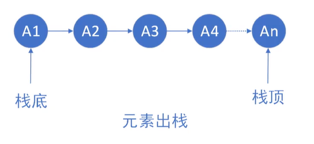

eg.栈的定义及初始化入栈

```
typedef struct {//栈定义
    ElemType data[50];
    int top;
}SqStack;


int main() {
    SqStack s;
    s.top=-1;
    s.data[++s.top]=4;
    return 0;
}
```

<font color="red">[注]前加加，先做加1，然后再去做其他的操作</font>

eg.出栈

```
x=s.data[s.top--]
```

eg.定义栈$\implies$初始化栈$\implies$判断栈是否为空$\implies$元素入栈$\implies$获取栈顶元素$\implies$弹栈流程

```
#include <stdio.h>
#include <stdlib.h>

#define maxSize 50
typedef int ElemType;//让顺序表存储其他类型元素时，可以快速完成代码修改

typedef struct {//栈定义
    ElemType data[maxSize];//数组，存放栈的元素
    int top;//始终指向栈顶的一个变量
}SqStack;

//初始化栈
void InitStack(SqStack &s){
    s.top=-1;//初始化栈，就是s.top=-1,让栈为空
}

//判断栈是否为空
bool StackEmpty(SqStack s){
    if(-1==s.top){
        return true;
    } else{
        return false;
    }
}

//入栈接口
bool Push(SqStack &s,ElemType x){
    //判断栈是否满了
    if(s.top==maxSize-1){
        return false;
    } else{
        s.data[++s.top]=x;
        return true;
    }
}

//获取栈顶元素
bool GetTop(SqStack s,ElemType &m){
    if(StackEmpty(s)){
        return false;
    }
    m=s.data[s.top];//拿栈顶元素；
    return true;
}

//弹出栈顶元素
bool Pop(SqStack &s,ElemType &m){
    if(StackEmpty(s)){
        return false;
    }
    m=s.data[s.top--];//出栈
    return true;
}


int main() {
    SqStack s;
    InitStack(s);//初始化栈
    bool flag;
    flag=StackEmpty(s);//判断栈是否为空
    if(flag){
        printf("stack is empty\n");
    }
    Push(s,3);//元素入栈
    Push(s,4);
    Push(s,5);
    ElemType m;
    flag=GetTop(s,m);//获取栈顶元素
    if(flag){
        printf("get top %d\n",m);
    }
    Pop(s,m);//弹出栈顶元素(弹栈)
    if(flag){
        printf("pop top %d\n",m);
    }
    flag=GetTop(s,m);//获取栈顶元素
    if(flag){
        printf("get top %d\n",m);
    }
    return 0;
}
```

ie.

```
D:\CLionProjects\CPP\cmake-build-debug\CPP.exe
stack is empty
get top 5
pop top 5
get top 4

Process finished with exit code 0
```

## 4.2队列(Queue)

### 4.2.1定义:队列(Queue)简称队，也是一种操作受限的<font color="red">线性表</font>，只允许在表的一端进行插入，而在表的另一端进行删除。向队列中插入元素称为入队或进队，删除元素称为出队和离队。<font color="red">FIFO</font>

队头(Front)。允许删除的一端，又称队首。

队尾(Rear)。允许插入的一端。

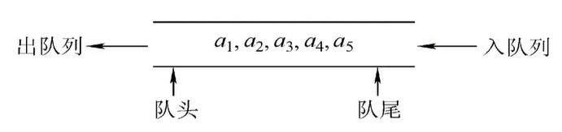

<font color="red">特性是先进先出(First In First Out,FIFO)</font>

### 4.2.2循环队列

eg.循环队列定义

```
typedef struct {//循环队列定义
    ElemType data[maxSize];//数组，存储maxSize-1个元素
    int front,rear;//队列头,队列尾
}SqQueue;


int main() {
    SqQueue Q;
    return 0;
}
```

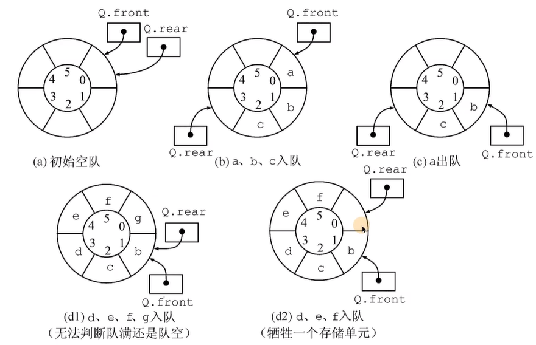
$$
[注](Q.rear+1) \% MaxSize==Q.front来判断队列是否存满，Q.rear==Q.front来判断队列是否为空
$$
eg.循环队列定义及入队出队

```
#include <stdio.h>
#include <stdlib.h>

#define maxSize 5
typedef int ElemType;//让顺序表存储其他类型元素时，可以快速完成代码修改

typedef struct {//循环队列定义
    ElemType data[maxSize];//数组，存储maxSize-1个元素
    int front,rear;//队列头,队列尾
}SqQueue;

//循环队列入队
bool EnQueue(SqQueue &Q,ElemType x){
    if((Q.rear+1)%maxSize==Q.front)//判断是否队满
        return false;
    Q.data[Q.rear]=x;//放入元素
    Q.rear=(Q.rear+1)%maxSize;//改变队尾标记
    return true;
}

//循环队列出队
bool DeQueue(SqQueue &Q,ElemType &x){
    if(Q.rear==Q.front)
        return false;
    x=Q.data[Q.front];//先进先出
    Q.front=(Q.front+1)%maxSize;
    return true;
}

int main() {
    SqQueue Q;
    ElemType m;
    m=3;
    EnQueue(Q,m);
    DeQueue(Q,m);
    return 0;
}
```

eg.循环队列初始化$\implies$判断循环队列是否为空$\implies$循环队列入队$\implies$循环队列出队流程

```
#include <stdio.h>
#include <stdlib.h>

#define maxSize 5
typedef int ElemType;//让顺序表存储其他类型元素时，可以快速完成代码修改
typedef struct {//循环队列定义
    ElemType data[maxSize];//数组，存储maxSize-1个元素
    int front,rear;//队列头,队列尾
}SqQueue;

//初始化循环队列
void InitQueue(SqQueue &Q){
    Q.front=Q.rear=0;//初始化循环队列，即使让头和尾都指向0号

}

//判断队列是否为空
bool IsEmpty(SqQueue Q){
    return Q.rear==Q.front;
}

//循环队列入队
bool EnQueue(SqQueue &Q,ElemType x){
    if((Q.rear+1)%maxSize==Q.front){//判断循环队列是否满了，满了就不能入队了
        return false;
    }
    Q.data[Q.rear]=x;//放入元素
    Q.rear=(Q.rear+1)%maxSize;//rear要加1，如果大于数组的最大下标，回到开头
    return true;
}

//循环队列出队
bool DnQueue(SqQueue &Q,ElemType &x){
    if(IsEmpty(Q)){//队列为空，无法出队
        return false;
    }
    x=Q.data[Q.front];//出队
    Q.front=(Q.front+1)%maxSize;
    return true;
}

int main() {
    SqQueue Q;
    InitQueue(Q);
    bool ret;
    ret=IsEmpty(Q);
    if(ret){
        printf("SqQueue is empty\n");
    } else{
        printf("SqQueue is not empty\n");
    }
    for (int i = 3; i <= 7; ++i) {
        ret=EnQueue(Q,i);
        if(ret){
            printf("EnQueue success,EnQueue num is %d\n",i);
        } else{
            printf("EnQueue failed,EnQueue num is %d\n",i);
        }
    }
    ElemType elemType;//存储出队元素
    ret=DnQueue(Q,elemType);
    if(ret){
        printf("DnQueue success\n");
    } else{
        printf("DnQueue failed\n");
    }
    ret=EnQueue(Q,7);
    if(ret){
        printf("EnQueue success\n");
    } else{
        printf("EnQueue failed\n");
    }
    return 0;
}
```

ie.

```
D:\CLionProjects\CPP\cmake-build-debug\CPP.exe
SqQueue is empty
EnQueue success,EnQueue num is 3
EnQueue success,EnQueue num is 4
EnQueue success,EnQueue num is 5
EnQueue success,EnQueue num is 6
EnQueue failed,EnQueue num is 7
DnQueue success
EnQueue success

Process finished with exit code 0
```


## 4.3队列的链式存储

### 4.3.1定义：队列的链式表示称为链队列，它实际上是一个同时<font color="red">带有 队头指针和队尾指针</font>的单链表。头指针指向队头结点，尾指针指向队尾结点，即单链表的最后一个结点。

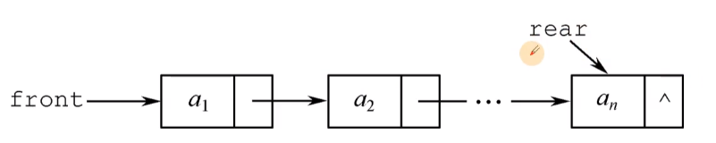

eg.队列的链式存储定义

```
typedef int ElemType;//让顺序表存储其他类型元素时，可以快速完成代码修改
typedef struct LNode{//顺序表定义
    ElemType data;
    struct LNode *next;
}LNode,*LinkList;

typedef struct {
    LNode *front,*rear;//链表头，链表尾
}LinkQueue;//先进先出
```

<font color="red">相对于原有编写的链表增加了尾指针</font>

eg.队列的链式存储初始化$\implies$入队$\implies$出队流程

```
#include <stdio.h>
#include <stdlib.h>

#define maxSize 5
typedef int ElemType;//让顺序表存储其他类型元素时，可以快速完成代码修改
typedef struct LinkNode{//顺序表定义
    ElemType data;
    struct LinkNode *next;
}LinkNode,*LinkList;

typedef struct {//链表队列定义
    LinkNode *front,*rear;//链表头，链表尾
}LinkQueue;//先进先出

//队列的初始化使用的是带头结点的链表实现的
void InitQueue(LinkQueue &Q){
    Q.front=Q.rear=(LinkNode*)malloc(sizeof(LinkNode));//头和尾指向同一个结点
    Q.front->next=NULL;//头结点的next指针为NULL
}

//入队
void EnQueue(LinkQueue &Q,ElemType x){
    LinkNode *pNew=(LinkNode*)malloc(sizeof(LinkNode));
    pNew->data=x;
    pNew->next=NULL;//要让next为NULL
    Q.rear->next=pNew;//尾指针的next指向pNew,因为从尾部插入
    Q.rear=pNew;//rear要指向新的尾部
}

//出队
bool DnQueue(LinkQueue &Q,ElemType &x){
    if(Q.rear==Q.front){//队列为空
        return false;
    }
    LinkNode *q=Q.front->next;//链表的第一个结点，存入q
    x=q->data;//获取要出队的元素值
    Q.front->next=q->next;//让一个结点断链
    if(Q.rear==q){//链表只剩余一个结点时，被删除后，要改变rear
        Q.rear=Q.front;
    }
    free(q);
    return true;
}

int main() {
    LinkQueue Q;
    InitQueue(Q);
    for (int i = 3; i <= 7; ++i) {
        EnQueue(Q,i);
    }
    ElemType elemType;
    bool ret;
    for (int i = 0; i < 7; ++i) {
        ret=DnQueue(Q,elemType);
        if(ret){
            printf("DnQueue success element=%d\n",elemType);
        } else{
            printf("DnQueue failed\n");
        }
    }
    return 0;
}
```

ie.

```
D:\CLionProjects\CPP\cmake-build-debug\CPP.exe
DnQueue success element=3
DnQueue success element=4
DnQueue success element=5
DnQueue success element=6
DnQueue success element=7
DnQueue failed
DnQueue failed
Process finished with exit code 0
```

# 5、树与二叉树

## 5.1树

### 5.1.1树的定义:

树是n(n>0)个结点的有限集。当n=0时，称为空树。在任意一颗非空树中应满足:

(1)有且仅有一个特定的称为根的结点。

(2)当n>1时，其余结点可分为m(m>0)个互不相交的有限集$T1,T2,\dots,Tm$,其中每个集合本身又是一棵树，并称为根的子树

### 5.1.2树的结构:

树作为一种逻辑结构，同事也是一种分层结构，具有以下两个特点:

(1)树的根结点没有前驱，除根结点外的所有结点有且只有一个前驱

(2)树中所有结点可以有零个或多个后继

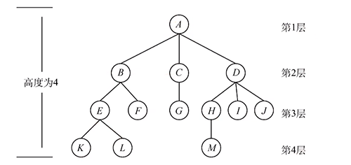

## 5.2二叉树

### 5.2.1二叉树的定义:

二叉树是另一种树形结构，其特点是每个结点至多只有两颗子树(即二叉树中不存在度大于2的结点)，并且二叉树的子树有左右之分，其次序不能任意颠倒。

与树相似，二叉树也以递归的形式定义。二叉树是n($n\geq 0$)个结点的有限集合:

(1)或者为空二叉树，即n=0

(2)或者由一个根结点和两个互不相交的被称为根的左子树和右子树组成。左子树和右子树又分别是一颗二叉树

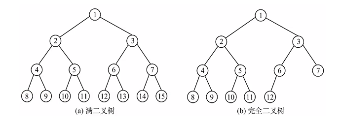

<font color="red">满二叉树对应每一层的个数是$2^{n-1}$个，n为层数</font>

<font color="red">完全二叉树要求二叉树从左往右依次放，同一层内如果右边有结点左边没有结点则不能称为完全二叉树</font>

### 5.2.2二叉树的链式存储

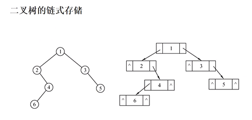

eg.二叉树链式存储建树

```
#include <stdio.h>
#include <stdlib.h>

#define maxSize 5
typedef int ElemType;//让顺序表存储其他类型元素时，可以快速完成代码修改
typedef char BiElemType;//让顺序表存储其他类型元素时，可以快速完成代码修改

typedef struct BiTNode{//二叉树定义
    BiElemType data;
    struct BiTNode *lChild;
    struct BiTNode *rChild;
}BiTNode,*BiTree;

//tag结构体是辅助队列使用的
typedef struct tag{
    BiTree p;//树的某一个结点的地址值
    struct tag *pNext;
}tag_t,*pTag_t;

int main() {
    BiTree pNew;//用来指向新申请的树结点
    BiTree tree=NULL;//tree是指向树根的，代表树
    pTag_t pHead=NULL,pTail=NULL,listPNew=NULL,pCur;
    char c;
    while (scanf("%c",&c)){
        if(c=='\n'){//读到换行就结束
            break;
        }
        //calloc申请的空间大小是两个参数直接相乘，并对空间初始化，赋值为0
        pNew= (BiTree)calloc(1,sizeof(BiTNode));
        pNew->data=c;
        listPNew=(pTag_t) calloc(1,sizeof (tag_t ));//给队列结点申请空间
        listPNew->p=pNew;
        //如果是树的第一个结点
        if(NULL==tree){
            tree=pNew;//tree指向树的根结点
            pHead=listPNew;//第一个结点既是队列头也是队列尾
            pTail=listPNew;
            pCur=listPNew;//pCur要指向要进入树的父亲元素
        } else{
            //让元素先入队列
            pTail->pNext=listPNew;
            pTail=listPNew;
            //接下来把b结点放入树中
            if(NULL==pCur->p->lChild){
                pCur->p->lChild=pNew;//pCur->p左孩子为空就放入左孩子
            } else if(NULL==pCur->p->rChild){
                pCur->p->rChild=pNew;//pCur->p右孩子为空就放入右孩子
                pCur=pCur->pNext;//当前结点左右孩子都有了，pCur就指向下一个
            }
        }
    }
    return 0;
}
```

### 5.2.3二叉树前序中序后序遍历

1.前序遍历(深度优先遍历)(preOrder):先打印自身,再打印左子树,再打印右子树

2.中序遍历(inOrder):先打印左子树,再打印当前结点,再打印右子树

3.后序遍历(postOrder):先打印左子树,再打印右子树,最后打印当前结点

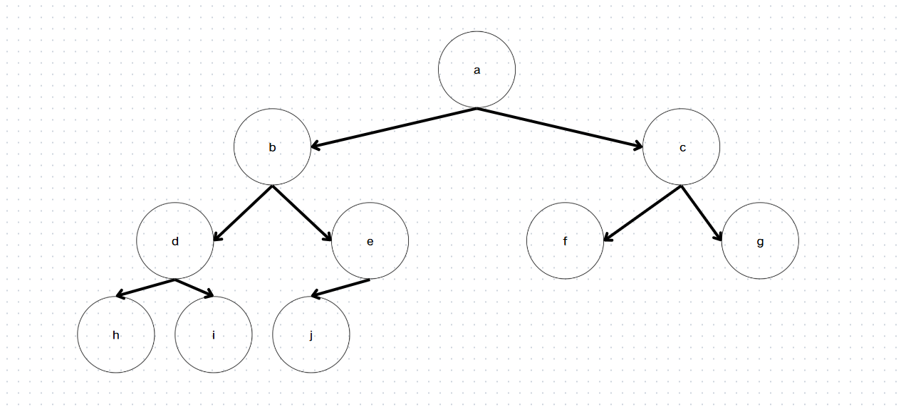

前序遍历结果:$abdhiejcfg$

中序遍历结果:$hdibjeafcg$

后序遍历结果:$hidjebfgca$

eg.得到结果过程，以前序遍历为例(递归思想)
$$
abc\cdots\cdots第一次递归，递归以a为头结点的二叉树\\
abdec\cdots\cdots第二次递归，递归以b为头结点的二叉树\\
abdhiec\cdots\cdots第三次递归，递归以d为头结点的二叉树\\
abdhiejc\cdots\cdots第四次递归，递归以e为头结点的二叉树\\
abdhiejfgc\cdots\cdots第五次递归，递归以c为头结点的二叉树\\
$$
同理可求出中序遍历和后序遍历结果

eg.前序中序后序遍历代码(代码简单,但是要深刻理解递归思想)

```
#include <stdio.h>
#include <stdlib.h>

#define maxSize 5
typedef int ElemType;//让顺序表存储其他类型元素时，可以快速完成代码修改
typedef char BiElemType;//让顺序表存储其他类型元素时，可以快速完成代码修改

typedef struct BiTNode{//二叉树定义
    BiElemType data;
    struct BiTNode *lChild;
    struct BiTNode *rChild;
}BiTNode,*BiTree;

//tag结构体是辅助队列使用的
typedef struct tag{
    BiTree p;//树的某一个结点的地址值
    struct tag *pNext;
}tag_t,*pTag_t;

//前序遍历(先序遍历,深度优先遍历)
void preOrder(BiTree p){
    if(p!=NULL){
        printf("%c",p->data);
        preOrder(p->lChild);//打印左子树
        preOrder(p->rChild);//打印右子树
    }
}

//中序遍历
void inOrder(BiTree p){
    if(p!=NULL){
        inOrder(p->lChild);//打印左子树
        printf("%c",p->data);
        inOrder(p->rChild);//打印右子树
    }
}

//后序遍历
void postOrder(BiTree p){
    if(p!=NULL){
        postOrder(p->lChild);//打印左子树
        postOrder(p->rChild);//打印右子树
        printf("%c",p->data);
    }
}

int main() {
    BiTree pNew;//用来指向新申请的树结点
    BiTree tree=NULL;//tree是指向树根的，代表树
    pTag_t pHead=NULL,pTail=NULL,listPNew=NULL,pCur;
    char c;
    while (scanf("%c",&c)){
        if(c=='\n'){//读到换行就结束
            break;
        }
        //calloc申请的空间大小是两个参数直接相乘，并对空间初始化，赋值为0
        pNew= (BiTree)calloc(1,sizeof(BiTNode));
        pNew->data=c;
        listPNew=(pTag_t) calloc(1,sizeof (tag_t ));//给队列结点申请空间
        listPNew->p=pNew;
        //如果是树的第一个结点
        if(NULL==tree){
            tree=pNew;//tree指向树的根结点
            pHead=listPNew;//第一个结点既是队列头也是队列尾
            pTail=listPNew;
            pCur=listPNew;//pCur要指向要进入树的父亲元素
        } else{
            //让元素先入队列
            pTail->pNext=listPNew;
            pTail=listPNew;
            //接下来把b结点放入树中
            if(NULL==pCur->p->lChild){
                pCur->p->lChild=pNew;//pCur->p左孩子为空就放入左孩子
            } else if(NULL==pCur->p->rChild){
                pCur->p->rChild=pNew;//pCur->p右孩子为空就放入右孩子
                pCur=pCur->pNext;//当前结点左右孩子都有了，pCur就指向下一个
            }
        }
    }
    printf("preOrder:\n");
    preOrder(tree);
    printf("\ninOrder:\n");
    inOrder(tree);
    printf("\npostOrder:\n");
    postOrder(tree);
    return 0;
}
```

```
D:\CLionProjects\CPP\cmake-build-debug\CPP.exe
abcdefghij//控制台输入
preOrder:
abdhiejcfg
inOrder:
hdibjeafcg
postOrder:
hidjebfgca
Process finished with exit code 0
```

### 5.2.4二叉树层序遍历(层次遍历，广度优先遍历)

层序遍历就是按从上到下，从左到右的顺序遍历二叉树。


层序遍历结果:$abcdefghijk$

eg.层序遍历代码

```
#include <stdio.h>
#include <stdlib.h>

#define maxSize 5
typedef int ElemType;//让顺序表存储其他类型元素时，可以快速完成代码修改
typedef char BiElemType;//让顺序表存储其他类型元素时，可以快速完成代码修改
typedef struct BiTNode{//二叉树定义
    BiElemType data;
    struct BiTNode *lChild;
    struct BiTNode *rChild;
}BiTNode,*BiTree;

typedef BiTree BiTreeElemType;//队列的结构体

typedef struct LinkNode{//顺序表定义
    BiTreeElemType data;
    struct LinkNode *next;
}LinkNode,*LinkList;

typedef struct {//链表队列定义
    LinkNode *front,*rear;//链表头，链表尾
}LinkQueue;//先进先出

//tag结构体是辅助队列使用的
typedef struct tag{
    BiTree p;//树的某一个结点的地址值
    struct tag *pNext;
}tag_t,*pTag_t;

//队列的初始化使用的是带头结点的链表实现的
void InitQueue(LinkQueue &Q){
    Q.front=Q.rear=(LinkNode*)malloc(sizeof(LinkNode));//头和尾指向同一个结点
    Q.front->next=NULL;//头结点的next指针为NULL
}

//入队
void EnQueue(LinkQueue &Q,BiTreeElemType x){
    LinkNode *pNew=(LinkNode*)malloc(sizeof(LinkNode));
    pNew->data=x;
    pNew->next=NULL;//要让next为NULL
    Q.rear->next=pNew;//尾指针的next指向pNew,因为从尾部插入
    Q.rear=pNew;//rear要指向新的尾部
}

//出队
bool DnQueue(LinkQueue &Q,BiTreeElemType &x){
    if(Q.rear==Q.front){//队列为空
        return false;
    }
    LinkNode *q=Q.front->next;//链表的第一个结点，存入q
    x=q->data;//获取要出队的元素值
    Q.front->next=q->next;//让一个结点断链
    if(Q.rear==q){//链表只剩余一个结点时，被删除后，要改变rear
        Q.rear=Q.front;
    }
    free(q);
    return true;
}

//判断队列是否为空
bool IsEmpty(LinkQueue Q){
    return Q.rear==Q.front;
}

void levelOrder(BiTree T){//层次遍历、层序遍历、广度优先遍历
    LinkQueue Q;//辅助队列
    InitQueue(Q);//初始化队列
    BiTree p;//存储出队的结点
    EnQueue(Q,T);//根入队
    while (!IsEmpty(Q)){
        DnQueue(Q,p);
        putchar(p->data);//等价于printf("%c",c)
        if(p->lChild){
            EnQueue(Q,p->lChild);//左孩子不为空就入队左孩子
        }
        if(p->rChild){
            EnQueue(Q,p->rChild);//右孩子不为空就入队右孩子
        }
    }
}

int main() {
    BiTree pNew;//用来指向新申请的树结点
    BiTree tree=NULL;//tree是指向树根的，代表树
    pTag_t pHead=NULL,pTail=NULL,listPNew=NULL,pCur;
    char c;
    //层次建树
    while (scanf("%c",&c)){
        if(c=='\n'){//读到换行就结束
            break;
        }
        //calloc申请的空间大小是两个参数直接相乘，并对空间初始化，赋值为0
        pNew= (BiTree)calloc(1,sizeof(BiTNode));
        pNew->data=c;
        listPNew=(pTag_t) calloc(1,sizeof (tag_t ));//给队列结点申请空间
        listPNew->p=pNew;
        //如果是树的第一个结点
        if(NULL==tree){
            tree=pNew;//tree指向树的根结点
            pHead=listPNew;//第一个结点既是队列头也是队列尾
            pTail=listPNew;
            pCur=listPNew;//pCur要指向要进入树的父亲元素
        } else{
            //让元素先入队列
            pTail->pNext=listPNew;
            pTail=listPNew;
            //接下来把b结点放入树中
            if(NULL==pCur->p->lChild){
                pCur->p->lChild=pNew;//pCur->p左孩子为空就放入左孩子
            } else if(NULL==pCur->p->rChild){
                pCur->p->rChild=pNew;//pCur->p右孩子为空就放入右孩子
                pCur=pCur->pNext;//当前结点左右孩子都有了，pCur就指向下一个
            }
        }
    }
    printf("levelOrder:\n");
    levelOrder(tree);
    return 0;
}
```

ie.

```
D:\CLionProjects\CPP\cmake-build-debug\CPP.exe
abcdefghij\\控制台输入
levelOrder:
abcdefghij
Process finished with exit code 0
```

# 6、查找

## 6.1顺序查找

顺序查找原理:顺序查找又称线性查找，它对于顺序表和链表都是适用的。对于顺序表，可通过数组下标递增来顺序扫描每个元素；对于链表，则通过指针next来依次扫描每个元素。

eg.顺序查找

```
#include <stdio.h>
#include <stdlib.h>
#include <time.h>
typedef int elemType;//让顺序表存储其他类型元素时，可以快速完成代码修改
typedef struct {
    elemType* elem;//整形指针，申请的堆空间的起始地址存入elem
    int TableLen;//存储动态数组里边元素的个数
}SSTable;

//init进行随机数生成
void STInit(SSTable &ST,int len){
    //多申请了一个位置，为了存哨兵，不使用哨兵也可以
    ST.TableLen=len+1;
    ST.elem= (elemType*)malloc(sizeof (elemType)*ST.TableLen);
    srand(time(NULL));//随机数生成
    for (int i = 1; i < ST.TableLen; ++i) {//因为第0个是哨兵，所以从1随机
        ST.elem[i]=rand()%100;//为了随机生成的数都在0~99
    }
}

//打印顺序表
void STPrint (SSTable ST){
    for (int i = 1; i < ST.TableLen; ++i) {
        printf("%3d",ST.elem[i]);
    }
    printf("\n");
}

//查找数据位置
int searchSeq(SSTable ST,elemType key){
    ST.elem[0]=key;//key存在零号位置，作为哨兵,有了哨兵，我们在循环时，可以少写一个i>=0
    int i;
    for (i = ST.TableLen-1; ST.elem[i]!=key; i--);
    return i;

}

int main() {
    SSTable ST;
    elemType key;
    int pos;//存取查询元素的位置
    STInit(ST,10);
    STPrint(ST);
    printf("please input search key：\n");
    fflush(stdout);//清空输出缓冲区
    scanf("%d",&key);
    pos=searchSeq(ST,key);
    if(pos){
        printf("find key,pos=%d\n",pos);
    } else{
        printf("not find\n");
    }
    return 0;
}
```

ie.

```
D:\CLionProjects\CPP\cmake-build-debug\CPP.exe
 76 86 71 26 18 53 15 10 75 61
please input search key：
15
find key,pos=7

Process finished with exit code 0
```

## 6.2折半查找(二分查找)(仅适用于有序的顺序表)

折半查找的基本思想:首先将给定值key与表中中间位置的元素比较，若相等，则查找成功，返回该元素的存储位置，若不等，则所需查找的元素只c能在中间元素以外的前半部分或后半部分(例如，在茶轴表升序排序时，给定值key大于中间元素，则所查找的元素只可能在后半部分)。然后在缩小的范围内继续进行同样的查找，如此重复，直到找到为止，或确定表中没有所需查找的元素，则查找不成功，返回查找失败的信息。

eg.二分查找

```
#include <stdio.h>
#include <stdlib.h>
#include <time.h>
typedef int elemType;//让顺序表存储其他类型元素时，可以快速完成代码修改
typedef struct {
    elemType* elem;//整形指针，申请的堆空间的起始地址存入elem
    int TableLen;//存储动态数组里边元素的个数
}SSTable;

//init进行随机数生成
void STInit(SSTable &ST,int len){
    //多申请了一个位置，为了存哨兵，不使用哨兵也可以
    ST.TableLen=len+1;
    ST.elem= (elemType*)malloc(sizeof (elemType)*ST.TableLen);
    srand(time(NULL));//随机数生成
    for (int i = 1; i < ST.TableLen; ++i) {//因为第0个是哨兵，所以从1随机
        ST.elem[i]=rand()%100;//为了随机生成的数都在0~99
    }
}

//打印顺序表
void STPrint (SSTable ST){
    for (int i = 1; i < ST.TableLen; ++i) {
        printf("%3d",ST.elem[i]);
    }
    printf("\n");
}

//实现二分查找
int binarySearch(SSTable L, elemType key){
    int low=0;
    int high=L.TableLen-1;
    int mid;
    while (low<=high){//low<=high,可以让mid既能取到low也能取到high
        mid=(low+high)/2;
        if(key>L.elem[mid]){//如果目标值大于中位数
            low=mid+1;
        } else if(key<L.elem[mid]){
            high=mid-1;
        } else{
            return mid;
        }
    }
    return -1;
}

//函数名储存的是函数的入口地址，也是一个指针，是函数指针类型
//left指针和right指针是指向数组中的任意两个元素
//qsort规定如果left指针指向的值大于right指针指向的值，返回正值，小于，返回负值，相当返回0；
int compare(const void *left,const void *right){
    return *(int *)left-*(int *)right;
    //return *(int *)right-*(int *)left;//从大到小排序
};

int main() {
    SSTable ST;
    STInit(ST,10);
    STPrint(ST);
    qsort(ST.elem,ST.TableLen,sizeof (elemType), compare);//排序
    STPrint(ST);
    elemType key;
    printf("please input search key\n");
    fflush(stdout);//清空输出缓冲区,要不然毛都打印不出来
    scanf("%d",&key);
    fflush(stdout);//清空输出缓冲区，要不然毛都打印不出来
    int post=binarySearch(ST,key);
    if(post!=-1){
        printf("find key is %d\n",post);
    } else{
        printf("not found\n");
    }
    return 0;
}
```

ie.

```
D:\CLionProjects\CPP\cmake-build-debug\CPP.exe
 67 11 62 15  4 22 94 84 75 41
  4 11 15 22 41 62 67 75 84 94
please input search key
11//控制台输入
find key is 2

Process finished with exit code 0
```

## 6.3二叉排序树

### 6.3.1定义

二叉排序树(也称二叉查找树)或者是一颗空树，或者是具有下列特性的二叉树:

(1) 若左子树非空，则左子树上所有结点的值均小于根结点的值

(2) 若右子树非空，则右子树上所有结点的值均大于根结点的值

(3)左、右子树也分别是一颗二叉排序树

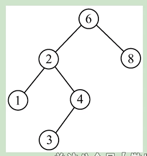

eg.二叉排序树新建，中序遍历，查找，删除

```
#include <stdio.h>
#include <stdlib.h>
#include <time.h>
typedef int keyType;//让顺序表存储其他类型元素时，可以快速完成代码修改
typedef struct BSTNode{
    keyType key;
    struct BSTNode *lChild,*rChild;
}BSTNode,*BiTree;

//递归创建二叉排序树
int BSTInsert1(BiTree &T,keyType key){
    if(NULL==T){//为新结点申请空间，第一个结点作为树根,后面递归再进入的不是树根，是为叶子结点
        T=(BiTree) malloc(sizeof(BSTNode));
        T->key=key;
        T->lChild=T->rChild=NULL;
        return 0;//代表插入成功
    } else if(key==T->key)
        return -1;//发现相同元素，就不插入
    else if(key<T->key)//如果要插入的结点，小于当前结点
        //函数调用结束后，左孩子和原来的父亲会关联起来，巧妙利用了引用机制
        return BSTInsert1(T->lChild,key);
    else
        return BSTInsert1(T->rChild,key);
}

//非递归创建二叉排序树
int BSTInsert(BiTree &T,keyType key){
    BiTree treeNew= (BiTree)calloc(1,sizeof(BSTNode));//新结点申请空间
    treeNew->key=key;//把值放入
    if(NULL==T){//树为空，新结点作为树根
        T=treeNew;
        return 0;
    }
    BiTree p=T,parent;//用来查找树
    while (p){
        parent=p;//parent用来存p的父亲
        if(key>p->key){
            p=p->rChild;
        } else if(key<p->key){
            p=p->lChild;
        } else{
            return -1;//相等的元素不可以放入查找树(考研不会考)
        }
    }
    //接下来要判断放到父亲的左边还是右边
    if(key>parent->key){//放到父亲的右边
        parent->rChild=treeNew;
    } else{//放到父亲的左边
        parent->lChild=treeNew;
    }
    return 0;
}

//树中不放入相等元素
void creatBST(BiTree &T,keyType* str,int len){
    for (int i = 0; i < len; ++i) {
        BSTInsert(T,str[i]);//把某一结点放入二叉排序树
    }

}

//中序遍历
void inOrder(BiTree T){
    if(NULL!=T){
        inOrder(T->lChild);
        printf("%3d",T->key);
        inOrder(T->rChild);
    }
}

BiTree BSTSearch(BiTree T,keyType k,BiTree &parent){
    parent=NULL;//存储要找的结点的父亲
    while (T!=NULL&&k!=T->key){
        parent=T;
        if(k<T->key)
            T=T->lChild;//比当前结点小，就左边找
        else
            T=T->rChild;//比当前结点大，就右边找
    }
    return T;
}

//通过递归删除树结点
void deleteNode(BiTree &root,keyType x){
    if(NULL==root){
        return;
    }
    if(root->key>x){//当前结点大于要删除的结点就在左子树找
        deleteNode(root->lChild,x);
    } else if(root->key<x){//当前结点小于要删除的结点就在右子树找
        deleteNode(root->rChild,x);
    } else{//查找到了删除结点
        if(root->lChild==NULL){//左子树为空，右子树直接顶上去
            BiTree tempNode=root;//用临时的存这的目的是一会要free
            root=root->rChild;
            free(tempNode);
        } else if(root->rChild==NULL){//右子树为空，左子树直接顶上去
            BiTree tempNode=root;//用临时的存这的目的是一会要free
            root=root->lChild;
            free(tempNode);
        } else{//两边都不为空
            //一般的删除策略是左子树的最大数据或右子树的最小数据
            //代替要删除的结点(这里采用查找左子树最大数据来代替，左子树的最有结点)
            BiTree tempNode=root->lChild;
            while (tempNode->rChild!=NULL){//向右找到最大的
                tempNode=tempNode->rChild;
            }
            root->key=tempNode->key;//把tempNode对应的值替换到要删除的值的位置上
            deleteNode(root->lChild,tempNode->key);//在左子树中找到tempNode的值，把其删除

        }
    }
}
//二叉排序树新建，中序遍历，查找，删除
int main() {

    BiTree T=NULL;//树根
    keyType str[7]={97,54,87,51,22,98,15};
    creatBST(T,str,7);
    inOrder(T);//中序遍历二叉查找树是由小到大的
    printf("\n");
    BiTree search,parent;
    search=BSTSearch(T,98,parent);
    if(search){
        printf("find key %d\n",search->key);
    } else{
        printf("not find\n");
    }
    deleteNode(T,54);//删除某个结点
    inOrder(T);
    return 0;
}
```

ie.

```
D:\CLionProjects\CPP\cmake-build-debug\CPP.exe
 15 22 51 54 87 97 98
find key 98
 15 22 51 87 97 98
Process finished with exit code 0
```

# 7、排序

## 7.1排序分类

排序算法分为交换类排序，插入类排序，选择类排序，归并类排序

1.交换排序分为:冒泡排序和快速排序

2.插入排序分为:直接插入排序、折半插入排序和希尔排序

3.选择排序分为:简单选择排序、堆排序(重要)

## 7.2冒泡排序

定义:冒泡排序的基本思想是，从后往前(或从前往后)两两比较相邻元素的值，$(若A[j-1]>A[j])$,则交换他们，直到序列比较完，我们称它为第一趟冒泡，结果是将最小的元素交换到待排序列的第一个位置，关键字最小的元素如气泡一般逐渐往上"漂浮"直至"水面"。下一趟冒泡时，前一趟确定的最小元素不再参与比较，每趟冒泡的结果是把序列中的最小元素放到了序列的最终位置$\dots\dots$这样最多做n-1趟冒泡就能把所有的元素排好序

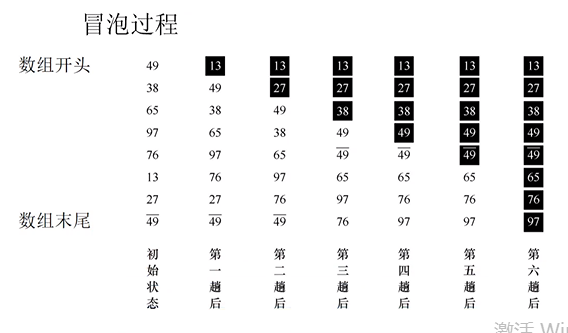

eg.冒泡排序代码

```
#include <stdio.h>
#include <stdlib.h>
#include <time.h>
#include <string>
typedef int elemType;
typedef struct {
    elemType *elem;//存储元素的起始地址
    int tableLen;//元素个数
}SSTable;

//初始化数组，随机生成10个元素存入数组中
void STInit(SSTable &ST,int len){
    ST.tableLen=len;
    ST.elem=(elemType *)malloc(sizeof (elemType)*ST.tableLen);//申请一块堆空间，当数组用
    srand(time(NULL));//随机数生成，每一次执行代码就会得到随机的10个元素
    for (int i = 0; i < ST.tableLen; ++i) {
        ST.elem[i]=rand()%100;//生成的是0-99之间
    }
}

//打印数组中的元素
void STPrint(SSTable ST){
    for (int i = 0; i < ST.tableLen; ++i) {
        printf("%3d",ST.elem[i]);
    }
    printf("\n");
}

//交换两个元素
void swap(int &a,int &b){
    int tmp;
    tmp=a;
    a=b;
    b=tmp;
}
//冒泡排序(排序往往都是用两层循环的)
//优先去写内层循环再写外层循环
void bubbleSort(elemType *A,int n){
    int i,j;
    bool flag;
    for(i=0;i<n-1;i++){//外层控制的是有序数的数目
        flag= false;
        for (j=n-1;j>i;j--){//内层控制比较和交换
            if(A[j-1]>A[j]){
                swap(A[j-1],A[j]);
                flag= true;
            }
        }
        if(flag== false)//如果一趟比较没有发生任何交换，说明有序，提前结束排序
            return;
    }
}
int main() {
    SSTable ST;
    STInit(ST,10);
    STPrint(ST);
    bubbleSort(ST.elem,10);
    STPrint(ST);
    return 0;
}
```

ie.

```
D:\CLionProjects\CPP\cmake-build-debug\CPP.exe
 63 77 79 89 66 54 75 42  1 41
  1 41 42 54 63 66 75 77 79 89

Process finished with exit code 0
```

最后我们计算一下时间复杂度和空间复杂度,时间复杂度其实就是程序实际的运行次数，可以看到内存是j>i,外层i的值是从0到N-1，所以程序的总运行次数是$1+2+3+\cdots+(N-1)$,即从1一直加到N-1，这是等差数列求和，得到结果是$\frac{N(N-1)}{2}$,即总运行了这么多次，忽略了低阶项和高阶项的首项系数，因此时间复杂度是$O(n^2)$,因为未使用额外的空间(额外空间必须雨输入元素的个数N相关)，所以空间复杂度为O(1)

加上哨兵flag后，如果数组本身有序，那么就是最好的时间复杂度O(n)

## 7.3快速排序

定义:快速排序的核心是分治思想:假设我们的目标依然是按从小到大的顺序排列，我们找到数组中的一个分割值，把比分割值小的数都放在数组的左边，把比分割值大的数都放在数组的右边，这样分割值的位置就被确定。数组一分为二，我们只需排前一半数组和后一半数组，复杂度直接减半。采用这种思想，不断地进行递归，最终分割得只剩一个元素时，整个序列自然就是有序的。

eg.快速排序代码

```
#include <stdio.h>
#include <stdlib.h>
#include <time.h>
#include <string>
typedef int elemType;
typedef struct {
    elemType *elem;//存储元素的起始地址
    int tableLen;//元素个数
}SSTable;

//初始化数组，随机生成10个元素存入数组中
void STInit(SSTable &ST,int len){
    ST.tableLen=len;
    ST.elem=(elemType *)malloc(sizeof (elemType)*ST.tableLen);//申请一块堆空间，当数组用
    srand(time(NULL));//随机数生成，每一次执行代码就会得到随机的10个元素
    for (int i = 0; i < ST.tableLen; ++i) {
        ST.elem[i]=rand()%100;//生成的是0-99之间
    }
}

//打印数组中的元素
void STPrint(SSTable ST){
    for (int i = 0; i < ST.tableLen; ++i) {
        printf("%3d",ST.elem[i]);
    }
    printf("\n");
}

//分割(快排的核心函数)
//挖坑法
int partition(elemType *A,int low,int high){
    elemType pivot=A[low];//拿最左边的元素作为分割值，并存储下来
    while (low<high){
        while (low<high&&A[high]>=pivot)//从后往前遍历，找到一个比分割值小的
            high--;
        A[low]=A[high];//把比分割值小的那个元素放到A[low]
        while (low<high&&A[low]<=pivot)//从前往后遍历，找到一个比分割值大的
            low++;
        A[high]=A[low];//把比分割值大的那个元素放到A[high],因为刚才high位置的元素已经放到了low位置
    }
    A[low]=pivot;//把分割值放到中间位置，因为左边都比他小，右边都比他大
    return low;
}

//快速排序
void quickSort(elemType *A,int low,int high){
    if(low<high){
        int pivotPos= partition(A,low,high);//存储分割值的位置
        quickSort(A,low,pivotPos-1);//前一半继续递归排好
        quickSort(A,pivotPos+1,high);
    }
}
int main() {
    SSTable ST;
    STInit(ST,10);
    STPrint(ST);
    quickSort(ST.elem,0,9);
    STPrint(ST);
    return 0;
}
```

ie.

```
D:\CLionProjects\CPP\cmake-build-debug\CPP.exe
 38 59 85 60 63 67  1 26 32 43
  1 26 32 38 43 59 60 63 67 85

Process finished with exit code 0
```

假如每次快速排序数组都被平均地一分为二，那么可以得出$QuickSort$递归的次数是$\log_{2}{n}$,第一次$patition$遍历次数为n，分为两个数组后，每个数组遍历$\frac{n}{2}$次，加起来还是n，因此时间复杂度是$O\log_{2}{n}$,因为计算机时二进制的，所以在复试面试回答复杂度或与人交流时，提刀复杂度一版直接讲$O(n\log{n})$,而不带下标2，快速排序最差的时间复杂度为什么是$n^2$呢？因为数组本身从小到大有序时，如果每次我们仍然用最左边的数作为分割值，那么每次数组都不会二分，导致递归n次，所以快速排序最坏的时间复杂度为n的平方。当然，，为了避免这种情况，有时会首先随机选择一个下标，先将对应下标的值与最左边的元素交换，再进行$partition$操作从而极大地降低出现最坏时间复杂度的概率，但是仍然不能完全避免。

因此快排最好和平均时间复杂度时$O(n\log{n})$,最差是$O(n^2)$

快排的空间复杂度是$O(\log_2n)$，因为递归的次数是$\log_2n$,而每次递归的形参都是需要占用空间的

## 7.4直接插入排序

定义:如果一个序列只有一个数，那么该序列自然是有序的。插入排序首先将第一个数视为有序序列，然后把后面9个数视为要依次插入的序列。首先，我们通过外层循环控制要插入的数，用$inserVal$保留要插入的值87，我们比较$arr[0]$是否大于$arr[1]$，即3是否大于87，由于不大于，因此不发生移动，这时有序序列是$3,87$。接着将数值2插入有序序列，首先将2赋值给$inserVal$，这时判断87是否大于2，因为87大于2，所以87向后移将2覆盖，然后判断3是否大于2，因为3大于2，所以3移动到87所在的位置，内层循环结束，这时将2赋值给$arr[0]$的位置，得到下表中第二次插入后的效果。

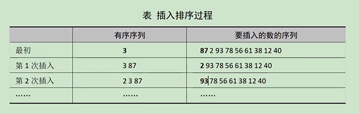

继续循环会将数依次插入有序序列，最终使得整个数组有序。插入排序主要用在部分数有序的场景，例如手机通讯录时时刻刻都是有序的，新增一个电话号码时，以插入排序的方法将其插入原有的有序序列，这样就降低了复杂度。

eg.插入排序代码

```
#include <stdio.h>
#include <stdlib.h>
#include <time.h>
#include <string>
typedef int elemType;
typedef struct {
    elemType *elem;//存储元素的起始地址
    int tableLen;//元素个数
}SSTable;

//初始化数组，随机生成10个元素存入数组中
void STInit(SSTable &ST,int len){
    ST.tableLen=len;
    ST.elem=(elemType *)malloc(sizeof (elemType)*ST.tableLen);//申请一块堆空间，当数组用
    srand(time(NULL));//随机数生成，每一次执行代码就会得到随机的10个元素
    for (int i = 0; i < ST.tableLen; ++i) {
        ST.elem[i]=rand()%100;//生成的是0-99之间
    }
}

//打印数组中的元素
void STPrint(SSTable ST){
    for (int i = 0; i < ST.tableLen; ++i) {
        printf("%3d",ST.elem[i]);
    }
    printf("\n");
}

void insertSort(elemType *A,int n){
    int i,j,insertVal;
    for (i = 1; i < n; ++i) {//外层控制要插入的数
        insertVal=A[i];//保存要插入的数
        //内层控制比较，j要大于等于0，同时arr[j]大于insertVal时,arr[j]元素向后覆盖
        for (j = i-1; j>=0 && A[j]>insertVal; j--) {
            A[j+1]=A[j];
        }
        A[j+1]=insertVal;//把要插入的元素放到对应的位置
    }
}

int main() {
    SSTable ST;
    STInit(ST,10);
    STPrint(ST);
    insertSort(ST.elem,10);
    STPrint(ST);
    return 0;
}
```

ie.

```
D:\CLionProjects\CPP\cmake-build-debug\CPP.exe
 46 28 59 38  0 53 78  0  7 37
  0  0  7 28 37 38 46 53 59 78

Process finished with exit code 0
```

随着有序序列的不断增加，插入排序比较次数也会增加，插入排序的执行次数也是从1加到$N-1$,总运行次数为$\frac{N(N-1)}{2}$,时间复杂度依然是$O(n^2)$,因为未使用额外的空间(额外空间必须与输入元素的个数N相关)，所以空间复杂度是$O(1)$。如果数组本身有序，那么就是最好的时间复杂度$O(n)$。

## 7.5选择排序

定义:假设排序表为$L[1\cdots n]$,第$i$趟排序即从$L[1\cdots n]$中选择关键字最小的元素与$L(i)$交换，每一趟排序可以确定一个元素的最终位置，这样经过$n-1$趟排序就可以使得整个排序表有序。

首先假设第零个元素是最小值，把下标0赋值给$min$($min$记录最小的元素的下标)，内层比较时，从1号元素一直比较到9号元素，谁更小，就把它的下标赋给$min$,一轮比较结束后，将$min$对应位置的元素与元素$i$交换，如下表所示。第一轮确认2最小，将2与数组开头的元素3交换，第二轮我们最初认为87最小，经过一轮比较，发现3最小，这时将87与3交换。持续进行，最终使数组有序。

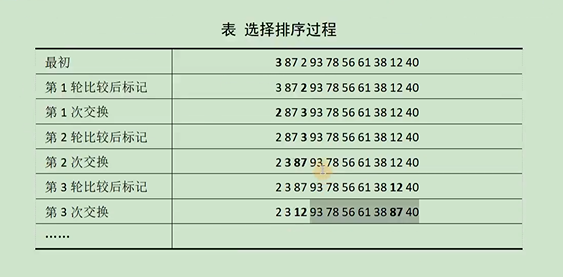

eg.选择排序代码

```
#include <stdio.h>
#include <stdlib.h>
#include <time.h>
#include <string>
typedef int elemType;
typedef struct {
    elemType *elem;//存储元素的起始地址
    int tableLen;//元素个数
}SSTable;

//初始化数组，随机生成10个元素存入数组中
void STInit(SSTable &ST,int len){
    ST.tableLen=len;
    ST.elem=(elemType *)malloc(sizeof (elemType)*ST.tableLen);//申请一块堆空间，当数组用
    srand(time(NULL));//随机数生成，每一次执行代码就会得到随机的10个元素
    for (int i = 0; i < ST.tableLen; ++i) {
        ST.elem[i]=rand()%100;//生成的是0-99之间
    }
}

//打印数组中的元素
void STPrint(SSTable ST){
    for (int i = 0; i < ST.tableLen; ++i) {
        printf("%3d",ST.elem[i]);
    }
    printf("\n");
}

//交换元素
void swap(elemType &a,elemType &b){
    elemType tmp;
    tmp=a;
    a=b;
    b=tmp;
}

void selectionSort(elemType *A,int n){
    int i,j,min;//min记录最小的元素的下标
    for(i=0;i<n-1;i++){
        min=i;//我们认为i号元素最小
        for(j=i+1;j<n;j++){//找到从i开始到最后的序列的最小值的下标
            if(A[j]<A[min]){//当某个元素A[j]小于最小元素时
                min=j;//将下标j赋值给min,min就记录下俩了最小值的下标
            }
        }
        swap(A[i],A[min]);//遍历完毕找到最小值的位置后，与A[i]交换，这样最小值就到了最前面
    }
}

int main() {
    SSTable ST;
    STInit(ST,10);
    STPrint(ST);
    selectionSort(ST.elem,10);
    STPrint(ST);
    return 0;
}
```

ie.

```
D:\CLionProjects\CPP\cmake-build-debug\CPP.exe
  4 28 56 66 93 69 42 43 57  4
  4  4 28 42 43 56 57 66 69 93

Process finished with exit code 0
```

选择排序虽然减少了交换次数，但是循环比较的次数依然和冒泡排序的数量是一样的，都是从1到$N-1$,总运行次数为$\frac{N(N-1)}{2}$。我们忽略循环内语句的数量，因为我们在计算时间复杂度时，主要考虑N有关的循环，如果循环内交换的多，例如5条语句，那么最终得到的无非是$5n^2$;循环内交换的少，例如有两条语句，那么得到的就是$2n^2$，但是时间复杂度计算是忽略首项系数的，因此最终还是$O(n^2)$。因此，选择排序的时间复杂度依然是$O(n^2)$,因为未使用额外的空间(额外的空间必须与输入元素的个数$N$相关)，所以空间复杂度是$O(1)$。<font color="red">另外考研初试问时间复杂度，直接写最终结构即可，不用分析过程，除非清晰说明需要给出计算过程，或者分析过程(但是目前一直没有这个要求)</font>

## 7.6堆排序

堆的定义:堆($Heap$)是计算机科学中的一种特殊的树状结构。若满足以下特点，则可称为堆:"给定堆中任意结点P和C，若P是C的父结点，则P的值小于等于(或大于等于)C的值。"若父结点的值恒小于等于子结点的值，则该堆称为最小堆(min heap);反之，若父结点的值恒大于等于子结点，则称该堆为最大堆(max heap)。堆中最顶端的那个结点称为根结点(root node),根结点本身没有父结点(parent node)。工作中，我们将最小堆称为小根堆或小顶堆，把最大堆称为大根堆或大顶堆

eg.假设我们有3,87,2,93,78,56,61,38,12,40共10个元素，我们将这10个元素组成一个完全二叉树，这里采用层次建树法，虽然只有一个数组存储元素，**但是我们能将二叉树中任意一个我贼之的元素对应数组下标上，我们将二叉树中每个元素对应到数组下标的这种数据结构称为堆**，比如<font color="red">最后一个父元素的下标是N\2-1，也就是a[4],对应的值是78</font>。为什么是N\2-1？因为这是层次建立一颗完全二叉树的特性。可以这样记忆:如果父结点的下标是dad，那么父结点对应的左子树下标值是2*dad+1,接着，依次将每颗子树都调整为父结点的最大值，最终将整棵树变为一个大根堆

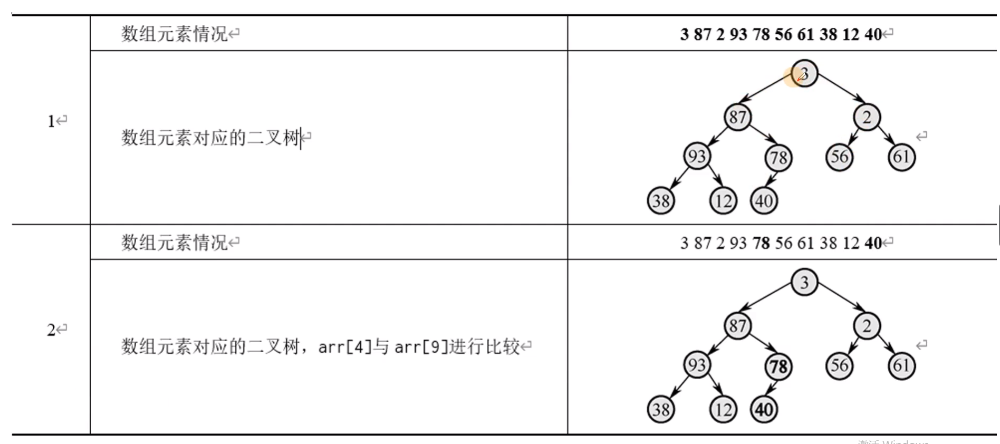

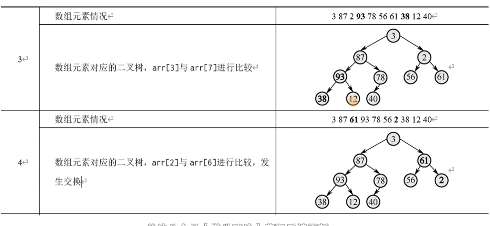

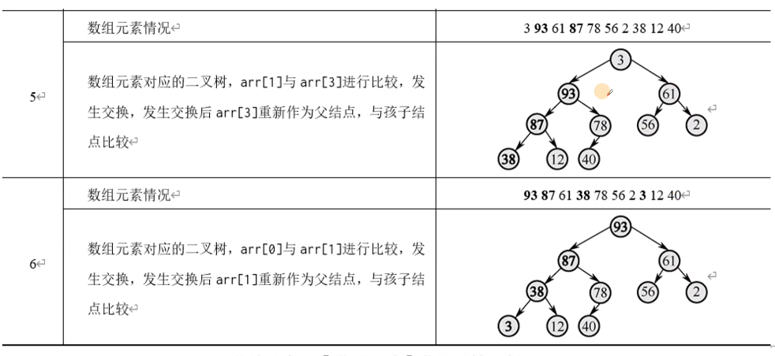

eg.堆排序代码

```
#include <stdio.h>
#include <stdlib.h>
#include <time.h>
#include <string>
typedef int elemType;
typedef struct {
    elemType *elem;//存储元素的起始地址
    int tableLen;//元素个数
}SSTable;

//初始化数组，随机生成10个元素存入数组中
void STInit(SSTable &ST,int len){
    ST.tableLen=len;
    ST.elem=(elemType *)malloc(sizeof (elemType)*ST.tableLen);//申请一块堆空间，当数组用
    srand(time(NULL));//随机数生成，每一次执行代码就会得到随机的10个元素
    for (int i = 0; i < ST.tableLen; ++i) {
        ST.elem[i]=rand()%100;//生成的是0-99之间
    }
}

//打印数组中的元素
void STPrint(SSTable ST){
    for (int i = 0; i < ST.tableLen; ++i) {
        printf("%3d",ST.elem[i]);
    }
    printf("\n");
}

//交换元素
void swap(elemType &a,elemType &b){
    elemType tmp;
    tmp=a;
    a=b;
    b=tmp;
}

//把某个子树调整为大根堆(堆排序的核心)
void adjustDown(elemType A[],int k,int len){
    int dad=k;//父亲的下标
    int son=2*dad+1;//左孩子的下标
    while (son<len){
        if(son+1<len && A[son]<A[son+1]){//如果左孩子小于右孩子
            son++;//拿右孩子
        }
        if(A[son]>A[dad]){//如果孩子大于父亲
            swap(A[son],A[dad]);//交换
            dad=son;//son从新作为dad，去判断下面的子树是否符合大根堆
            son=2*dad+1;
        } else
            break;
    }
}

void heapSort(elemType A[],int len){
    int i;
    //把堆调整为大根堆
    for(i=len/2-1;i>=0;i--){
        adjustDown(A,i,len);
    }
    swap(A[0],A[len-1]);//交换根部元素和最后一个元素
    for (i=len-1;i>1;i--){//i代表的是剩余无序元素数组的长度
        adjustDown(A,0,i);//调整剩余元素为大根堆
        swap(A[0],A[i-1]);//交换根部元素和无序元素数组的最后一个元素
    }
}

int main() {
    SSTable ST;
    STInit(ST,10);
    elemType A[10]={3,87,2,93,78,56,61,38,12,40};
    memcpy(ST.elem,A,sizeof (A));
    STPrint(ST);
    heapSort(ST.elem,10);
    STPrint(ST);
    return 0;
}
```

ie.

```
D:\CLionProjects\CPP\cmake-build-debug\CPP.exe
  3 87  2 93 78 56 61 38 12 40
  2  3 12 38 40 56 61 78 87 93

Process finished with exit code 0
```

$adjustDoown$函数 的循环次数是$\log_2n$,$heapSort$函数的第一个$for$循环了$\frac{n}{2}$次，第二个$for$循环了$n$次，总计$\frac{3}{2}n\log_2n$次，因此时间复杂度是$O(n\log_2n)$

堆排序最好、最坏、平均时间复杂度都是$O(n\log_2n)$

堆排序的空间复杂度是$O(1)$,因为没有使用与n相关的额外空间

## 7.7归并排序

原理:

 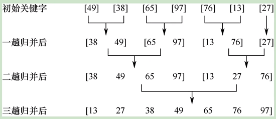

如上图所示，我们把每两个元素归为一组，进行小组内排序，然后再次把两个有序小组合并为一个有序数组，最终合并为一个有序数组。

归并排序的代码采用递归思想实现的。首先，最小下标值和最大下标值相加并除以2，得到中间下标值$mid$,用$MergeSort$对$low$到$mid$排序，然后用$MergeSort$对$mid+1$到$high$排序，当数组的前半部分和后半部分都排序好后，使用$Merge$函数。$Merge$函数的作用是合并两个有序数组。为了提高合并有序数组的效率，在$Merge$函数内定义了$B[N]$。首先，我们通过循环把数组$A$中从$low$到$high$的元素全部复制到$B$中,这时游标$i$(遍历的变量称为游标)从$low$开始，游标$j$从mid+1开始，谁最小就将谁先放入数组$A$,对其游标加$1$，并在每轮循环时对数组$A$的计数游标$k$加$1$

eg.归并排序代码

```
#include <stdio.h>
#include <stdlib.h>
#include <time.h>
#include <string>
#define N 7
typedef int elemType;

//合并两个有序数组
void Merge(elemType A[],int low,int mid,int high){
    static elemType B[N];//加static的目的是无论递归调用多少次，都只有一个B[N]
    int i,j,k;
    for (i=low;i<=high;i++){//把A[i]里面的每个元素给B[i]
        B[i]=A[i];
    }
    k=low;
    for (i=low,j=mid+1;i<=mid&&j<=high;k++){//合并两个有序数组
        if(B[i]<B[j])
            A[k]=B[i++];
        else
            A[k]=B[j++];
    }
    //把某一个有序数组的剩余元素放进来
    while (i<=mid)//前一半的有剩余元素放入
        A[k++]=B[i++];
    while (j<=high)//后一半的有剩余元素放入
        A[k++]=B[j++];
}

void MergeSort(elemType A[],int low,int high){//递归分割
    if(low<high){
        int mid=(low+high)/2;
        MergeSort(A,low,mid);//排序好前一半
        MergeSort(A,mid+1,high);//排序好后一半
        Merge(A,low,mid,high);//将两个排序好的数组合并
    }
}

void print(int* a){
    for (int i = 0; i < N; ++i) {
        printf("%3d",a[i]);
    }
    printf("\n");
}

//归并排序的空间复杂度是O[N]
int main() {
    int A[7]={49,38,65,97,76,13,27};
    MergeSort(A,0,6);
    print(A);
    return 0;
}
```

ie.

```
D:\CLionProjects\CPP\cmake-build-debug\CPP.exe
 13 27 38 49 65 76 97

Process finished with exit code 0
```

$MergeSort$函数的递归次数是$\log_2n$,$Merge$函数的循环了$n$次，因此时间复杂度是$O(n\log_2n)$。

归并排序最好，最坏，平均时间复杂度都是$O(n\log_2n)$。

归并排序的空间复杂度是$O(n)$因为使用了数组$B$,它的大小与$A$一样，占用$n$个元素的空间

## 7.8所有排序的时间复杂度与空间复杂度汇总

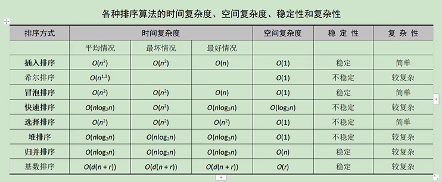

稳定性是指排序前后，相等的元素位置是否会交换

复杂度是指代码编写的难度
