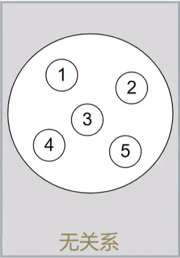
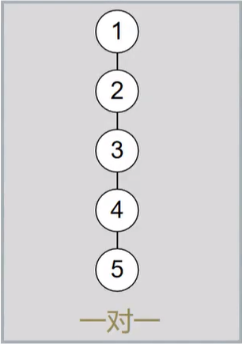
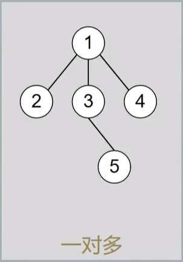
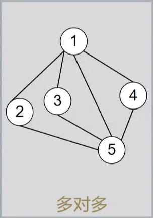
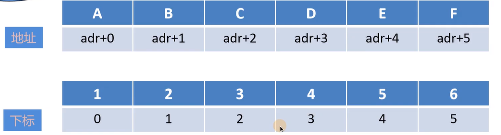
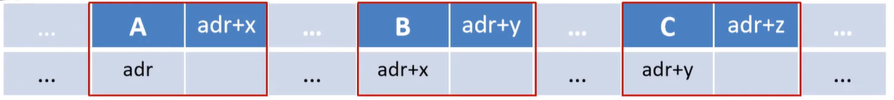
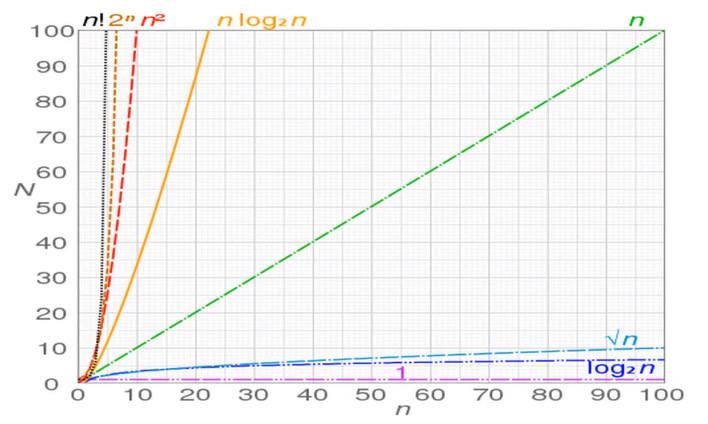

# 1、逻辑结构与存储结构

## 1.1、概念

1.逻辑结构:数据元素之间的逻辑关系(抽象的)(对人友好)

2.存储结构:数据结构在计算机中的表现(具体的)(对计算机友好)

## 1.2、逻辑结构分类

1.<font size=5 color=red>集合结构</font>



2.<font size=5 color=red>线性结构</font>



3.<font size=5 color=red>树型结构</font>：可以有无数个孩子，但是只能有一个父亲



4.<font size=5 color=red>图形结构</font>



## 1.3、存储结构分类

1.<font size=5 color=red>顺序存储</font>



eg.C语言实现

```
int array[6]={1,2,3,4,5,6};//定义数组并初始化printf("%d\n",array[3]);//随机访问第四个元素
```

2.<font size=5 color=red>链式存储</font>



eg.C语言实现

```
typedef struct Lnode{
    int data;
    struct Lnode *next;
}Lnode,*LinkList;
Lnode *L;
    L=(LinkList) malloc(sizeof(Lnode));
    A->next=B;
    B->next=C;
```

3.<font size=5 color=red>索引存储</font>

4.<font size=5 color=red>散列存储</font>

<font size=5 color=red>注:索引和散列都是用顺序存储和链式存储实现的，计算机中任何逻辑结构都只能用顺序和链式实现</font>

顺序存储与链式存储分析

| 优缺点 | 顺序存储                                      |                           链式存储                           |
| ------ | :-------------------------------------------- | :----------------------------------------------------------: |
| 优点   | 1.可实现随机存储<br/>2.每个元素占用最少的空间 |            充分利用所有存储单元，不会出现碎片现象            |
| 缺点   | 只能使用整块的存储单元，会产生较多的碎片      | 1.需要额外的存储空间用来存放下一结点的指针<br/>2.只能实现顺序存取 |

# 2、时间复杂度与空间复杂度

## 2.1算法的定义

### 2.1.1定义：对特定问题求解步骤的描述

### 2.1.2特性：有穷性、确定性、可行性、输入性、输出性

## 2.2时间复杂度

### 2.2.1定义：时间复杂度指算法中所有语句的频度(执行次数)之和

记为：
$$
T(n)=O(f(n))
$$
其中，n是问题的规模；f(n)是问题规模n下某个函数

<font size=5 color=red>表示随着问题规模n的增大，算法执行时间的增长率和f(n)的增长率相同</font>

2.2.2常见的时间复杂度
$$
O(1)<O(\log_2n)<O(n)<O(n\log_2n)<O(n^2)<O(n^3)<O(2^n)<O(n!)
$$
<font size=5 color=red>最高阶数越小，说明算法的时间性能越好</font>



eg.如果一个算法的执行次数为$3n^3+5n$，那么该算法的时间复杂度为多少

ie.是$O(n^3)$,因为时间复杂度计算忽略高阶项系数和低阶项

## 2.3空间复杂度

### 2.3.1定义：空间复杂度是S(n)指算法运行过程中所使用的辅助空间的大小

记为：
$$
S(n)=O(f(n))
$$
1.除了需要存储算法本身的指令、常数、变量和输入的数据外，还需要存储对数据操作的存储单元

2.若输入数据所占空间只取决于问题本身，和算法无关，这样只需要分析该算法在实现时所需的辅助单元即可

3.算法原地工作是指算法所需的辅助空间是常量，即O(1)

空间复杂度O(1):n个元素数组排序，不使用额外的空间(随着n的增长而增长的空间叫额外空间)，空间复杂度就是O(1)
