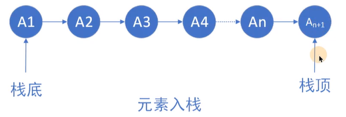

# 1、逻辑结构与存储结构

## 1.1、概念

1.逻辑结构:数据元素之间的逻辑关系(抽象的)(对人友好)

2.存储结构:数据结构在计算机中的表现(具体的)(对计算机友好)

## 1.2、逻辑结构分类

1.<font size=5 color=red>集合结构</font>


2.<font size=5 color=red>线性结构</font>


3.<font size=5 color=red>树型结构</font>：可以有无数个孩子，但是只能有一个父亲


4.<font size=5 color=red>图形结构</font>


## 1.3、存储结构分类

1.<font size=5 color=red>顺序存储</font>


eg.C语言实现

```
int array[6]={1,2,3,4,5,6};//定义数组并初始化printf("%d\n",array[3]);//随机访问第四个元素
```

2.<font size=5 color=red>链式存储</font>


eg.C语言实现

```
typedef struct Lnode{
    int data;
    struct Lnode *next;
}Lnode,*LinkList;
Lnode *L;
    L=(LinkList) malloc(sizeof(Lnode));
    A->next=B;
    B->next=C;
```

3.<font size=5 color=red>索引存储</font>

4.<font size=5 color=red>散列存储</font>

<font size=5 color=red>注:索引和散列都是用顺序存储和链式存储实现的，计算机中任何逻辑结构都只能用顺序和链式实现</font>

顺序存储与链式存储分析

| 优缺点 | 顺序存储                                      |                           链式存储                           |
| ------ | :-------------------------------------------- | :----------------------------------------------------------: |
| 优点   | 1.可实现随机存储<br/>2.每个元素占用最少的空间 |            充分利用所有存储单元，不会出现碎片现象            |
| 缺点   | 只能使用整块的存储单元，会产生较多的碎片      | 1.需要额外的存储空间用来存放下一结点的指针<br/>2.只能实现顺序存取 |

# 2、时间复杂度与空间复杂度

## 2.1算法的定义

### 2.1.1定义：对特定问题求解步骤的描述

### 2.1.2特性：有穷性、确定性、可行性、输入性、输出性

## 2.2时间复杂度

### 2.2.1定义：时间复杂度指算法中所有语句的频度(执行次数)之和

记为：
$$
T(n)=O(f(n))
$$
其中，n是问题的规模；f(n)是问题规模n下某个函数

<font size=5 color=red>表示随着问题规模n的增大，算法执行时间的增长率和f(n)的增长率相同</font>

2.2.2常见的时间复杂度
$$
O(1)<O(\log_2n)<O(n)<O(n\log_2n)<O(n^2)<O(n^3)<O(2^n)<O(n!)
$$
<font size=5 color=red>最高阶数越小，说明算法的时间性能越好</font>


eg.如果一个算法的执行次数为$3n^3+5n$，那么该算法的时间复杂度为多少

ie.是$O(n^3)$,因为时间复杂度计算忽略高阶项系数和低阶项

## 2.3空间复杂度

### 2.3.1定义：空间复杂度是S(n)指算法运行过程中所使用的辅助空间的大小

记为：
$$
S(n)=O(f(n))
$$
1.除了需要存储算法本身的指令、常数、变量和输入的数据外，还需要存储对数据操作的存储单元

2.若输入数据所占空间只取决于问题本身，和算法无关，这样只需要分析该算法在实现时所需的辅助单元即可

3.算法原地工作是指算法所需的辅助空间是常量，即O(1)

空间复杂度O(1):n个元素数组排序，不使用额外的空间(随着n的增长而增长的空间叫额外空间)，空间复杂度就是O(1)

# 3、线性表（<font color=red>逻辑结构</font>）

## 3.1线性表

### 3.1.1定义：

由$n(n\leq0)$个相同类型的元素组成的有序集合。
$$
L=(a_1,a_2,\cdots,a_{i-1},a_i,a_{i+1},\cdots,a_n)
$$
1.线性表中的元素个数n，称为线性表的长度，当n=0时，为空表。

2.$a_1$是唯一的"第一个"数据元素，$a_n$是唯一的"最后一个"数据元素

3.$a_{i-1}$为$a_i$的直接<font size=5 color=red>前驱</font>,$a_{i+1}$为$a_i$的直接<font size=5 color=red>后继</font>

### 3.1.2线性表的特点：

1.表中元素 的个数是<font size=5 color=red>有限</font>的

2.表中元素的<font size=5 color=red>数据类型都相同</font>。意味着每一个元素占用相同大小的空间

3.表中元素具有逻辑上的<font size=5 color=red>顺序性</font>，在序列中各元素排序有其先后顺序

## 3.2线性表的顺序表示（<font color=red>顺序表</font>）

###  3.2.1顺序表的特点

逻辑上相邻的两个元素在物理位置上也相邻

顺序表的定义:

```
#define maxSize 50//定义线性表的长度
typedef struct {
    ElemType data[maxSize];//顺序表的元素
    int len;//顺序表的当前长度
}sqList;//顺序表的类型定义
```

优缺点:

| 优点                                                     | 缺点                                       |
| -------------------------------------------------------- | ------------------------------------------ |
| 可以随机存取(根据表头元素地址和元素序号)表中任意一个元素 | 插入和删除操作需要移动大量元素             |
| 存储密度高，每个结点只存储数据元素                       | 线性表变化较大时，难以确定存储空间的容量   |
|                                                          | 存储分配需要一整段连续的存储空间，不够灵活 |

### 3.2.2线性表插入操作

最好情况：在表尾插入元素，不需要移动元素，时间复杂度为$O(1)$

最坏情况：在表头插入元素，所有元素依次后移，时间复杂度为$O(n)$

平均情况：在插入位置概率均等的情况下，平均移动元素的次数为$n/2$,时间复杂度为O(n)

eg.

```
//判断插入位置i是否合法(满足1<=i<=len+1)
    //判断存储空间是否已满(即插入x后是否会超出数组长度)
    for (int j = L.len; j >=i ; j--) //将最后一个元素到第i个元素依次后移一位
        L.data[j]=L.data[j-1];
    L.data[i-1]=x;//空出的位置i放入x
    L.len++;//线性表长度加1
```

### 3.2.3线性表删除操作

最好情况：删除表尾元素，不需要移动元素，时间复杂度为$O(1)$ 

最坏情况：删除表头元素，之后的所有元素依次前移，时间复杂度为$O(n)$

平均情况：在删除位置概率均等的情况下，平均移动元素的次数为$n/2$,时间复杂度为O(n)

eg.

```
//判断删除位置i是否合法(满足1<=i<=len+1)
    e=L.data[i-1];//将被删除的元素赋值给e
    for (int j = i; j <L.len ; j++) //将删除位置后的元素依次前移
        L.data[j-1]=L.data[j];
    L.len--;//线性表长度减1
```

### 3.2.4顺序表插入删除实战代码

eg.插入删除及查找

```
#include <stdio.h>
#include <stdlib.h>

#define maxSize 50
typedef int ElemType;//让顺序表存储其他类型元素时，可以快速完成代码修改
typedef struct {
    ElemType data[maxSize];
    int len;//顺序表长度
}sqList;
//顺序表的插入，因为L会改变，因此我们这里要引用,i是插入的位置
bool ListInsert(sqList &L,int i,ElemType elemType){
    //判断i是否合法
    if(1>i||i>L.len+1){
        return false;
    }
    //如果存储空间满了，不能插入
    if(L.len==maxSize){
        return false;
    }
    //把后面的元素依次往后移动，空出位，放入要插入的元素
    for(int j=L.len;j>=i;j--){
        L.data[j]=L.data[j-1];
    }
    L.data[i-1]=elemType;//放入要插入的元素
    L.len++;//顺序表长度加1
    return true;
}
//打印顺序表
void PrintList(sqList L){
    for (int i = 0; i < L.len; ++i) {
        printf("%3d",L.data[i]);
    }
}
//删除顺序表中的元素,i是要删除的元素的位置，del是为了获取被删除的元素的值
bool ListDelete(sqList &L,int i,ElemType &del){
    //判断删除的元素的位置是否合法
    if(i<1||i>L.len)
        return false;
    del=L.data[i-1];//首先保存要删除元素的值
    for (int j = i-1; j <L.len ; ++j)
        L.data[j-1]=L.data[j];
    L.len--;
    return true;

}
//查找某个元素的位置，找到了就返回对应位置，没找到就就返回0
int LocateElem(sqList L,ElemType elemType){
    for (int i = 0; i < L.len; ++i) {
        if(elemType==L.data[i])
            return i+1;
    }
    return 0;
}
int main() {
    sqList L;//定义一个顺序表
    bool ret;//ret用来装函数的返回值
    L.data[0]=1;//放入元素
    L.data[1]=2;
    L.data[2]=3;
    L.len=3;//设置长度
    ElemType del;//删除的元素存入del中
    int pos;//存储元素位置
    for (int i = 0; i < L.len; ++i) {
        printf("%3d",L.data[i]);
    }
    printf("\n");
    ret =ListInsert(L,2,60);
    if(ret){
        printf("insert sqList success\n");
        PrintList(L);
    } else
        printf("insert sqList failed\n");
    printf("\n");
    ret =ListDelete(L,1,del);
    if(ret){
        printf("delete sqList success\n");
        printf("delete element=%d\n",del);
        PrintList(L);
    } else
        printf("delete sqList failed\n");
    pos=LocateElem(L,60);
    if(pos){
        printf("find this element\n");
        printf("element pos=%d\n",pos);
    } else{
        printf("find this element\n");
    }
    return 0;
}
```

ie.

```
D:\CLionProjects\CPP\cmake-build-debug\CPP.exe
  1  2  3
insert sqList success
  1 60  2  3
delete sqList success
delete element=1
 60  2  3find this element
element pos=1

Process finished with exit code 0
```

## 3.3线性表的链式表示（<font color=red>链表</font>）

### 3.3.1单链表结点的定义

```
typedef struct LNote{//单链表结点类型
    ElemType data;//数据域
    struct LNote *next;//指针域
}LNote,*LinkList;
```

头指针：链表中第一个结点的<font color=red size=5>存储位置</font>，用来标识单链表

头结点：在单链表第一个结点之间附加的一个结点，为了操作上的方便

<font color=red size=5>若链表有头结点，则头指针永远指向头结点，不论链表是否为空，头指针均不为空，头指针是链表的必须元素，他标识一个链表。头直接点是为了操作的方便而设立的，其数据域一般为空，或者存放链表的长度。有头节点后，对在第一结点前插入和删除第一结点的操作就统一了，不需要频繁重置头指针。但头结点不是必须的。</font>

| 优点                                         | 缺点                                               |
| -------------------------------------------- | -------------------------------------------------- |
| 插入和删除操作不需要移动元素，只需要修改指针 | 单链表附加指针域，也存在浪费存储空间的缺点         |
| 不需要大量的连续存储空间                     | 查找操作时需要从头开始便利，依次查找，不能随机存取 |

eg.创建新结点

```
q= (LNote*)malloc(sizeof(LNote));//创建新结点
q->data=x;
```

eg.表头及中间插入元素

```
q->next=p->next;
p->next=q;
```

eg.表尾插入元素

```
p->next=q;
q->next=NULL;
```

eg.表头、中间及表尾删除元素

```
q=p->next;
p->next=q->next;
free(q);
```

eg.按序号查找结点值

```
LNote *p=L.next;
int j=1;
while (p&&j<i){
    p=p->next;
    j++;
}
return p;
```

eg.按值查找结点

```
LNote *p=L->next;
while (p!=NULL&&p->data!=e){
    p=p->next;
}
returen p;
```

## 3.4头插法新建链表

eg.

```
#include <stdio.h>
#include <stdlib.h>

#define maxSize 50
typedef int ElemType;//让顺序表存储其他类型元素时，可以快速完成代码修改
typedef struct LNode{
    ElemType data;//数据域
    struct LNode *next;//指针域
}LNode,*LinkList;
//LNode*是结构体指针，和LinkList完全等价的
void list_head_insert(LinkList &L){//头插法新建链表
    L=(LinkList) malloc(sizeof (LNode));//申请头结点空间，头指针指向头结点
    L->next=NULL;
    ElemType x;
    scanf("%d",&x);
    LNode *s;//用来指向申请的新结点
    while (x!=9999){
        scanf("%d",&x);
        s=(LinkList) malloc(sizeof(LNode));
        s->data=x;
        s->next=L->next;//s的next指向原本链表的第一个结点
        L->next=s;//头结点的next，指向新结点
    }
}
void print_list(LinkList L){//链表打印
    L=L->next;
    while (L!=NULL){
        printf("data=%d,next=%p。",L->data,L->next);
        L=L->next;
    }
}
int main() {
    LinkList L;//L是链表头指针，是结构体指针类型
    list_head_insert(L);
    print_list(L);
    return 0;
}
```

ie.

```
D:\CLionProjects\CPP\cmake-build-debug\CPP.exe
1 2 3 4 5 9999
data=9999,next=00000000001f4d70。data=5,next=00000000001f4d30。data=4,next=00000000001f4cf0。data=3,next=00000000001f4cb0。data=2,next=0000000000000000。
Process finished with exit code 0
```

## 3.5尾插法新建链表

eg.

```
#include <stdio.h>
#include <stdlib.h>

#define maxSize 50
typedef int ElemType;//让顺序表存储其他类型元素时，可以快速完成代码修改
typedef struct LNode{
    ElemType data;
    struct LNode *next;//指向下一个结点
}LNode,*LinkList;
void lest_tail_insert(LinkList &L){//尾插法新建链表
    L=(LinkList) malloc(sizeof (LNode));
    L->next=NULL;
    ElemType x;
    scanf("%d",&x);
    LNode *s,*r=L;//s是指向申请的新结点，r始终指向链表尾部
    while (x!=9999){
        s=(LinkList) malloc(sizeof (LNode));//为新结点申请空间
        s ->data=x;
        r->next=s;//新结点给尾结点的next指针
        r=s;//r要指向新的尾部
        scanf("%d",&x);
    }
    r->next=NULL;//让尾结点的next为NULL
}
void print_list(LinkList L){//链表打印
    L=L->next;
    while (L!=NULL){
        printf("data=%d,next=%p。",L->data,L->next);
        L=L->next;
    }
}
int main() {
    LinkList L;//L是链表头指针，是构造体指针类型
    lest_tail_insert(L);
    print_list(L);
    return 0;
}
```

ie.

```
D:\CLionProjects\CPP\cmake-build-debug\CPP.exe
1 2 3 4 5 9999
data=1,next=00000000006b4cf0。data=2,next=00000000006b4d30。data=3,next=00000000006b4d70。data=4,next=00000000006b4db0。data=5,next=0000000000000000。
Process finished with exit code 0
```

## 3.6按位置查找数据和按值查找

eg.按位置查找

```
#include <stdio.h>
#include <stdlib.h>

#define maxSize 50
typedef int ElemType;//让顺序表存储其他类型元素时，可以快速完成代码修改
typedef struct LNode{
    ElemType data;
    struct LNode *next;//指向下一个结点
}LNode,*LinkList;
void lest_tail_insert(LinkList &L){//尾插法新建链表
    L=(LinkList) malloc(sizeof (LNode));
    L->next=NULL;
    ElemType x;
    scanf("%d",&x);
    LNode *s,*r=L;//s是指向申请的新结点，r始终指向链表尾部
    while (x!=9999){
        s=(LinkList) malloc(sizeof (LNode));//为新结点申请空间
        s ->data=x;
        r->next=s;//新结点给尾结点的next指针
        r=s;//r要指向新的尾部
        scanf("%d",&x);
    }
    r->next=NULL;//让尾结点的next为NULL
}
void print_list(LinkList L){//链表打印
    L=L->next;
    while (L!=NULL){
        printf("%3d",L->data);
        L=L->next;
    }
    printf("\n");
}
LinkList GetElem(LinkList L,int pos){//按位置查找
    if(pos==0)
        return L;
    if(pos<0)
        return NULL;
    int i=0;
    while (L&&i<pos){//L!=NULL等价于L
        L=L->next;
        i++;
    }
    return L;
}
int main() {
    LinkList L;//L是链表头指针，是构造体指针类型
    LinkList search;//用来存储拿到的某一个结点
    lest_tail_insert(L);
    print_list(L);
    search=GetElem(L,2);
    if(search!=NULL){
        printf("Succeeded in searching by serial number\n");
        printf("%d\n",search->data);
    }
    return 0;
}
```

ie.

```
D:\CLionProjects\CPP\cmake-build-debug\CPP.exe
1 2 3 4 5 9999
  1  2  3  4  5
Succeeded in searching by serial number
2

Process finished with exit code 0
```

eg.按值查找

```
#include <stdio.h>
#include <stdlib.h>

#define maxSize 50
typedef int ElemType;//让顺序表存储其他类型元素时，可以快速完成代码修改
typedef struct LNode{
    ElemType data;
    struct LNode *next;//指向下一个结点
}LNode,*LinkList;
void lest_tail_insert(LinkList &L){//尾插法新建链表
    L=(LinkList) malloc(sizeof (LNode));
    L->next=NULL;
    ElemType x;
    scanf("%d",&x);
    LNode *s,*r=L;//s是指向申请的新结点，r始终指向链表尾部
    while (x!=9999){
        s=(LinkList) malloc(sizeof (LNode));//为新结点申请空间
        s ->data=x;
        r->next=s;//新结点给尾结点的next指针
        r=s;//r要指向新的尾部
        scanf("%d",&x);
    }
    r->next=NULL;//让尾结点的next为NULL
}
void print_list(LinkList L){//链表打印
    L=L->next;
    while (L!=NULL){
        printf("%3d",L->data);
        L=L->next;
    }
    printf("\n");
}
LinkList LocateElem(LinkList L,ElemType value){//按值查询
    while (L){
        if(L->data==value)
            return L;
        L=L->next;
    }
    return NULL;
}
int main() {
    LinkList L;//L是链表头指针，是构造体指针类型
    LinkList search;//用来存储拿到的某一个结点
    lest_tail_insert(L);
    print_list(L);
    search=LocateElem(L,6);
    if(search!=NULL){
        printf("Search by value succeeded\n");
        printf("%d\n",search->data);
    }
    return 0;
}
```

ie.

```
D:\CLionProjects\CPP\cmake-build-debug\CPP.exe
1 6 2 7 9 0 9999
  1  6  2  7  9  0
Search by value succeeded
6

Process finished with exit code 0
```

## 3.7在第i个位置插值

eg.

```
#include <stdio.h>
#include <stdlib.h>

#define maxSize 50
typedef int ElemType;//让顺序表存储其他类型元素时，可以快速完成代码修改
typedef struct LNode{
    ElemType data;
    struct LNode *next;//指向下一个结点
}LNode,*LinkList;
void lest_tail_insert(LinkList &L){//尾插法新建链表
    L=(LinkList) malloc(sizeof (LNode));
    L->next=NULL;
    ElemType x;
    scanf("%d",&x);
    LNode *s,*r=L;//s是指向申请的新结点，r始终指向链表尾部
    while (x!=9999){
        s=(LinkList) malloc(sizeof (LNode));//为新结点申请空间
        s ->data=x;
        r->next=s;//新结点给尾结点的next指针
        r=s;//r要指向新的尾部
        scanf("%d",&x);
    }
    r->next=NULL;//让尾结点的next为NULL
}
void print_list(LinkList L){//链表打印
    L=L->next;
    while (L!=NULL){
        printf("%3d",L->data);
        L=L->next;
    }
    printf("\n");
}
LinkList GetElem(LinkList L,int pos){//按位置查找
    if(pos==0)
        return L;
    if(pos<0)
        return NULL;
    int i=0;
    while (L&&i<pos){//L!=NULL等价于L
        L=L->next;
        i++;
    }
    return L;
}
bool ListFrontInsert(LinkList &L,int i,ElemType value){//在第i个位置插值
    LinkList p= GetElem(L,i-1);
    if(NULL==p)
        return false;
    LinkList q= (LinkList)malloc(sizeof (LNode));
    q ->data=value;
    q->next=p->next;
    p->next=q;
    return true;
}
int main() {
    LinkList L;//L是链表头指针，是构造体指针类型
    LinkList search;//用来存储拿到的某一个结点
    lest_tail_insert(L);
    print_list(L);
    ListFrontInsert(L,2,99);
    print_list(L);
    return 0;
}
```

ie.

```
D:\CLionProjects\CPP\cmake-build-debug\CPP.exe
3 4 5 6 7 9999
  3  4  5  6  7
  3 99  4  5  6  7

Process finished with exit code 0
```

## 3.8删除第i个位置的元素

eg.

```
#include <stdio.h>
#include <stdlib.h>

#define maxSize 50
typedef int ElemType;//让顺序表存储其他类型元素时，可以快速完成代码修改
typedef struct LNode{
    ElemType data;
    struct LNode *next;
}LNode,*LinkList;

void lest_tail_insert(LinkList &L){//尾插法新建链表
    L=(LinkList) malloc(sizeof (LNode));
    L->next=NULL;
    ElemType x;
    scanf("%d",&x);
    LNode *s,*r=L;//s是指向申请的新结点，r始终指向链表尾部
    while (x!=9999){
        s=(LinkList) malloc(sizeof (LNode));//为新结点申请空间
        s ->data=x;
        r->next=s;//新结点给尾结点的next指针
        r=s;//r要指向新的尾部
        scanf("%d",&x);
    }
    r->next=NULL;//让尾结点的next为NULL
}
void print_list(LinkList L){//链表打印
    L=L->next;
    while (L!=NULL){
        printf("%3d",L->data);
        L=L->next;
    }
    printf("\n");
}
LinkList GetElem(LinkList L,int pos){//按位置查找
    if(pos==0)
        return L;
    if(pos<0)
        return NULL;
    int i=0;
    while (L&&i<pos){//L!=NULL等价于L
        L=L->next;
        i++;
    }
    return L;
}

//删除第i个位置的元素
bool ListDelete(LinkList L,int i){//删除时L是不会变的所以不需要加引用
    LinkList p= GetElem(L,i-1);//拿到要删除结点的前一个结点地址
    if(NULL==p)
        return false;
    LinkList q=p->next;//拿到要删除的结点指针
    p->next=q->next;//断链
    free(q);//释放被删除结点的空间
    return true;
}

int main() {
    LinkList L;
    lest_tail_insert(L);
    print_list(L);
    ListDelete(L,4);
    print_list(L);
    return 0;
}
```

ie.

```
D:\CLionProjects\CPP\cmake-build-debug\CPP.exe
2 3 4 5 6 9999
  2  3  4  5  6
  2  3  4  6

Process finished with exit code 0
```

# 4、栈与队列

## 4.1栈(Stack)

### 4.1.1定义：栈:只允许在一端(栈顶TOP)进行插入或删除操作的线性表(先进后出)

### 4.1.2栈的基本操作:




eg.栈的定义及初始化入栈

```
typedef struct {//栈定义
    ElemType data[50];
    int top;
}SqStack;


int main() {
    SqStack s;
    s.top=-1;
    s.data[++s.top]=4;
    return 0;
}
```

<font color="red">[注]前加加，先做加1，然后再去做其他的操作</font>

eg.出栈

```
x=s.data[s.top--]
```

eg.定义栈$\implies$初始化栈$\implies$判断栈是否为空$\implies$元素入栈$\implies$获取栈顶元素$\implies$弹栈流程

```
#include <stdio.h>
#include <stdlib.h>

#define maxSize 50
typedef int ElemType;//让顺序表存储其他类型元素时，可以快速完成代码修改

typedef struct {//栈定义
    ElemType data[maxSize];//数组，存放栈的元素
    int top;//始终指向栈顶的一个变量
}SqStack;

//初始化栈
void InitStack(SqStack &s){
    s.top=-1;//初始化栈，就是s.top=-1,让栈为空
}

//判断栈是否为空
bool StackEmpty(SqStack s){
    if(-1==s.top){
        return true;
    } else{
        return false;
    }
}

//入栈接口
bool Push(SqStack &s,ElemType x){
    //判断栈是否满了
    if(s.top==maxSize-1){
        return false;
    } else{
        s.data[++s.top]=x;
        return true;
    }
}

//获取栈顶元素
bool GetTop(SqStack s,ElemType &m){
    if(StackEmpty(s)){
        return false;
    }
    m=s.data[s.top];//拿栈顶元素；
    return true;
}

//弹出栈顶元素
bool Pop(SqStack &s,ElemType &m){
    if(StackEmpty(s)){
        return false;
    }
    m=s.data[s.top--];//出栈
    return true;
}


int main() {
    SqStack s;
    InitStack(s);//初始化栈
    bool flag;
    flag=StackEmpty(s);//判断栈是否为空
    if(flag){
        printf("stack is empty\n");
    }
    Push(s,3);//元素入栈
    Push(s,4);
    Push(s,5);
    ElemType m;
    flag=GetTop(s,m);//获取栈顶元素
    if(flag){
        printf("get top %d\n",m);
    }
    Pop(s,m);//弹出栈顶元素(弹栈)
    if(flag){
        printf("pop top %d\n",m);
    }
    flag=GetTop(s,m);//获取栈顶元素
    if(flag){
        printf("get top %d\n",m);
    }
    return 0;
}
```

ie.

```
D:\CLionProjects\CPP\cmake-build-debug\CPP.exe
stack is empty
get top 5
pop top 5
get top 4

Process finished with exit code 0
```

## 4.2队列(Queue)

### 4.2.1定义:队列(Queue)简称队，也是一种操作受限的<font color="red">线性表</font>，只允许在表的一端进行插入，而在表的另一端进行删除。向队列中插入元素称为入队或进队，删除元素称为出队和离队。<font color="red">FIFO</font>

队头(Front)。允许删除的一端，又称队首。

队尾(Rear)。允许插入的一端。


<font color="red">特性是先进先出(First In First Out,FIFO)</font>

### 4.2.2循环队列

eg.循环队列定义

```
typedef struct {//循环队列定义
    ElemType data[maxSize];//数组，存储maxSize-1个元素
    int front,rear;//队列头,队列尾
}SqQueue;


int main() {
    SqQueue Q;
    return 0;
}
```


$$
[注](Q.rear+1) \% MaxSize==Q.front来判断队列是否存满，Q.rear==Q.front来判断队列是否为空
$$
eg.循环队列定义及入队出队

```
#include <stdio.h>
#include <stdlib.h>

#define maxSize 5
typedef int ElemType;//让顺序表存储其他类型元素时，可以快速完成代码修改

typedef struct {//循环队列定义
    ElemType data[maxSize];//数组，存储maxSize-1个元素
    int front,rear;//队列头,队列尾
}SqQueue;

//循环队列入队
bool EnQueue(SqQueue &Q,ElemType x){
    if((Q.rear+1)%maxSize==Q.front)//判断是否队满
        return false;
    Q.data[Q.rear]=x;//放入元素
    Q.rear=(Q.rear+1)%maxSize;//改变队尾标记
    return true;
}

//循环队列出队
bool DeQueue(SqQueue &Q,ElemType &x){
    if(Q.rear==Q.front)
        return false;
    x=Q.data[Q.front];//先进先出
    Q.front=(Q.front+1)%maxSize;
    return true;
}

int main() {
    SqQueue Q;
    ElemType m;
    m=3;
    EnQueue(Q,m);
    DeQueue(Q,m);
    return 0;
}
```

eg.循环队列初始化$\implies$判断循环队列是否为空$\implies$循环队列入队$\implies$循环队列出队流程

```
#include <stdio.h>
#include <stdlib.h>

#define maxSize 5
typedef int ElemType;//让顺序表存储其他类型元素时，可以快速完成代码修改
typedef struct {//循环队列定义
    ElemType data[maxSize];//数组，存储maxSize-1个元素
    int front,rear;//队列头,队列尾
}SqQueue;

//初始化循环队列
void InitQueue(SqQueue &Q){
    Q.front=Q.rear=0;//初始化循环队列，即使让头和尾都指向0号

}

//判断队列是否为空
bool IsEmpty(SqQueue Q){
    return Q.rear==Q.front;
}

//循环队列入队
bool EnQueue(SqQueue &Q,ElemType x){
    if((Q.rear+1)%maxSize==Q.front){//判断循环队列是否满了，满了就不能入队了
        return false;
    }
    Q.data[Q.rear]=x;//放入元素
    Q.rear=(Q.rear+1)%maxSize;//rear要加1，如果大于数组的最大下标，回到开头
    return true;
}

//循环队列出队
bool DnQueue(SqQueue &Q,ElemType &x){
    if(IsEmpty(Q)){//队列为空，无法出队
        return false;
    }
    x=Q.data[Q.front];//出队
    Q.front=(Q.front+1)%maxSize;
    return true;
}

int main() {
    SqQueue Q;
    InitQueue(Q);
    bool ret;
    ret=IsEmpty(Q);
    if(ret){
        printf("SqQueue is empty\n");
    } else{
        printf("SqQueue is not empty\n");
    }
    for (int i = 3; i <= 7; ++i) {
        ret=EnQueue(Q,i);
        if(ret){
            printf("EnQueue success,EnQueue num is %d\n",i);
        } else{
            printf("EnQueue failed,EnQueue num is %d\n",i);
        }
    }
    ElemType elemType;//存储出队元素
    ret=DnQueue(Q,elemType);
    if(ret){
        printf("DnQueue success\n");
    } else{
        printf("DnQueue failed\n");
    }
    ret=EnQueue(Q,7);
    if(ret){
        printf("EnQueue success\n");
    } else{
        printf("EnQueue failed\n");
    }
    return 0;
}
```

ie.

```
D:\CLionProjects\CPP\cmake-build-debug\CPP.exe
SqQueue is empty
EnQueue success,EnQueue num is 3
EnQueue success,EnQueue num is 4
EnQueue success,EnQueue num is 5
EnQueue success,EnQueue num is 6
EnQueue failed,EnQueue num is 7
DnQueue success
EnQueue success

Process finished with exit code 0
```


## 4.3队列的链式存储

### 4.3.1定义：队列的链式表示称为链队列，它实际上是一个同时<font color="red">带有 队头指针和队尾指针</font>的单链表。头指针指向队头结点，尾指针指向队尾结点，即单链表的最后一个结点。


eg.队列的链式存储定义

```
typedef int ElemType;//让顺序表存储其他类型元素时，可以快速完成代码修改
typedef struct LNode{//顺序表定义
    ElemType data;
    struct LNode *next;
}LNode,*LinkList;

typedef struct {
    LNode *front,*rear;//链表头，链表尾
}LinkQueue;//先进先出
```

<font color="red">相对于原有编写的链表增加了尾指针</font>

eg.队列的链式存储初始化$\implies$入队$\implies$出队流程

```
#include <stdio.h>
#include <stdlib.h>

#define maxSize 5
typedef int ElemType;//让顺序表存储其他类型元素时，可以快速完成代码修改
typedef struct LinkNode{//顺序表定义
    ElemType data;
    struct LinkNode *next;
}LinkNode,*LinkList;

typedef struct {//链表队列定义
    LinkNode *front,*rear;//链表头，链表尾
}LinkQueue;//先进先出

//队列的初始化使用的是带头结点的链表实现的
void InitQueue(LinkQueue &Q){
    Q.front=Q.rear=(LinkNode*)malloc(sizeof(LinkNode));//头和尾指向同一个结点
    Q.front->next=NULL;//头结点的next指针为NULL
}

//入队
void EnQueue(LinkQueue &Q,ElemType x){
    LinkNode *pNew=(LinkNode*)malloc(sizeof(LinkNode));
    pNew->data=x;
    pNew->next=NULL;//要让next为NULL
    Q.rear->next=pNew;//尾指针的next指向pNew,因为从尾部插入
    Q.rear=pNew;//rear要指向新的尾部
}

//出队
bool DnQueue(LinkQueue &Q,ElemType &x){
    if(Q.rear==Q.front){//队列为空
        return false;
    }
    LinkNode *q=Q.front->next;//链表的第一个结点，存入q
    x=q->data;//获取要出队的元素值
    Q.front->next=q->next;//让一个结点断链
    if(Q.rear==q){//链表只剩余一个结点时，被删除后，要改变rear
        Q.rear=Q.front;
    }
    free(q);
    return true;
}

int main() {
    LinkQueue Q;
    InitQueue(Q);
    for (int i = 3; i <= 7; ++i) {
        EnQueue(Q,i);
    }
    ElemType elemType;
    bool ret;
    for (int i = 0; i < 7; ++i) {
        ret=DnQueue(Q,elemType);
        if(ret){
            printf("DnQueue success element=%d\n",elemType);
        } else{
            printf("DnQueue failed\n");
        }
    }
    return 0;
}
```

ie.

```
D:\CLionProjects\CPP\cmake-build-debug\CPP.exe
DnQueue success element=3
DnQueue success element=4
DnQueue success element=5
DnQueue success element=6
DnQueue success element=7
DnQueue failed
DnQueue failed
Process finished with exit code 0
```

