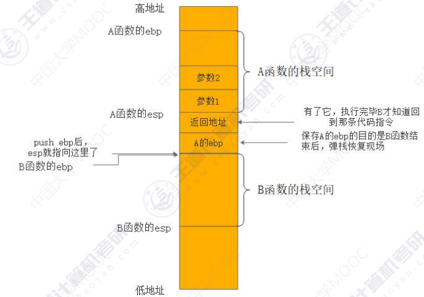
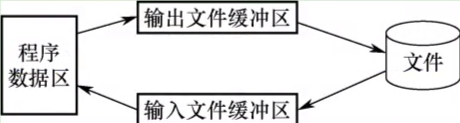
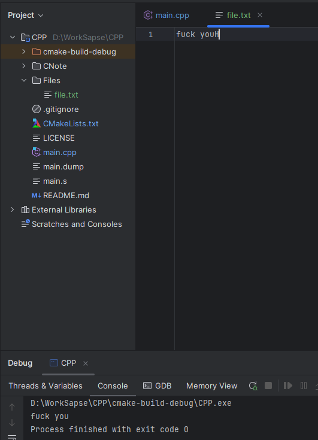
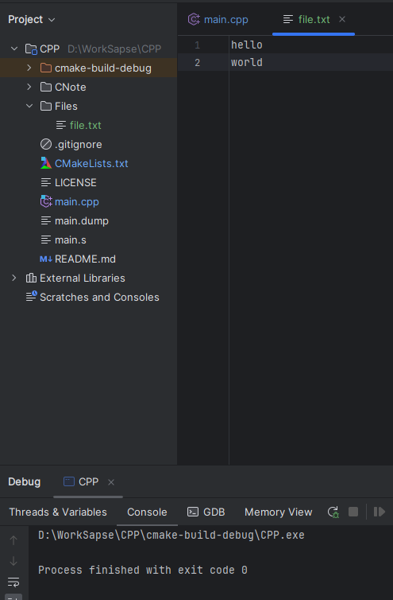
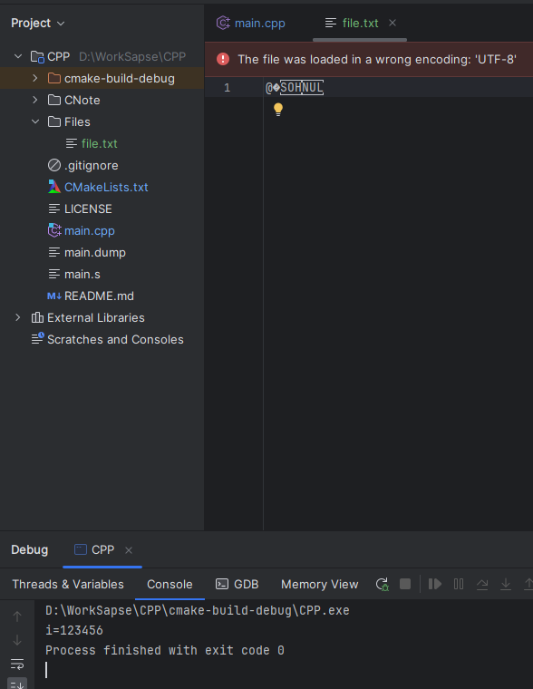

# 1、C语言语法进阶

## 1.1条件运算符

条件运算符是C语言中唯一的一个三目运算符，三目运算符代表有三个操作数。运算符也称为操作符。条件运算符通过判断问号之前的表达式的真假来确定整体表达式的值

eg.

```
#include <stdio.h>
#include <stdlib.h>
#include <time.h>
#include <string>

int main() {
    int a=5,b=10,max;
        max=a>b?a:b;//条件运算符的优先级高于赋值运算符
        printf("max=%d",max);
    return 0;
}
```

ie.

```
D:\CLionProjects\CPP\cmake-build-debug\CPP.exe
max=10
Process finished with exit code 0
```

## 1.2逗号运算符

逗号运算符的优先级最低，逗号表达式的整体值是最后一个表达式的值

eg.

```
#include <stdio.h>
#include <stdlib.h>
#include <time.h>
#include <string>

int main() {
    int i=10,j=1;
    if(i+3,j-1){//逗号表达因为优先级最低，所以它的值是最后一个表达式的值
        printf("if not execute");
    }
    if(i+3,j){//逗号表达因为优先级最低，所以它的值是最后一个表达式的值
        printf("if execute");
    }
    //逗号表达式的常见使用场景，for的表达式1初始化多个变量
    for (i=0,j=1;i<10;i++){
        
    }
    return 0;
}
```

ie.

```
D:\CLionProjects\CPP\cmake-build-debug\CPP.exe
if execute
Process finished with exit code 0
```

## 1.3自增自减运算符

自增、自减运算符和其他运算符有很大的区别，因为其他运算符除赋值运算符可以改变变量本身的值外，不回有这种效果。因为自增、自减会改变变量的值，所以不能用于常量

eg.

```
#include <stdio.h>
#include <stdlib.h>
#include <time.h>
#include <string>

int main() {
    int i=-1,j;
    j=i++>-1;//后++等价于j=i>-1;i=i+1;
    printf("i=%d,j=%d\n",i,j);
    int a=-1,b;
    b=++a>-1;//前++等价于a=a+1;b=(b+1)>-1
    printf("a=%d,b=%d",a,b);
    return 0;
}
```

ie.

```
D:\CLionProjects\CPP\cmake-build-debug\CPP.exe
i=0,j=0
a=0,b=1
Process finished with exit code 0
```

eg.自增自减运算符与取值运算符

```
#include <stdio.h>
#include <stdlib.h>
#include <time.h>
#include <string>

//自增自减运算符与取值运算符结合
int main() {
    int a[3]={3,7,8};
    int *p;
    int j;
    p=a;//p指向数组其实元素
    j=*p++;//先把*p的值赋给j，然后对p加1，等价于语句 j=*p;p++;
    printf("a[0]=%d,j=%d,*p=%d\n",a[0],j,*p);
    j=p[0]++;//先把p[0]赋给j，然后对p[0]加一，等价于语句j=p[0];p[0]++
    printf("a[0]=%d,j=%d,*p=%d",a[0],j,*p);
    return 0;
}
```

ie.

```
D:\CLionProjects\CPP\cmake-build-debug\CPP.exe
a[0]=3,j=3,*p=7
a[0]=3,j=7,*p=8
Process finished with exit code 0
```

## 1.4位运算符

位运算符<<,>>,~,|,^,&依次是左移，右移，按位取反，按位或，按位异或，按位与。位运算符只能用于对整型

数据进行操作

左移:高位丢弃，低位补0，相当于乘以2。工作中很多时候申请内存时会用左移，例如要申请$1GB$大小的空间，可以使用$malloc(1<<30)$

右移:低位丢弃，正数的高位补0(无符号数我们认为时正数)，负数的高位补1，相当于除以2。移位比乘法和除发的效率要高，负数右移，对偶数来说时除以2，但对奇数来说试是先减1，后除以2，例如，$-8>>1$，得到的是$-4$,但$-7>>1$得到的并不是$-3$而是$-4$。另外对于$-1$来说，无论右移多少位，值永远是$-1$。

C语言的左移和右移相当于算数左移与算数右移。考研中的逻辑左移与右移，左移和右移空位都补0。

异或:相同数进行异或时，结果为0，任何数和0异或的结果是其本身。

按位取反:数位上的数是1变0，0变1

按位与和按位或:用两个数的每一位进行与和或

eg.左移

```
#include <stdio.h>
#include <stdlib.h>
#include <time.h>
#include <string>

//位运算符:左移
int main() {
    short i=5;//short是2个字节的整型，int是4个字节
    short j;
    j=i<<1;//一个变量移动以后自身不会变化
    printf("j=%d",j);
    return 0;
}
```

ie.

```
D:\CLionProjects\CPP\cmake-build-debug\CPP.exe
j=10
Process finished with exit code 0
```

解析:
$$
代码输入:十进制:5\\
Clion内存视图:十六进制:00\quad 05\\
实际计算:二进制:0000\quad 0000\quad 0000\quad 0101\\
高位丢弃:000\quad 0000\quad 0000\quad 0101\\
低位补0:0000\quad 0000\quad 0000\quad 1010\\
Clion内存视图:十六进制:0a\quad 00\\
控制台输出:十进制:10
$$
内存视图:


eg.有符号右移

```
#include <stdio.h>
#include <stdlib.h>
#include <time.h>
#include <string>

//位运算符：左移与右移
int main() {
    short i=5;//short是2个字节的整型，int是4个字节
    short j;
    j=i<<1;//一个变量移动以后自身不会变化
    printf("j=%d\n",j);//左移是乘2，结果是10
    j=i>>1;
    printf("j=%d",j);//右移是除以2，结果是2
    return 0;
}
```

ie.

```
D:\CLionProjects\CPP\cmake-build-debug\CPP.exe
j=10
j=2
Process finished with exit code 0
```

解析
$$
代码输入:十进制:5\\
Clion内存视图:十六进制:00\quad 05\\
实际计算:二进制:0000\quad 0000\quad 0000\quad 0101\\
short类型，高位为0，视为正数\\
高位补0:00000\quad 0000\quad 0000\quad 0101\\
低位丢弃:0000\quad 0000\quad 0000\quad 0010\\
Clion内存视图:十六进制:02\quad 00\\
控制台输出:十进制:2
$$
内存视图:


eg.无符号右移

```
#include <stdio.h>
#include <stdlib.h>
#include <time.h>
#include <string>

//位运算符:右移
int main() {
    short i=0x8011,j=0;
    unsigned short s=0x8011;//在short前加unsigned,无符号数是非负数
    unsigned short r=0;
    j=i>>1;//对i右移，对有符号数进行右移
    r=s>>1;//对s右移，对无符号数进行右移
    printf("j=%d,r=%d",j,r);
    return 0;
}
```

ie.

```
D:\CLionProjects\CPP\cmake-build-debug\CPP.exe
j=-16376,r=16392
Process finished with exit code 0
```

解析:
$$
有符号右移:\\
代码输入:i,十六进制:8011\\
Clion内存视图:十六进制:1180(小端)\\
实际计算:二进制:1000\quad 0000\quad 0001\quad 0001\\
short类型\quad 高位为1，负数\\
高位补1:二进制:11000\quad 0000\quad 0001\quad 0001\\
低位丢弃:二进制:1100\quad 0000\quad 0000\quad 1000\\
Clion内存视图:十六进制:08\quad c0\\
控制台输出:j,十进制:-16376\\
无符号右移:\\
代码输入:s,十六进制:8011\\
Clion内存视图:十六进制:1180(小端)\\
实际计算:二进制:1000\quad 0000\quad 0001\quad 0001\\
unsigned\quad short类型,视为正数\\
高位补1:二进制:01000\quad 0000\quad 0001\quad 0001\\
低位丢弃:二进制:0100\quad 0000\quad 0000\quad 1000\\
Clion内存视图:十六进制:08\quad 40\\
控制台输出:r,十进制:-16392\\
$$
内存视图:


eg.按位与，按位或，按位异或，按位取反

```
#include <stdio.h>
#include <stdlib.h>
#include <time.h>
#include <string>

//位运算符:按位与，按位或，按位异或，按位取反
int main() {
    short i=5,j=7;
    printf("i & j=%d\n",i&j);//按位与
    printf("i | j=%d\n",i|j);//按位或
    printf("i ^ j=%d\n",i^j);//按位异或
    printf("~i=%d",~i);//按位取反
    return 0;
}
```

.ie

```
D:\CLionProjects\CPP\cmake-build-debug\CPP.exe
i & j=5
i | j=7
i ^ j=2
~i=-6
Process finished with exit code 0
```

解析:
$$
i:二进制:0000\quad 0000\quad 0000 \quad 0101\\
j:二进制:0000\quad 0000\quad 0000 \quad 0111\\
按位与计算:\\
101\&111=(1\&1)(0\&1)(1\&1)=(1)(0)(1)=101\\
i\&j:二进制:0000\quad 0000\quad 0000 \quad 0101\\
i\&j:十进制:5\\
按位或计算:\\
101|111=(1|1)(0|1)(1|1)=(1)(1)(1)=111\\
i\&j:二进制:0000\quad 0000\quad 0000 \quad 0111\\
i\&j:十进制:7\\
按位取反计算:\\
i:二进制:0000\quad 0000\quad 0000 \quad 0101\\
\~i:二进制:1111\quad 1111\quad 1111 \quad 1010\\
~i:十进制:-6\\
解析:\\
①~i最高位为1，是负数\\
②然后再次进行取反+1\\
~~i:二进制:0000\quad 0000\quad 0000 \quad 0110(补码)\\
~~i:十进制:6\\
综合①，②得~i=-6\\
异或计算\\
异或计算规则:相同为0，相异为1\\
i:二进制:0000\quad 0000\quad 0000 \quad 0101\\
j:二进制:0000\quad 0000\quad 0000 \quad 0111\\
i^j:二进制:0000\quad 0000\quad 0000\quad 0010\\
十进制:2
$$
<font color="red">异或运算有两个特性，一个是任何数和零异或得到的是自身，两个相等的数异或得到的是零，异或满足交换律</font>

例题，数组$A=\{8,5,3,5,8\}$,找出只出现了一次的那个数

```
#include <stdio.h>
#include <stdlib.h>
#include <time.h>
#include <string>

int main() {
    int A[5]={5,8,3,8,5};
    int result=0;
    for (int i = 0; i < 5; ++i) {
        result ^=A[i];
    }
    printf("result=%d",result);
    return 0;
}
```

```
D:\CLionProjects\CPP\cmake-build-debug\CPP.exe
result=3
Process finished with exit code 0
```

## 1.5二维数组

二维数组定义的一般形式如下:

```
类型说明符 数组名[常量表达式][常量表达式]
```

eg.定义$a为3\times4(3行4列)$的数组，$b为5\times10(5行10列)$的数组

```
float a[3][4],b[5][10]
```

可以将二维数组视为一种特殊的一维数组:一个数组中的元素类型是一维数组的一维数组

eg.可以把二维数组$a[3][4]$视为一个一维数组，它有三个元素$a[0],a[1]和[a2]$,每个元素又是一个包含4个元素的一维数组


二维数组中的元素在内存中的存储规则是按行存储，即先顺序存储第一个的元素，后顺序存储第二行的元素，数组元素的获取一次是从$a[0][0]到a[0][1]$,直到最后一个元素$a[2][]3$


eg.

```
#include <stdio.h>
#include <stdlib.h>
#include <time.h>
#include <string>

int main() {
    int a[3][4]={1,2,3,4,5,6,7,8,9,10,11,12};
    printf("sizeof(a)=%d\n",sizeof(a));
    printf("a[2][3]=%d",a[2][3]);
    return 0;
}
```

ie.

```
D:\CLionProjects\CPP\cmake-build-debug\CPP.exe
sizeof(a)=48
a[2][3]=12
Process finished with exit code 0
```

内存视图


# 2、数据的机器级表示

## 2.1补码

计算机的$CPU$无法做减法操作(硬件上没有减法器)，只能做加法操作，$CPU$中有一个逻辑单元叫<font color="red">加法器。计算机所作的减法，都是通过加法器将其变化为加法实现的。</font>例如实现$2-5的方法是2+(-5)$。由于计算机只能存储0和1，因此我们编写程序来查看计算机是如何存储$-5$的，5的二进制数为$101$，称为<font color="red">原码</font>。计算机用补码表示$-5$，补码是对原码取反后加1的结果，即计算机表示$-5$时会对5的二进制($101$)取反后加1。


$-5$在内存中存储为$0xfffffffb$,因为对5取反后得到$0xfffffffa$,加1后得到$0xfffffffb$(由于是$x86$架构是小端存储，小端存储是低字节在前，高字节在后，即低字节在低地址，高字节在高地址，$fb$对于$0xfffffffb$是最低字节，因此$fb$在最前面，大端和小端相反)，对其加2后得$0xfffffffd$它就是k的值


$$
5的原码:0000\quad 0000\quad 0000\quad 0000\quad 0000\quad 0000\quad 0000\quad 0101\\
原码的补码表示其负数\\
原码取反后加一得补码\\
补码-5:1111\quad 1111\quad 1111\quad 1111\quad 1111\quad 1111\quad 1111\quad 1011\\
对于有符号数，最高位为1就是负数，最高位为0就是正数\\
2的原码:0000\quad 0000\quad 0000\quad 0000\quad 0000\quad 0000\quad 0000\quad 0010\\
-5与2两者相加:1111\quad 1111\quad 1111\quad 1111\quad 1111\quad 1111\quad 1111\quad 1101(补码-3)\\
补码变原码依然可以通过取反加1获得\\
原码:0000\quad 0000\quad 0000\quad 0000\quad 0000\quad 0000\quad 0000\quad 0011(原码3)\\
$$
当最高位为1(代表负数)时，要取得原码才知道$0xfffffffd$的值，即对其取反后加1(当然，也可减1后取反，结果是一样的)得到3，所以其值为$-3$。

反码:反码是一种在计算机中数的机器码表示，对于单个数值(二进制的0和1)而言，对其进行取反操作就是将0变为1，1变为0，正数的反码和原码一样，负数的反码就是在原码的基础上符号保持不变，其他位取反

| 十进制 |   原码    |   反码    |
| :----: | :-------: | :-------: |
|   6    | 0000 0110 | 0000 0110 |
|   -3   | 1000 0011 | 1111 1100 |

## 2.2整型不同类型解析

整型变量包括六种类型，其中有符号短整型与无符号短整型的最高位所代表的意义不同。不同整型变量表示的整型的范围不同。超出范围会发生溢出现象，导致计算报错。


<center>不同整型变量表示的整型数的范围</center>

| 类型         | 类型说明符            | 长度               | 整形术的范围                                       | 十进制             |
| ------------ | --------------------- | ------------------ | -------------------------------------------------- | ------------------ |
| 基本整型     | $int$                 | 4字节              | $-2^{31} \sim(2^{31}-1)$                           | $-21亿\sim21亿$    |
| 短整型       | $short$               | 2字节              | $-2^{15} \sim(2^{15}-1)$                           | $-32768\sim 32767$ |
| 长整型       | $long$                | 4字节(64位为8字节) | $-2^{31} \sim(2^{31}-1)$或$-2^{63} \sim(2^{63}-1)$ |                    |
| 无符号整型   | $unsigned\quad int$   | 4字节              | $0\sim(2^{32}-1)$                                  | $0\sim21亿$        |
| 无符号短整型 | $unsigned\quad short$ | 2字节              | $0\sim (2^{16}-1)$                                 | $0\sim 65535$      |
| 无符号长整形 | $unsigned\quad long$  | 4字节(64位为8字节) | $0\sim(2^{32}-1)$或$0\sim(2^{64}-1)$               |                    |

## 2.3溢出解析

有符号短整型数可以表示的最大值为32767，我们对其加1时，值会变为多少呢，实际运行打印得到的是$-32768$

解析：
$$
十进制:32767\\
二进制:0111\quad1111\quad1111\quad1111\\
加1后:1000\quad0000\quad0000\quad0000\\
十进制:-32768\\
$$
eg.

```
#include <stdio.h>
#include <stdlib.h>
#include <time.h>
#include <string>

//整型不同类型及溢出演示
int main() {
    int i=10;
    short a=32767;
    short b=0;
    long c;//32位的程序是4字节，64位程序是8字节
    b=a+1;//发生了溢出，解决溢出的办法是用更大的空间来从存
    printf("b=%d\n",b);
    unsigned int m=3;
    unsigned short n=0x8056;//无符号类型，最高位不认为是符号位
    unsigned long k=5;
    b=0x8056;
    printf("b=%d\n",b);//b是有符号类型，所以输出是负值
    printf("n=%u",n);//无符号类型要用%u,用%d是不规范的
}
```

ie.

```
D:\CLionProjects\CPP\cmake-build-debug\CPP.exe
b=-32768
b=-32682
n=32854
Process finished with exit code 0
```

## 2.4浮点数IEEE754标准解析

在C语言中，要使用$float$关键字或$double$关键字定义浮点型变量。***$float$型变量占用内存空间为4个字节，$double$型变量占用的内存空间为8个字节***。与整型数据的存储方式不同，浮点型数据是按照指数形式存储的。系统把一个浮点型数据分为小数部分(用$M$表示)和指数部分(用$E$表示)并分别存放。指数部分采用规范化的指数形式，指数也分正、负(符号位，用$S$表示)。

数符(即符号位)占1位，是0时代表正数，是1时代表负数


<center>IEEE-754浮点型变量存储标准</center>

|    格式    | $SEEEEEEE$ | $EMMMMMMM$ | $MMMMMMMM$ | $MMMMMMMM$ |
| :--------: | :--------: | :--------: | :--------: | :--------: |
|  二进制数  |  01000000  |  10010000  |  00000000  |  00000000  |
| 十六进制数 |     40     |     90     |     00     |     00     |

$S:S$是符号位，用来表示正、负，是1是代表负数，是0时代表正数。

$E:E$代表指数部分(指数部分的值规定只能是1到254，不能是全0，全1)，指数部分运算前都要减去127(这是$IEEE-754$的规定)，因为还要表示负指数，这里的1000001转化为十进制数为129，$129-127=2$,即实际指数部分为2。

$M:M$代表小数部分，这里为$0010\quad0000\quad0000\quad0000\quad0000\quad000$,底数左边省略存储了一个1(这是$IEEE-754$的规定)，使用的实际底数表示为$1.00100000000000000000000$

<center>上表可转换如下</center>

|  S   |   阶码   |             尾数             |
| :--: | :------: | :--------------------------: |
|  0   | 10000001 | 0010 0000 0000 0000 0000 000 |

eg.

```
#include <stdio.h>
#include <stdlib.h>
#include <time.h>
#include <string>

//IEEE-754
int main() {
    float f=4.5;
    return 0;
}
```

内存视图


##  2.5浮点数精度丢失

浮点型变量分为单精度($float$)型和双精度($double$)型。

|   类型   | 位数 |                    数值范围                    |        有效数字(精度)         |
| :------: | :--: | :--------------------------------------------: | :---------------------------: |
| $float$  |  32  |   $10^{-37}\sim10^{38}(2^{-126}\sim2^{127})$   |  6~7位(因为23位二进制来表示)  |
| $double$ |  64  | $10^{-307}\sim10^{308}(2^{-1022}\sim2^{1023})$ | 15~16位(因为52位二进制来表示) |


eg.

```
#include <stdio.h>
#include <stdlib.h>
#include <time.h>
#include <string>

//精度丢失
int main() {
    //赋值的一瞬间发生精度丢失，因为浮点数常量默认是8个字节存储float型
    float a=1.23456789e10,b;//12345678900
    double c=1.23456789e10,d,f;//12345678900
    //理论上结果应该是12345678920
    b=a+20;//精度丢失
    d=c+20;//精度未丢失
    f=a+20;//精度丢失
    printf("b=%f\n",b);//%f即可输出float，也可输出double
    printf("d=%f\n",d);//%f即可输出float，也可输出double
    printf("f=%f",f);//%f即可输出float，也可输出double
    return 0;
}
```

ie.

```
D:\CLionProjects\CPP\cmake-build-debug\CPP.exe
b=12345678848.000000
d=12345678920.000000
f=12345678848.000000
Process finished with exit code 0
```

# 3、汇编语言

## 3.1汇编指令格式

我们编译后的可执行程序，也就是$main.exe$是放在代码段的，$PC$指针寄存器存储了一个指针，始终指向要执行的指令，读取了代码段的某一条指令后，会交给译码器来解析，这时候译码器就知道要做什么事情了，$CPU$中的计算单元加法器不能直接对栈上的某个变量$a$，直接做加1操作，需要首先将栈，也就是内存上的数据，加载到寄存器中，然后再用加法器做加1操作，再从寄存器搬到内存上去。$CPU$读写寄存器的速度比读写内存的速度要快很多


<font color="red">操作码字段</font>:表征指令的操作特性与功能(指令的唯一标识)，不同指令操作码不能相同

<font color="red">地址码字段</font>:指定参与操作的操作数的地址码

指令中指定操作数存储位置的字段称为地址码，地址码中可以包含存储器地址。也可包含寄存器编号。

指令可以有一个，两个或者三个操作数，也可以没有操作数，根据一条指令有几个操作数地址，可将指令分为零地址指令，一地址指令，二地址指令，三地址指令

| 操作码字段 | 地址码   |            |
| ---------- | -------- | ---------- |
| 操作码     | A1 A2 A3 | 三地址指令 |
| 操作码     | A1 A2    | 二地址指令 |
| 操作码     | A1       | 一地址指令 |
| 操作码     |          | 零地址指令 |

<font color="red">零地址指令</font>：只用操作码，没有地址码(空操作 停止等)

<font color="red">一地址指令</font>：指令编码中只有一个地址码，指出了参加操作的一个操作数的存储位置，如果还有另一个操作数则隐含在累加器中

eg.INC AL 自加指令

<font color="red">二地址指令</font>：指令编码中有两个地址，分别指出了参加操作的两个操作数的存储位置，结果存储在其中一个地址中

(op a1,a2)a1和a2的操作结果放入a1

eg. MOV AL,BL

ADD AL,30

<font color="red">三地址指令</font>：指令编码中有三个地址，指出了参加操作的两个操作数的存储位置和一个结果的地址

(op a1,a2,a3;a1和a2的结果放入a3)

<font color="red">二地址指令格式中，从操作数的物理位置来说可归为三种类型</font>

寄存器-寄存器(RR)型指令:需要多个通用寄存器或个别专用寄存器，<font color="red">从寄存器中取操作数，把操作结果放入另一个寄存器</font>，机器执行寄存器-寄存器型的指令非常快，不需要访存。

寄存器-存储器(RS)型指令:执行此类指令时，纪要访问内存单元，又要访问寄存器。

存储器-存储器(SS)型指令:操作时都是涉及内存单元，参与操作的数都是放在内存里，从内存某单元中取操作数，操作结果存放至内存另一个单元中，因此机器执行指令需要多次访问内存

寄存器英文:$register$

存储器英文:$storage$

复杂指令集:变长 $x86\quad CISC\quad Complex\quad Instruction\quad Set\quad Computer$

精简指令集:变长 $arm\quad RISC\quad Reduced\quad Instruction\quad Set\quad Computin$

## 3.2生成汇编方法

编译过程:
$$
第一步：main.c\implies编译器\implies main.s文件(.s文件就是汇编文件，文件内时汇编代码)\\
第二步:我们的main.s汇编文件\implies汇编器\implies main.obj\\
第三步:main.obj文件\implies链接器\implies可执行文件exe
$$
配置好$mingw64$或$MinGW$的环境变量后在控制台输入$gcc -S -fverbose-asm main.cpp$即可生成汇编文件

## 3.3汇编常用指令

### 3.3.1相关寄存器


除了$EBP和ESP$外，其他几个寄存器的用途是比较随意的，也就是什么都可以存

### 3.3.2常用指令

汇编指令通常可以分为数据传送指令、逻辑计算指令和控制流指令，下面以$Intel$格式为例，介绍一些重要的指令。以下用于操作数的标记分别表示寄存器、内存和常数


(1)数据传送指令

①$mov$指令。将第二个操作数(寄存器的内容，内存中的内容或常数值)复制到第一个操作数(寄存器或内存)，但不能用于直接从内存复制到内存

其语法如下:

```
	mov <reg>,<reg>
	mov <reg>,<mem>
	mov <mem>,<reg>
	mov <reg>,<con>
	mov <mem>,<con>
```

eg.

```
	mov eax,ebx #将ebx值复制到eax
	mov byte ptr [var],5 #将5保存到var值指示的内存地址的一字节中
```

②$push$指令。将操作数压入内存的栈，常用于函数调用。$ESP$是栈顶，压栈前先将$ESP$值减4(栈增长方向与内存地址增长方向相反)，然后将操作数压入$ESP$指令的地址。

其语法如下:

```
	push <reg32>
	push <mem>
	push <con32>
```

eg.(注意，栈中元素固定为32位)

```
	push eax #将eax值压栈
	push [var] #将var值指示的内存地址的4字节值压栈
```

③$pop$指令。与$push$指令相反，$pop$指令执行的是出栈工作，出栈前先将$ESP$指示的地址中的内容出栈，然后将$ESP$的值加4

其语法如下:

```
	pop edi #弹出栈顶元素送到edi
	pop [ebx] #弹出栈顶元素送到ebx值指示的内存地址的4字节中
```

(2)算数和逻辑运算指令

①$add/sub$指令。$add$指令将两个操作数相加，相加的结果保存到第一个操作数中。$sub$指令用于两个操作数相减，相减的结果保存到第一个操作数中

它们的语法如下:

```
	add <reg><reg> / sub <reg><reg>
	add <reg><mem> / sub <reg><mem>
	add <mem><reg> / sub <mem><reg>
	add <reg><con> / sub <reg><con>
	add <mem><con> / sub <mem><con>
```

eg.

```
	sub eax, 10 #eax⇦ eax-10
	add byte ptr [var], 10 #10与var值指示的内存地址的一字节值相加，
	并将结果保存在var值指示的内存地址的字节中
```

②$inc/dec$指令。$inc,dec$指令分别表示将操作数自加1、自减1

它们的语法如下:

```
	inc <reg> / dec <reg>
	inc <mem> / dec <mem>
```

eg.

```
	dec eax #eax值自减1
	inc dword ptr [var] #var值指示的内存地址的4字节值自加1
```

③$imul$指令。带符号整数乘法指令，有两种格式：1.两个操作数，将两个操作数相乘，将结果保存在第一个操作数中，第一个操作数必须为寄存器。2.三个操作数，将第二个和第三个操作数相乘，将结果保存在第一个操作数中，第一个操作数必须为寄存器。

其语法如下:

```
	imul <reg32>,<reg32>
	imul <reg32>,<mem>
	imul <reg32>,<reg32>,<con>
	imul <reg32>,<mem>,<con>
```

eg.

```
	imul eax, [var] #eax⇦ eax * [var]
	imul esi,edi,25 #esi⇦ edi *25
```

乘法操作结果可能溢出，则编译器置溢出标志$OF=1$,以使$CPU$调用溢出异常处理程序。

④$idiv$指令。带符号整数除法指令，它只有一个操作数，即除数，而被除数为$edx:eax$中的内容(64位整数)，操作结果有两部分:商和余数，商送到$eax$,余数则送到$edx$

其语法如下:

```
	idiv <reg32>
	idiv <mem>
```

eg.

```
	idiv ebx
	idiv dword ptr [var]
```

⑤$and/or/xor$指令。$and、or，xor$指令分别是逻辑与、逻辑或、逻辑异或操作指令，用于操作数的位操作，操作结果放在第一个操作数中

它们的语法如下:

```
	and <reg>,<reg> / or <reg>,<reg> / xor <reg>,<reg>
	and <reg>,<mem> / or <reg>,<mem> / xor <reg>,<mem>
	and <mem>,<reg> / or <mem>,<reg> / xor <mem>,<reg>
	and <reg>,<con> / or <reg>,<con> / xor <reg>,<con>
	and <mem>,<con> / or <mem>,<con> / xor <mem>,<con>
```

eg.

```
	and eax,0fH #将eax中的前28位全部置为0，最后4位保持不变
	xor edx,edx #置edx中的内容为0
```

⑥$not$指令。位翻转指令，将操作数中的每一位翻转，即$0\rightarrow1,1\rightarrow0$

其语法如下:

```
	not <reg>
	not <mem>
```

eg.

```
	not byte ptr [var] #将var值指示的内存地址的一个字节的所有位翻转
```

⑦$neg$指令。取负指令。

其语法如下:

```
	neg <reg>
	neg <mem>
```

eg.

```
	neg eax #eax⇦-eax
```

⑧$shl/shr$指令。逻辑移位指令，$shl$位逻辑左移，$shr$为逻辑右移，第一个操作数表示被操作数，第二个操作数指示移位的位数

它们的语法如下:

```
	shl <reg>,<con8> /shr <reg>,<con8>
	shl <mem>,<con8> /shr <mem>,<con8>
	shl <reg>,<cl> /shr <reg>,<cl>
	shl <mem>,<cl> /shr <mem>,<cl>
```

eg.

```
	shl eax,1 #将eax值左移1位，相当于乘以2
	shr ebx,cl #将ebx值右移n位(n位cl中的值)，相当于除以2^n
```

⑨$lea$指令。地址传送指令，将有效地址传送逗号指定的寄存器

eg.

```
	lea eax,DWORD PTR _arr$[ebp]
	#lea指令的作用，是DWORD PTR _arr$[ebq]对应空间的内存地址值放到eax中
```

(2)控制流指令

$x86$处理器维持着一个指示当前执行指令的指令指针($IP$),当一条指令执行后，此指针自动指向下一条指令。$IP$寄存器不能直接操作，但可以用控制流指令更新，通常用标签($label$)指示程序中的指令地址，在$x86$汇编代码中，可在任何指令前加入标签。eg.

```
		mov esi,[ebq+8]
	begin:xor ecx,ecx
		mov eax,[esi]
```

这样就用$begin$($begin$代表标签名，可以为别的名字)指示了第二条指令，控制流指令通过标签就可以实现程序指令的跳转。

①$jmp$指令。$jmp$指令控制$IP$转移到$label$所指示的地址(从$label$中取出指令执行)。

其语法如下:

```
	jmp <lable>
```

eg.

```
	jmp begin #跳转到begin标记的指令执行
```

②$jcondition$指令。条件转移指令，依据$CPU$状态字中的一系列状态转移。$CPU$状态字中包括指示最后一个算术运算符结果是否为0，运算结果是否为负数等。

其语法如下:

```
	je <label> (jump when equal)
	jne <label> (jump when not equal)
	jz <label> (jump when last result was zero)
	jg <label> (jump when greater than)
	jge <label> (jump when greater than or equal to)
	jl <label> (jump when less than)
	jle <label> (jump when less than or equal to)
```

eg.

```
	cmp eax,ebx
	jle done
	#如果eax的值小于ebx值，跳转到done指示的指令执行，否则执行下一条指令
```

③$cmp/test$指令。$cmp$指令用于比较两个操作数的值，$test$指令对两个操作数进行逐位与运算，这两类指令都不保存操作结果，仅根据运算结果设置$CPU$状态字中的<font color="red">条件码</font>。

其语法如下:

```
	cmp <reg>,<reg> / test<reg><reg>
	cmp <reg>,<mem> / test<reg><mem>
	cmp <mem>,<reg> / test<mem><reg>
	cmp <reg>,<con> / test<reg><con>
```

$cmp$和$test$指令通常和$jcondition$指令搭配使用

eg.

```
	cmp dwordd ptr [var],10 #将var指示的主存地址的4字符内容，与10比较
	jne loop #如果相等则继续顺序执行否则跳转到loop处执行
	test eax,eax #测试eax是否为零
	jz xxxx #为零则置标志ZF为1，跳转到xxxx处执行
```

④$call/ret$指令。分别用于实现子程序(过程，函数等)的调用及返回。

其语法如下:

```
	call <label>
	ret
```

$call$指令首先将当前执行指令地址入栈，然后无条件转移到由标签指示的指令。与其他简单的跳转指令不同，$call$指令保存调用之前的地址信息(当$call$指令结束后，返回调用之前的地址)。$ret$指令实现子程序的返回机制，$ret$指令弹出栈中保存的指令地址，然后无条件转移到保存的指令地址执行。$call$和$ret$是程序(函数)调用中最关键的两条指令。

### 3.3.3条件码

编译器通过条件码(标志位)设置指令和各类转移指令类实现程序中的选择结构语句。

(1)条件码(标志位)

除了整数寄存器，CPU还维护着一组条件码(标志位)寄存器，它们描述了最近的算术或逻辑运算操作的属性。可以检测这些寄存器来执行条件分支指令，最常用的条件码有:

$CF$:进(借)位标志。最近无符号整数加(减)运算后的进(借)位情况。有进(借)位，$CF=1$;否则$CF=0$。如$(unsigned)t<(unsigned)a$,因为判断大小是相减。

$ZF$:零标志。最近的操作的运算结果是否为0.若为0，$ZF=1$;否则$ZF=0$。如$(t==0)$。

$SF$:符号标志。最近的带符号数运算结果的符号。负数时，$SF=1$;否则$SF=0$。

$OF$:溢出标志。最近带符号数运算的结果是否溢出，若溢出，$OF=1$;否则$OF=0$。

可见，$OF$和$SF$对无符号数运算来说没有意义，而$CF$对带符号数运算来说没有意义。

如何判断溢出，简单的就是正数相加变负数为溢出，负数相加变正数为溢出，但是考研不这么考，考研往往给你十六进制的两个数考溢出，通过如下手法判断即可。

①数据高位进位，符号位进位未进位，溢出。

②数据位高位未进位，符号位进位，溢出。

③数据高位进位，符号位进位，不溢出。(负数)

④数据位高位未进位，符号位进位未进位，不溢出。(正数)

<font color="red">简单一句话就是数据高位和符号位高位进位不一样的时候会溢出</font>

常见的算术逻辑运算指令($add,sub,imul,or,and,shl,inc,dec,not,sal$等)会设置条件码。但有两类指令只设置条件码而不改变任何其他寄存器，即$cmp$和$test$指令，$cmp$指令和$sub$指令的行为一样，$test$和$and$指令的行为一样,但它们只设置条件码，而不更新目的寄存器

<font color="red">Jcondition条件转移指令，就是根据条件码ZF和SF来实现跳转</font>

## 3.4各种变量赋值

eg.

```
#include <stdio.h>
int main() {
    int arr[3]={1,3,3};
    int *p;
    int i=5;
    int j=10;
    i=arr[2];
    p=arr;
    printf("i=%d\n",i);
    return 0;
}
```

控制台键入gcc -m32 -masm=intel -S -fverbose-asm main.cpp命令生成汇编文件

ie.

```
.text
.def ___main; .scl 2; .type 32; .endef
.section .rdata,"dr" 
LC0:
.ascii "i=%d\12\0"
.text
.globl _main
.def _main; .scl 2; .type 32; .endef
_main:
push ebp #
mov ebp, esp #, 
and esp, -16 #, 
sub esp, 48 #, 
# main.c:3: int main() {
call ___main # #从 main 到这里这一段我们函数调用时解析，暂时不管
# main.c:4: int arr[3] = {1, 2, 3};
mov DWORD PTR [esp+24], 1 # arr,#把常量 1 放入栈指针(esp 寄存器存的栈指针)偏移 24个字节的
mov DWORD PTR [esp+28], 2 # arr, 
mov DWORD PTR [esp+32], 3 # arr, 
# main.c:6: int i = 5;
mov DWORD PTR [esp+44], 5 # i,#把常量 5 放入栈指针(esp 寄存器存的栈指针)偏移 44 个字节的位置，这个位置是变量 i 的空间
# main.c:7: int j = 10;
mov DWORD PTR [esp+40], 10 # j,#把常量 10 放入栈指针(esp 寄存器存的栈指针)偏移 40个字节的位置，这个位置是变量 j 的空间
# main.c:8: i = arr[2];
mov eax, DWORD PTR [esp+32] # tmp89, arr#把栈指针(esp 寄存器存的栈指针)偏移 32 个字节的位置拿到的数据，放到寄存器 eax 中
mov DWORD PTR [esp+44], eax # i, tmp89#把 eax 寄存器的内容放入栈指针(esp 寄存器存的栈指针)偏移 44 个字节的位置
# main.c:9: p = arr;
lea eax, [esp+24] # tmp90,#lea 和 mov 不一样，是拿栈指针偏移 24 个字节的位置的地址，把地址放到 eax 寄存器
mov DWORD PTR [esp+36], eax # p, tmp90 #把 eax 寄存器的内容放入栈指针(esp 寄存器存的栈指针)偏移 36 个字节的位置，在这里你可以看到
# main.c:10: printf("i=%d\n", i);
mov eax, DWORD PTR [esp+44] # tmp91, i#把栈指针，偏移 44 个字节的位置拿到的数据，放到寄存器 eax 中
mov DWORD PTR [esp+4], eax #, tmp91 #把 eax 数据放到栈指针偏移 4 个字节位置的内存中
mov DWORD PTR [esp], OFFSET FLAT:LC0 #,#把 LC0(也就是上面那个字符串）的地址，放到寄存器栈指针指向的内存位置
call _printf # #调用 printf 函数
# main.c:11: return 0;#下面的内容暂时不管
mov eax, 0 # _10, 
# main.c:12: }
leave
ret
.ident "GCC: (x86_64-posix-sjlj-rev0, Built by MinGW-W64 project) 8.1.0"
.def _printf; .scl 2; .type 32; .endef
```

我们从 main 标签位置开看即可。我们的 C 代码在让 CPU 去运行时，其实所有的变量名都已经消失了，实际是数据从一个空间，拿到另一个空间的过程。

我们访问所有变量的空间都是通过栈指针（$esp$ 时刻都存着栈指针，也可以称为栈顶指针）的偏移，来获取对应变量内存空间的数据的。

$ptr -- pointer$ (既指针)得缩写。汇编里面 $ptr$ 是规定的字(既保留字),是用来临时指定类型的。(可以理解为，$ptr$是临时的类型转换，相当于$C$语言中的强制类型转换)如mov ax,bx; 是把$BX$寄存器""里"的值赋予$AX$，由于二者都是寄存器，长度已定($word$型)，所以没有必要加$WORD$
mov ax,word ptr [bx];是把内存地址等于“$BX$寄存器的值”的地方所存放的数据，赋予$ax$。由于只是给出一个内存地址，不知道希望赋予$ax$的，是$byte$还是$word$，所以可以用$word$明确指出；如果不用，既(mov ax, [bx];)则在8086中是默认传递一个字，既两个字节给$ax$。
intel 中的$dword$ $ptr$长字(四字节),$word$ $ptr$是双字$byte$ $ptr$是一字节

## 3.5选择循环

eg.

```
#include <stdio.h>

int main() {
    int i=5;
    int j=10;
    if(i<j)
        printf("i is small\n");
    for (i = 0; i < 5; ++i) {
        printf("this is loop\n");
    }
    return 0;
}
```

控制台键入gcc -m32 -masm=intel -S -fverbose-asm main.cpp命令生成汇编文件

ie.

```
.text#这里是文字常量区，放了我们的字符串常量，.LC0 和.LC1 分别是我们要用到的两
个字符串常量的起始地址
.def ___main; .scl 2; .type 32; .endef
.section .rdata,"dr" 
LC0:
.ascii "i is small\0" 
LC1:
.ascii "this is loop\0"
text
.globl _main
.def _main; .scl 2; .type 32; .endef
_main:
push ebp #
mov ebp, esp #, 
and esp, -16 #, 
sub esp, 32 #, 
# main.c:4: {
call ___main ##从 main 到这里这一段我们函数调用时解析，暂时不管
# main.c:5: int i=5;
mov DWORD PTR [esp+28], 5 # i,#把常量 5 放入栈指针(esp 寄存器存的栈指针)偏移 28 个字节的位置，这个位置是变量 i 的空间
# main.c:6: int j=10;
mov DWORD PTR [esp+24], 10 # j,#把常量 10 放入栈指针(esp 寄存器存的栈指针)偏移 24 个字节的位置，这个位置是变量 j 的空间
# main.c:7: if (i < j)
mov eax, DWORD PTR [esp+28] # tmp89, i#把栈指针(esp 寄存器存的栈指针)偏移28 个字节的位置内的值，放入 eax 寄存器
cmp eax, DWORD PTR [esp+24] # tmp89, j#比较 eax 寄存器内的值和栈指针偏移 24个字节位置的值的大小，拿 eax 寄存器值减去 DWORD PTR [esp+24]，然后设置条件码
jge L2 #, #如果 eax 寄存器大于等于 DWORD PTR [esp+24]，那么跳转到 L2,否则直接往下执行，jge 是根据条件码 ZF 和 SF 来判断的
# main.c:9: printf("i is small\n");
mov DWORD PTR [esp], OFFSET FLAT:LC0 #,#把 LC0(也就是上面那个字符串）的地址，放到寄存器栈指针指向的内存位置
call _puts #
L2:
# main.c:11: for(i=0;i<5;i++)
mov DWORD PTR [esp+28], 0 # i,#把常量 0 放入栈指针(esp 寄存器存的栈指针)偏移 28 个字节的位置，这个位置是变量 i 的空间
# main.c:11: for(i=0;i<5;i++)
jmp L3 # #无条件跳转到 L3
L4:
# main.c:13: printf("this is loop\n");
mov DWORD PTR [esp], OFFSET FLAT:LC1 #,#把 LC1(也就是上面那个字符串）的地址，放到寄存器栈指针指向的内存位置
call _puts #
# main.c:11: for(i=0;i<5;i++)
add DWORD PTR [esp+28], 1 # i, 
L3:
# main.c:11: for(i=0;i<5;i++)
cmp DWORD PTR [esp+28], 4 # i,#比较栈指针偏移 24个字节位置的值与 4 的大小，拿 DWORD PTR [esp+24]减去 4，然后设置条件码jle L4 #, #小于等于就跳转到 L4
# main.c:15: return 0;
mov eax, 0 # _11, 
# main.c:16: }
leave
ret
.ident "GCC: (x86_64-posix-sjlj-rev0, Built by MinGW-W64 project) 8.1.0"
.def _puts; .scl 2; .type 32; .endef
```

主要掌握的指令是 $cmp,jge,jmp,jle$等。以及了解一下字符串常量是存在文字常量区。

## 3.6函数调用

eg.

```
#include <stdio.h>

int add(int a,int b){
    int ret;
    ret=a+b;
    return ret;
}
int main() {
    int a,b,ret;
    int *p;
    a=5;
    p=&a;
    b=*p+2;
    ret= add(a,b);
    printf("add result=%d\n",ret);
    return 0;
}
```

控制台键入gcc -m32 -masm=intel -S -fverbose-asm main.cpp命令生成汇编文件

ie.

```
.text
.globl _add
.def _add; .scl 2; .type 32; .endef _
add:#add 函数的入口，这里阅读需要结合咱们的函数调用图（图 3）
push ebp # #把原有函数，也就是 main 函数的栈基指针压栈，压栈是把 ebp 的值保存到内存上，位置就是 esp 指向的位置
mov ebp, esp #, ##把 main 的栈顶指针 esp，作为 add 函数的栈基指针 ebp
sub esp, 16 #, #由于 add 函数自身要使用栈空间，把 esp 减去 16，是指 add 函数的函数栈空间大小是 16 个字节
# main.c:5: ret = a + b;
mov edx, DWORD PTR [ebp+8] # tmp93, a #拿到实参，也就是 a 的值，放入edx
mov eax, DWORD PTR [ebp+12] # tmp94, b#拿到实参，也就是 b 的值，放入 eax
add eax, edx # tmp92, tmp93 #将 eax 和 edx 相加
mov DWORD PTR [ebp-4], eax # ret, tmp92 #把 eax，也就是 ret 的值，放入 ebp减 4 个字节位置
# main.c:6: return ret;
mov eax, DWORD PTR [ebp-4] # _4, ret
# main.c:7: }
leave
ret #函数返回,弹出压栈的指令返回地址，回到 main 函数执行
.def ___main; .scl 2; .type 32; .endef
.section .rdata,"dr" 
LC0:
.ascii "add result=%d\12\0"
.text
.globl _main
.def _main; .scl 2; .type 32; .endef
_main:
push ebp #
mov ebp, esp #, 
and esp, -16 #, 
sub esp, 32 #, 
# main.c:9: int main() {
call ___main #从 main 到这里这一段我们函数调用时原理，与 add 一致
# main.c:12: a = 5;
mov DWORD PTR [esp+16], 5 # a,#把常量 5 放入栈指针(esp 寄存器存的栈指针)偏移 16 个字节的位置，这个位置是变量 a 的空间
# main.c:13: p = &a;
lea eax, [esp+16] # tmp91, #这里用的 lea，和 mov 不一样，是将 esp+16 位置的地址，放到 eax 寄存器中
mov DWORD PTR [esp+28], eax # p, tmp91 #把 eax 中的值放到栈指针偏移 28 字节位置，也就是指针变量 p 中
# main.c:14: b = *p + 2; #下面两个 mov 是间接访问的经典解析
mov eax, DWORD PTR [esp+28] # tmp92, p #栈指针偏移 28 字节位置，也就是指针变量 p 的值，放到 eax 寄存器
mov eax, DWORD PTR [eax] # _1, *p_5#把 eax 寄存器中的值作为地址，去内存访问到对应的数据，放入 eax 中
# main.c:14: b = *p + 2;
add eax, 2 # tmp93,#对 eax 中的值加 2，结果还是在 eax 中
mov DWORD PTR [esp+24], eax # b, tmp93#把 eax 中的值放到栈指针偏移 24 字节位置，也就是变量 b 中
# main.c:15: ret = add(a, b);#下面是函数调用，实参传递的经典动作，从而理解值传递是什么实现的
mov eax, DWORD PTR [esp+16] # a.0_2, a#栈指针偏移 16 字节位置，也就是变量 a的值，放到 eax 寄存器
mov edx, DWORD PTR [esp+24] # tmp94, b#栈指针偏移 24 字节位置，也就是变量b 的值，放到 edx 寄存器
mov DWORD PTR [esp+4], edx #, tmp94#把 edx 中的值（变量 b），放到寄存器栈指针偏移 4 自己的内存位置
mov DWORD PTR [esp], eax #, a.0_2#把 eax 中的值（变量 a），放到寄存器栈指针指向的内存位置
call _add # #调用 add 函数
mov DWORD PTR [esp+20], eax # ret, tmp95
# main.c:16: printf("add result=%d\n", ret);
mov eax, DWORD PTR [esp+20] # tmp96, ret
mov DWORD PTR [esp+4], eax #, tmp96
mov DWORD PTR [esp], OFFSET FLAT:LC0 #, 
call _printf #
# main.c:17: return 0;
mov eax, 0 # _10, 
# main.c:18: }
leave
ret
.ident "GCC: (x86_64-posix-sjlj-rev0, Built by MinGW-W64 project) 8.1.0"
.def _printf; .scl 2; .type 32; .endef
```

<font color="red">函数栈是向下生长的。所谓向下生长，是指从内存高地址想低地址的路径延伸</font>。于是，栈就有栈底和栈顶，栈顶的地址要比栈底低。

对$x86$体系的$CPU$而言，寄存器$ebp$可称为帧指针或基址指针($base\quad pointer$),寄存器$esp$可称为栈指针($base\quad pointer$)。

(1)$ebp$在未改变之前始终指向栈帧的开始(也就是栈底)，所以$ebp$的用途是在堆栈中寻址(寻址的作用会在下面详细介绍)。

(2)$esp$会随着数据的入栈和出栈而移动，即$esp$始终指向栈顶。
如下图所示，假设函数$A$调用函数$B$，称函数$A$为调用者，称函数$B$为被调用者，则函数调用过程可以描述如下：
(1)首先将调用者($A$)的堆栈的基址$(ebp)$入栈，以保存之前任务的信息。
(2)然后将调用者$(A)$的栈顶指针$(esp)$的值赋给$ebp$，作为新的基址(即被调用者$B$的栈底)。原有函数的栈顶，是新函数的栈底。
(3)再后在这个基址(被调用者$B$的栈底)上开辟(一般用$sub$指令)相应的空间用作被调用者$B$的栈空间。
(4)函数$B$返回后，当前栈帧的$ebp$恢复为调用者$A$的栈顶$(esp)$，使栈顶恢复函数$B$被调用前的位置；然后调用者$A$从恢复后的栈顶弹出之前的$ebp$值(因为这个值在函数调用前一步被压入堆栈)。



这样，$ebp$和$esp$就都恢复了调用函数$B$前的位置，即栈恢复函数$B$调用前的状态。相当于($ret$指令做了什么)

```
mov esp,ebp //把 ebp 内的内容复制到 esp 寄存器中，也就是 B 函数的栈基作为原有调用者 A 函数的栈顶
pop ebp //弹出栈顶元素，放到 ebp 寄存器中，因为原有 A 函数的栈基指针压到了内存里，所以弹出后，放入 ebp,这样原函数 A 的现场恢复完毕
```

<font color="red">这一节主要掌握的指令是 add,sub,call,ret 等。</font>

下面还需要掌握函数调用时，机器码的偏移值，我们前面转的都只有汇编，没有含有机器码，如何得到机器码，需要执行下面两条指令。

第一条 gcc -m32 -g -o main main.c （Mac 一致）

第二条 objdump --source main.exe >main.dump(Mac 去掉.exe 后缀，写为 main 即可）

只需要掌握下面代码中的 e8 ab ff ff ff call 401510 <_add>中的 e8 ab ff ff ff 是什么含义即可，e8 代表 call，而 ab ff ff ff 是通过 00401460 减去 4014b5 所得

```
00401460 <__Z3addii>:
#include <stdio.h>
#include <stdlib.h>
#include <time.h>
#include <string>

int add(int a,int b){
  401460:	55                   	push   %ebp
  401461:	89 e5                	mov    %esp,%ebp
  401463:	83 ec 10             	sub    $0x10,%esp
    int ret;
    ret=a+b;
  401466:	8b 55 08             	mov    0x8(%ebp),%edx
  401469:	8b 45 0c             	mov    0xc(%ebp),%eax
  40146c:	01 d0                	add    %edx,%eax
  40146e:	89 45 fc             	mov    %eax,-0x4(%ebp)
    return ret;
  401471:	8b 45 fc             	mov    -0x4(%ebp),%eax
}
  401474:	c9                   	leave  
  401475:	c3                   	ret
int main() {
  401476:	55                   	push   %ebp
  401477:	89 e5                	mov    %esp,%ebp
  401479:	83 e4 f0             	and    $0xfffffff0,%esp
  40147c:	83 ec 20             	sub    $0x20,%esp
  40147f:	e8 8c 05 00 00       	call   401a10 <___main>
    int a,b,ret;
    int *p;
    a=5;
  401484:	c7 44 24 10 05 00 00 	movl   $0x5,0x10(%esp)
  40148b:	00 
    p=&a;
  40148c:	8d 44 24 10          	lea    0x10(%esp),%eax
  401490:	89 44 24 1c          	mov    %eax,0x1c(%esp)
    b=*p+2;
  401494:	8b 44 24 1c          	mov    0x1c(%esp),%eax
  401498:	8b 00                	mov    (%eax),%eax
  40149a:	83 c0 02             	add    $0x2,%eax
  40149d:	89 44 24 18          	mov    %eax,0x18(%esp)
    ret= add(a,b);
  4014a1:	8b 44 24 10          	mov    0x10(%esp),%eax
  4014a5:	8b 54 24 18          	mov    0x18(%esp),%edx
  4014a9:	89 54 24 04          	mov    %edx,0x4(%esp)
  4014ad:	89 04 24             	mov    %eax,(%esp)
  4014b0:	e8 ab ff ff ff       	call   401460 <__Z3addii>
  4014b5:	89 44 24 14          	mov    %eax,0x14(%esp)
    printf("add result=%d\n",ret);
  4014b9:	8b 44 24 14          	mov    0x14(%esp),%eax
  4014bd:	89 44 24 04          	mov    %eax,0x4(%esp)
  4014c1:	c7 04 24 65 50 40 00 	movl   $0x405065,(%esp)
  4014c8:	e8 e3 25 00 00       	call   403ab0 <_printf>
    return 0;
  4014cd:	b8 00 00 00 00       	mov    $0x0,%eax
  4014d2:	c9                   	leave  
  4014d3:	c3                   	ret    
  4014d4:	66 90                	xchg   %ax,%ax
  4014d6:	66 90                	xchg   %ax,%ax
  4014d8:	66 90                	xchg   %ax,%ax
  4014da:	66 90                	xchg   %ax,%ax
  4014dc:	66 90                	xchg   %ax,%ax
  4014de:	66 90                	xchg   %ax,%ax
```

# 4、文件操作

## 4.1文件操作原理

程序执行时就称为进程，进程运行过程的数据均在内存中。需要存储运算后的数据时，就需要使用文件。这样程序下次启动后，就可以直接从文件中读取数据。(不像我们之前的程序，每次运行都需要手动输入数据)。

文件是指存储在外部介质(如磁盘，磁带)上的数据集合。操作系统(Windows,Linux,Mac等)，是以文件为单位对数据进行管理的。



C语言对文件的处理方法如下:

**缓冲文件系统**:系统自动地在内存区为每个正在使用的文件开辟一个缓冲区。用缓冲文件系统进行的输入/输出称为高级磁盘输入/输出。

**非缓冲文件系统**:系统不自动开辟确定大小的缓冲区，而由程序为每个文件设定缓冲区。用非缓冲文件系统进行的输入/输出称为低级输入/输出。

缓冲区其实就是一段**内存空间**，分为读缓冲，写缓冲。C语言缓冲的三个特性如下:

(1)**全缓冲**:在这种情况下，当填满标准I/O缓存后才进行实际I/O操作。全缓冲的典型代表是对磁盘文件的读写操作。

(2)**行缓冲**:在这种情况下，当在输入和输出中遇到换行符时，将执行真正的I/O操作。这时，我们输入的字符先存放到缓冲区中，等按下回车键换行时才进行实际的I/O操作。典型代表是标准输入缓冲区(stdin)和标准输出缓冲区(stdout)。

(3)**不带缓冲**:也就是不进行缓冲，标准出错情况(stderr)是典型代表，这就使得出错信息可以直接尽快显示出来。

### 4.1.1文件指针

打开一个文件后，我们会得到一个$FILE*$类型的文件指针$fp$,然后通过该文件指针对文件进行操作。$FILE*$是一个结构体指针，其具体内容如下所示:

```
struct _iobuf {
    char *_ptr; //下一个要被读取的字符地址
    int _cnt; //剩余的字符，若是输入缓冲区，则表示缓冲区中还有多少个字符未被读取
    char *_base; //缓冲区基地址
    int _flag; //读写状态标志位
    int _file; //文件描述符
    int _charbuf;
    int _bufsiz; //缓冲区大小
    char *_tmpfname;
  };
  typedef struct _iobuf FILE;
```

$fp$是一个指向$FILE$类型结构体的指针变量。可以使$fp$指向某个文件的结构体变量，从而通过该结构体变量中的文件信息来访问该文件。

## 4.2文件打开及关闭

**fopen函数**:用于打开由fname(文件名)指定的文件，并返回一个关联该文件的流。如果发生错误，那么fopen返回NULL。mode(方式)用于决定文件的用途(如输入，输出等)，具体形式如下所示:

```
	FILE *fopen(const char *name,const char *mode);
```

常用的 mode 参数及其各自的意义如下所示。

| mode（方式） |                        意义                        |
| :----------: | :------------------------------------------------: |
|   **"r"**    |           **打开一个用于读取的文本文件**           |
|   **"w"**    | **创建一个用于写入的文本文件，如果存在会清空文件** |
|     "a"      |      附加到一个文本文件,文件存在不会清空文件       |
|   **"rb"**   |          **打开一个用于读取的二进制文件**          |
|   **"wb"**   |          **创建一个用于写入的二进制文件**          |
|     "ab"     |            创建一个用于写入的二进制文件            |
|   **"r+"**   |          **打开一个用于读/写的文本文件**           |
|   **"w+"**   |          **创建一个用于读/写的文本文件**           |
|     "a+"     |            打开一个用于读/写的文本文件             |
|  **"rb+"**   |         **打开一个用于读/写的二进制文件**          |
|  **"wb+"**   |         **创建一个用于读/写的二进制文件**          |
|    "ab+"     |           打开一个用于读/写的二进制文件            |

用文本模式写入的文件只能用文本模式读取，用二进制模式写入的文件只能用二进制文件读取。

文本模式只能写入字符串，二进制模式可以写入整型数，浮点数和结构体。

eg.

```
#include <stdio.h>

//文件操作
int main() {
    FILE *fp;//定义一个FILE类型的指针变量
    fp= fopen("../Files/file.txt","r");//使用相对路径打开文件
    if(NULL==fp){//判断文件是否打开失败
        perror("fopen");//定位失败原因
        return -1;
    }
    return 0;
}
```

ie.

```
D:\WorkSapse\CPP\cmake-build-debug\CPP.exe

Process finished with exit code 0
```

**fget函数**:用于从指定的文件中读入一个字符，该文件必须是以读或读写方式打开的。如果读取一个字符成功，那么赋给ch。如果遇到文件结束符，那么返回文件结束标志EOF(-1)。具体形式如下所示:

```
	int fgetc(FILE * stream);
```

eg.

```
#include <stdio.h>

//文件操作
int main() {
    FILE *fp;//定义一个FILE类型的指针变量
    fp= fopen("../Files/file.txt","r");//使用相对路径打开文件
    if(NULL==fp){//判断文件是否打开失败
        perror("fopen");//定位失败原因
        return -1;
    }
    char c;
    while ((c= fgetc(fp))!=EOF)//读取文件内的所有内容
        printf("%c",c);
    return 0;
}
```

ie.

```
D:\WorkSapse\CPP\cmake-build-debug\CPP.exe
fuck you
Process finished with exit code 0
```

**fputc函数**:用于将字符串ch的值输出到fp指向的文件中，如果输出成功，那么返回输出的字符，如果输出失败，那么返回EOF(-1)。具体形式如下所示:

```
	int fputc(int ch, FILE *stream);
```

**fclose函数**:用于关闭给出的文件流，并释放已关联到流的所有缓冲区。fclose执行成功时返回0，否则返回EOF(-1)。具体形式如下所示:

```
	int fclose(FILE *stream);
```

eg.

```
#include <stdio.h>

//文件操作
int main() {
    FILE *fp;//定义一个FILE类型的指针变量
    fp= fopen("../Files/file.txt","r+");//使用相对路径打开文件
    if(NULL==fp){//判断文件是否打开失败
        perror("fopen");//定位失败原因
        return -1;
    }
    char c;
    while ((c= fgetc(fp))!=EOF)//读取文件内的所有内容
        printf("%c",c);
    c= fputc('H',fp);
    if(-1==c){
        perror("fputc");
        return -1;
    }
    fclose(fp);
    return 0;
}
```

ie.

```
D:\WorkSapse\CPP\cmake-build-debug\CPP.exe
fuck you
Process finished with exit code 0

```



## 4.3文件读写

### 4.3.1 fread函数与fwrite函数

fread函数与fwrite函数的具体形式如下所示:

```
	int fread(void *buffer,size_t size,size_t num, FILE *stream);
	int fwrite(void *buffer,size_t size,size_t count, FILE *stream);
```

其中buffer是一个指针，对fread来说它是读入数据的存放地址，对fwrite来说它是输出数据的地址(均指起始地址)；size是要读写的单个成员字节数；num和count是要进行读写多少size字节的数据项；fp是文件型指针；fread函数的返回值是读取的内容数量，fwrite写成功后返回值是已写对象的数量。

eg.write

```
#include <stdio.h>
#include <string.h>

//文件操作
int main() {
    char buf[20]="hello\nworld";
    int ret;//存储函数的返回值
    FILE *fp;//定义一个FILE类型的指针变量
    fp= fopen("../Files/file.txt","r+");//使用相对路径打开文件
    if(NULL==fp){//判断文件是否打开失败
        perror("fopen");//定位失败原因
        return -1;
    }
    ret= fwrite(buf,sizeof(char), strlen(buf),fp);//把buf中的字符串写入文件
    fclose(fp);
    return 0;
}
```

ie.

```
D:\WorkSapse\CPP\cmake-build-debug\CPP.exe

Process finished with exit code 0
```



eg.fread

```
#include <stdio.h>
#include <string.h>

//文件操作
int main() {
    char buf[20]="hello\nworld";
    int ret;//存储函数的返回值
    FILE *fp;//定义一个FILE类型的指针变量
    fp= fopen("../Files/file.txt","r+");//使用相对路径打开文件
    if(NULL==fp){//判断文件是否打开失败
        perror("fopen");//定位失败原因
        return -1;
    }
//    ret= fwrite(buf,sizeof(char), strlen(buf),fp);//把buf中的字符串写入文件
    char buf1[20]={0};
    ret =fread(buf1,sizeof(char), strlen(buf),fp);
    puts(buf1);
    fclose(fp);
    return 0;
}
```

ie.

```
D:\WorkSapse\CPP\cmake-build-debug\CPP.exe
hello
world
Process finished with exit code 0
```

eg.二进制模式下读写

```
#include <stdio.h>
#include <string.h>

//文件操作
int main() {
    int i=123456;
    int ret;//存储函数的返回值
    FILE *fp;//定义一个FILE类型的指针变量
    fp= fopen("../Files/file.txt","rb+");//使用相对路径打开文件
    if(NULL==fp){//判断文件是否打开失败
        perror("fop en");//定位失败原因
        return -1;
    }
    ret= fwrite(&i,sizeof(int), 1,fp);//把buf中的字符串写入文件
    i=0;
    fread(&i,sizeof(int ), 1,fp);
    printf("i=%d",i);
    fclose(fp);
    return 0;
}
```

ie.

```
D:\WorkSapse\CPP\cmake-build-debug\CPP.exe
i=123456
Process finished with exit code 0
```



## 4.4文件位置指针偏移

### 4.4.1 fseek函数

**fseek函数**:fseek函数的功能是改变文件的位置指针，其具体调用形式如下:

```
	int fseek(FILE *stream, long offset,int origin);
```

其中fseek的说明如下：

```
	fseek(文件类型指针,位移量,起始点)
```

起始点的说明如下:

|   文件开头   | SEEK_SET |  0   |
| :----------: | :------: | :--: |
| 文件当前位置 | SEEK_CUR |  1   |
|   文件末尾   | SEEK_END |  2   |

位移量是指以起始点为基点，向前移动的字节数，一般要求为long型。

fseek函数调用成功时返回零，调用失败时返回非零。

### 4.4.2 ftell函数

ftell函数返回stream(流)当前的文件位置，发生错误时返回-1。当我们想知道位置指针距离文件开头的位置时，就需要用到ftell函数，其具体形式如下所示:

```
	long ftell(FILE *satream);
```

eg.

```
#include <stdio.h>
#include <string.h>

//文件操作
int main() {
    char str[20]="hello\nworld";
    int len=0;//用于保存字符串长度
    long pos;
    int ret;//存储函数的返回值
    FILE *fp;//定义一个FILE类型的指针变量
    fp= fopen("../Files/file.txt","r+");//使用相对路径打开文件
    if(NULL==fp){//判断文件是否打开失败
        perror("fopen");//定位失败原因
        return -1;
    }
    len= strlen(str);
    fwrite(str,sizeof(char),len,fp);
    ret= fseek(fp,-5,SEEK_CUR);
    if(ret!=0){
        perror("fseek");
        fclose(fp);
        return -1;
    }
    pos= ftell(fp);
    printf("now pos=%ld\n",pos);
    memset(str,0,sizeof(str));//清空str
    fread(str,sizeof(char),sizeof(str),fp);
    printf("str=%s\n",str);
    return 0;
}
```

ie.

```
D:\WorkSapse\CPP\cmake-build-debug\CPP.exe
now pos=7
str=world

Process finished with exit code 0
```

