# 1、C语言语法进阶

## 1.1条件运算符

条件运算符是C语言中唯一的一个三目运算符，三目运算符代表有三个操作数。运算符也称为操作符。条件运算符通过判断问号之前的表达式的真假来确定整体表达式的值

eg.

```
#include <stdio.h>
#include <stdlib.h>
#include <time.h>
#include <string>

int main() {
    int a=5,b=10,max;
        max=a>b?a:b;//条件运算符的优先级高于赋值运算符
        printf("max=%d",max);
    return 0;
}
```

ie.

```
D:\CLionProjects\CPP\cmake-build-debug\CPP.exe
max=10
Process finished with exit code 0
```

## 1.2逗号运算符

逗号运算符的优先级最低，逗号表达式的整体值是最后一个表达式的值

eg.

```
#include <stdio.h>
#include <stdlib.h>
#include <time.h>
#include <string>

int main() {
    int i=10,j=1;
    if(i+3,j-1){//逗号表达因为优先级最低，所以它的值是最后一个表达式的值
        printf("if not execute");
    }
    if(i+3,j){//逗号表达因为优先级最低，所以它的值是最后一个表达式的值
        printf("if execute");
    }
    //逗号表达式的常见使用场景，for的表达式1初始化多个变量
    for (i=0,j=1;i<10;i++){
        
    }
    return 0;
}
```

ie.

```
D:\CLionProjects\CPP\cmake-build-debug\CPP.exe
if execute
Process finished with exit code 0
```

## 1.3自增自减运算符

自增、自减运算符和其他运算符有很大的区别，因为其他运算符除赋值运算符可以改变变量本身的值外，不回有这种效果。因为自增、自减会改变变量的值，所以不能用于常量

eg.

```
#include <stdio.h>
#include <stdlib.h>
#include <time.h>
#include <string>

int main() {
    int i=-1,j;
    j=i++>-1;//后++等价于j=i>-1;i=i+1;
    printf("i=%d,j=%d\n",i,j);
    int a=-1,b;
    b=++a>-1;//前++等价于a=a+1;b=(b+1)>-1
    printf("a=%d,b=%d",a,b);
    return 0;
}
```

ie.

```
D:\CLionProjects\CPP\cmake-build-debug\CPP.exe
i=0,j=0
a=0,b=1
Process finished with exit code 0
```

eg.自增自减运算符与取值运算符

```
#include <stdio.h>
#include <stdlib.h>
#include <time.h>
#include <string>

//自增自减运算符与取值运算符结合
int main() {
    int a[3]={3,7,8};
    int *p;
    int j;
    p=a;//p指向数组其实元素
    j=*p++;//先把*p的值赋给j，然后对p加1，等价于语句 j=*p;p++;
    printf("a[0]=%d,j=%d,*p=%d\n",a[0],j,*p);
    j=p[0]++;//先把p[0]赋给j，然后对p[0]加一，等价于语句j=p[0];p[0]++
    printf("a[0]=%d,j=%d,*p=%d",a[0],j,*p);
    return 0;
}
```

ie.

```
D:\CLionProjects\CPP\cmake-build-debug\CPP.exe
a[0]=3,j=3,*p=7
a[0]=3,j=7,*p=8
Process finished with exit code 0
```

## 1.4位运算符

位运算符<<,>>,~,|,^,&依次是左移，右移，按位取反，按位或，按位异或，按位与。位运算符只能用于对整型

数据进行操作

左移:高位丢弃，低位补0，相当于乘以2。工作中很多时候申请内存时会用左移，例如要申请$1GB$大小的空间，可以使用$malloc(1<<30)$

右移:低位丢弃，正数的高位补0(无符号数我们认为时正数)，负数的高位补1，相当于除以2。移位比乘法和除发的效率要高，负数右移，对偶数来说时除以2，但对奇数来说试是先减1，后除以2，例如，$-8>>1$，得到的是$-4$,但$-7>>1$得到的并不是$-3$而是$-4$。另外对于$-1$来说，无论右移多少位，值永远是$-1$。

C语言的左移和右移相当于算数左移与算数右移。考研中的逻辑左移与右移，左移和右移空位都补0。

异或:相同数进行异或时，结果为0，任何数和0异或的结果是其本身。

按位取反:数位上的数是1变0，0变1

按位与和按位或:用两个数的每一位进行与和或

eg.左移

```
#include <stdio.h>
#include <stdlib.h>
#include <time.h>
#include <string>

//位运算符:左移
int main() {
    short i=5;//short是2个字节的整型，int是4个字节
    short j;
    j=i<<1;//一个变量移动以后自身不会变化
    printf("j=%d",j);
    return 0;
}
```

ie.

```
D:\CLionProjects\CPP\cmake-build-debug\CPP.exe
j=10
Process finished with exit code 0
```

解析:
$$
代码输入:十进制:5\\
Clion内存视图:十六进制:00\quad 05\\
实际计算:二进制:0000\quad 0000\quad 0000\quad 0101\\
高位丢弃:000\quad 0000\quad 0000\quad 0101\\
低位补0:0000\quad 0000\quad 0000\quad 1010\\
Clion内存视图:十六进制:0a\quad 00\\
控制台输出:十进制:10
$$
内存视图:

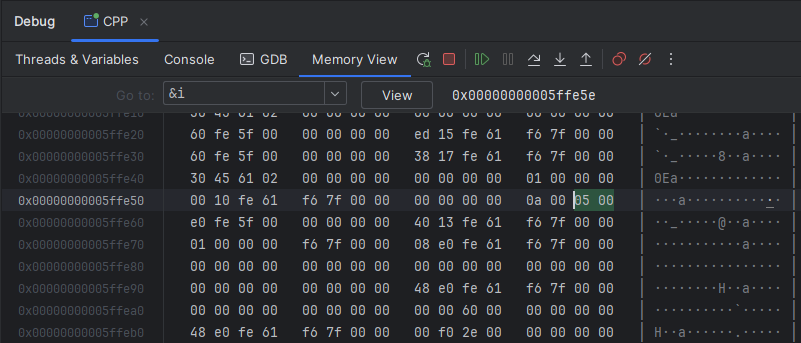

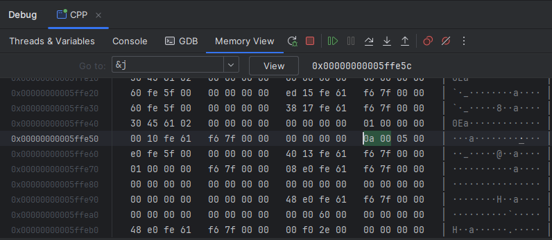

eg.有符号右移

```
#include <stdio.h>
#include <stdlib.h>
#include <time.h>
#include <string>

//位运算符：左移与右移
int main() {
    short i=5;//short是2个字节的整型，int是4个字节
    short j;
    j=i<<1;//一个变量移动以后自身不会变化
    printf("j=%d\n",j);//左移是乘2，结果是10
    j=i>>1;
    printf("j=%d",j);//右移是除以2，结果是2
    return 0;
}
```

ie.

```
D:\CLionProjects\CPP\cmake-build-debug\CPP.exe
j=10
j=2
Process finished with exit code 0
```

解析
$$
代码输入:十进制:5\\
Clion内存视图:十六进制:00\quad 05\\
实际计算:二进制:0000\quad 0000\quad 0000\quad 0101\\
short类型，高位为0，视为正数\\
高位补0:00000\quad 0000\quad 0000\quad 0101\\
低位丢弃:0000\quad 0000\quad 0000\quad 0010\\
Clion内存视图:十六进制:02\quad 00\\
控制台输出:十进制:2
$$
内存视图:

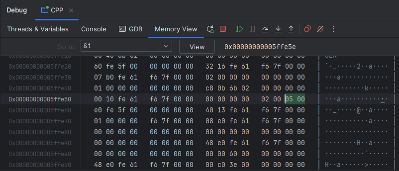

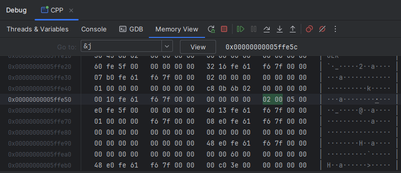

eg.无符号右移

```
#include <stdio.h>
#include <stdlib.h>
#include <time.h>
#include <string>

//位运算符:右移
int main() {
    short i=0x8011,j=0;
    unsigned short s=0x8011;//在short前加unsigned,无符号数是非负数
    unsigned short r=0;
    j=i>>1;//对i右移，对有符号数进行右移
    r=s>>1;//对s右移，对无符号数进行右移
    printf("j=%d,r=%d",j,r);
    return 0;
}
```

ie.

```
D:\CLionProjects\CPP\cmake-build-debug\CPP.exe
j=-16376,r=16392
Process finished with exit code 0
```

解析:
$$
有符号右移:\\
代码输入:i,十六进制:8011\\
Clion内存视图:十六进制:1180(小端)\\
实际计算:二进制:1000\quad 0000\quad 0001\quad 0001\\
short类型\quad 高位为1，负数\\
高位补1:二进制:11000\quad 0000\quad 0001\quad 0001\\
低位丢弃:二进制:1100\quad 0000\quad 0000\quad 1000\\
Clion内存视图:十六进制:08\quad c0\\
控制台输出:j,十进制:-16376\\
无符号右移:\\
代码输入:s,十六进制:8011\\
Clion内存视图:十六进制:1180(小端)\\
实际计算:二进制:1000\quad 0000\quad 0001\quad 0001\\
unsigned\quad short类型,视为正数\\
高位补1:二进制:01000\quad 0000\quad 0001\quad 0001\\
低位丢弃:二进制:0100\quad 0000\quad 0000\quad 1000\\
Clion内存视图:十六进制:08\quad 40\\
控制台输出:r,十进制:-16392\\
$$
内存视图: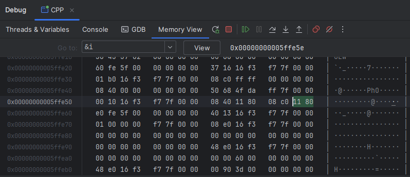

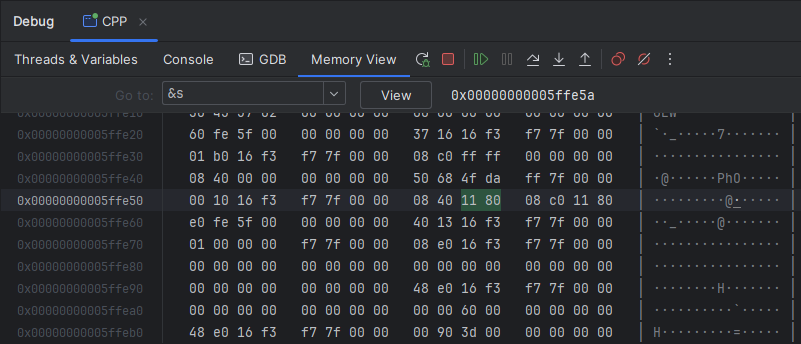

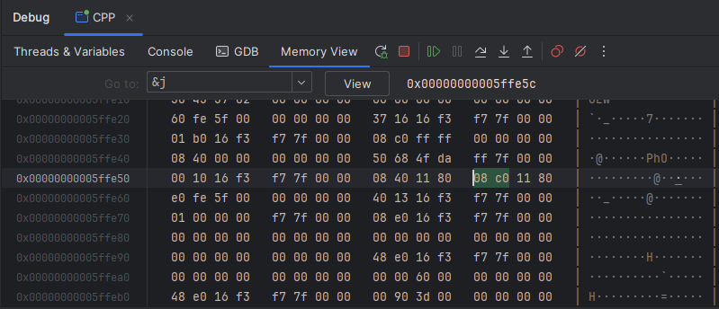

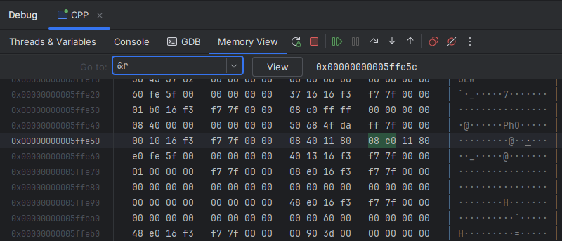

eg.按位与，按位或，按位异或，按位取反

```
#include <stdio.h>
#include <stdlib.h>
#include <time.h>
#include <string>

//位运算符:按位与，按位或，按位异或，按位取反
int main() {
    short i=5,j=7;
    printf("i & j=%d\n",i&j);//按位与
    printf("i | j=%d\n",i|j);//按位或
    printf("i ^ j=%d\n",i^j);//按位异或
    printf("~i=%d",~i);//按位取反
    return 0;
}
```

.ie

```
D:\CLionProjects\CPP\cmake-build-debug\CPP.exe
i & j=5
i | j=7
i ^ j=2
~i=-6
Process finished with exit code 0
```

解析:
$$
i:二进制:0000\quad 0000\quad 0000 \quad 0101\\
j:二进制:0000\quad 0000\quad 0000 \quad 0111\\
按位与计算:\\
101\&111=(1\&1)(0\&1)(1\&1)=(1)(0)(1)=101\\
i\&j:二进制:0000\quad 0000\quad 0000 \quad 0101\\
i\&j:十进制:5\\
按位或计算:\\
101|111=(1|1)(0|1)(1|1)=(1)(1)(1)=111\\
i\&j:二进制:0000\quad 0000\quad 0000 \quad 0111\\
i\&j:十进制:7\\
按位取反计算:\\
i:二进制:0000\quad 0000\quad 0000 \quad 0101\\
\~i:二进制:1111\quad 1111\quad 1111 \quad 1010\\
~i:十进制:-6\\
解析:\\
①~i最高位为1，是负数\\
②然后再次进行取反+1\\
~~i:二进制:0000\quad 0000\quad 0000 \quad 0110(补码)\\
~~i:十进制:6\\
综合①，②得~i=-6\\
异或计算\\
异或计算规则:相同为0，相异为1\\
i:二进制:0000\quad 0000\quad 0000 \quad 0101\\
j:二进制:0000\quad 0000\quad 0000 \quad 0111\\
i^j:二进制:0000\quad 0000\quad 0000\quad 0010\\
十进制:2
$$
<font color="red">异或运算有两个特性，一个是任何数和零异或得到的是自身，两个相等的数异或得到的是零，异或满足交换律</font>

例题，数组$A=\{8,5,3,5,8\}$,找出只出现了一次的那个数

```
#include <stdio.h>
#include <stdlib.h>
#include <time.h>
#include <string>

int main() {
    int A[5]={5,8,3,8,5};
    int result=0;
    for (int i = 0; i < 5; ++i) {
        result ^=A[i];
    }
    printf("result=%d",result);
    return 0;
}
```

```
D:\CLionProjects\CPP\cmake-build-debug\CPP.exe
result=3
Process finished with exit code 0
```

## 1.5二维数组

二维数组定义的一般形式如下:

```
类型说明符 数组名[常量表达式][常量表达式]
```

eg.定义$a为3\times4(3行4列)$的数组，$b为5\times10(5行10列)$的数组

```
float a[3][4],b[5][10]
```

可以将二维数组视为一种特殊的一维数组:一个数组中的元素类型是一维数组的一维数组

eg.可以把二维数组$a[3][4]$视为一个一维数组，它有三个元素$a[0],a[1]和[a2]$,每个元素又是一个包含4个元素的一维数组

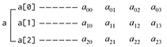

二维数组中的元素在内存中的存储规则是按行存储，即先顺序存储第一个的元素，后顺序存储第二行的元素，数组元素的获取一次是从$a[0][0]到a[0][1]$,直到最后一个元素$a[2][]3$

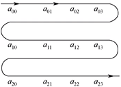

eg.

```
#include <stdio.h>
#include <stdlib.h>
#include <time.h>
#include <string>

int main() {
    int a[3][4]={1,2,3,4,5,6,7,8,9,10,11,12};
    printf("sizeof(a)=%d\n",sizeof(a));
    printf("a[2][3]=%d",a[2][3]);
    return 0;
}
```

ie.

```
D:\CLionProjects\CPP\cmake-build-debug\CPP.exe
sizeof(a)=48
a[2][3]=12
Process finished with exit code 0
```

内存视图

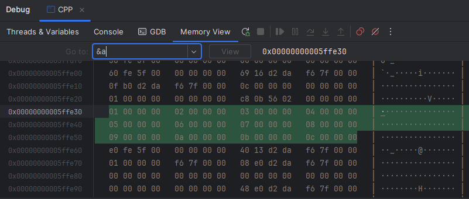

# 2、数据的机器级表示

## 2.1补码

计算机的$CPU$无法做减法操作(硬件上没有减法器)，只能做加法操作，$CPU$中有一个逻辑单元叫<font color="red">加法器。计算机所作的减法，都是通过加法器将其变化为加法实现的。</font>例如实现$2-5的方法是2+(-5)$。由于计算机只能存储0和1，因此我们编写程序来查看计算机是如何存储$-5$的，5的二进制数为$101$，称为<font color="red">原码</font>。计算机用补码表示$-5$，补码是对原码取反后加1的结果，即计算机表示$-5$时会对5的二进制($101$)取反后加1。

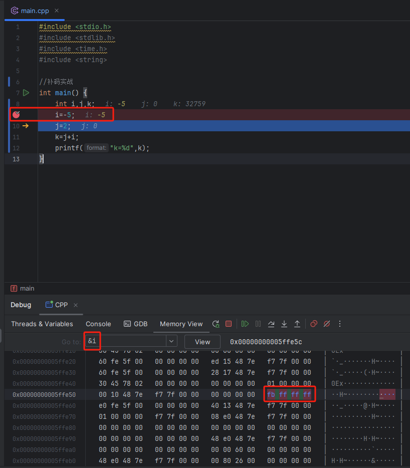

$-5$在内存中存储为$0xfffffffb$,因为对5取反后得到$0xfffffffa$,加1后得到$0xfffffffb$(由于是$x86$架构是小端存储，小端存储是低字节在前，高字节在后，即低字节在低地址，高字节在高地址，$fb$对于$0xfffffffb$是最低字节，因此$fb$在最前面，大端和小端相反)，对其加2后得$0xfffffffd$它就是k的值

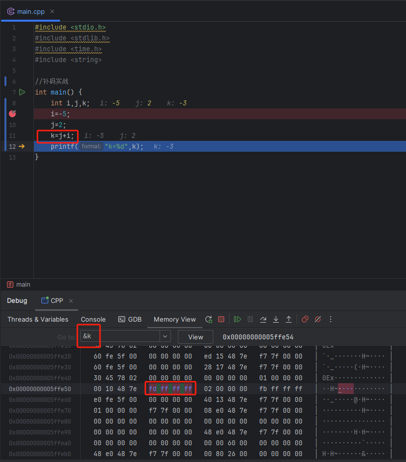


$$
5的原码:0000\quad 0000\quad 0000\quad 0000\quad 0000\quad 0000\quad 0000\quad 0101\\
原码的补码表示其负数\\
原码取反后加一得补码\\
补码-5:1111\quad 1111\quad 1111\quad 1111\quad 1111\quad 1111\quad 1111\quad 1011\\
对于有符号数，最高位为1就是负数，最高位为0就是正数\\
2的原码:0000\quad 0000\quad 0000\quad 0000\quad 0000\quad 0000\quad 0000\quad 0010\\
-5与2两者相加:1111\quad 1111\quad 1111\quad 1111\quad 1111\quad 1111\quad 1111\quad 1101(补码-3)\\
补码变原码依然可以通过取反加1获得\\
原码:0000\quad 0000\quad 0000\quad 0000\quad 0000\quad 0000\quad 0000\quad 0011(原码3)\\
$$
当最高位为1(代表负数)时，要取得原码才知道$0xfffffffd$的值，即对其取反后加1(当然，也可减1后取反，结果是一样的)得到3，所以其值为$-3$。

反码:反码是一种在计算机中数的机器码表示，对于单个数值(二进制的0和1)而言，对其进行取反操作就是将0变为1，1变为0，正数的反码和原码一样，负数的反码就是在原码的基础上符号保持不变，其他位取反

| 十进制 |   原码    |   反码    |
| :----: | :-------: | :-------: |
|   6    | 0000 0110 | 0000 0110 |
|   -3   | 1000 0011 | 1111 1100 |

