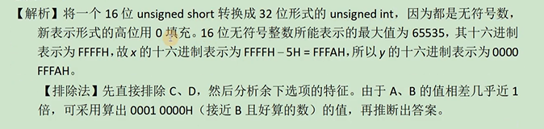
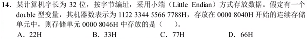

# 一、单链表

## 例一

***题目***


***解题设计***

**第一阶段，如何找到链表的中间结点**，不要用遍历两次链表的方法找中间结点，这样会降低算法的性能，这里使用**两个指针同步向后遍历的方法**。定义两个指针pcur，ppre，让pcur每次走两步，ppre指针每次走一步。当pcur指针走到最后，那么ppre指针刚好在中间。注意，由于pcur每次循环走两步，因此每走一步都注意判断是否为NULL。

**第二阶段，后一半链表我们设置为L2，要让L2原地逆置**。

第一步：链表原地逆置，使用3个指针，分别为r,s,t，他们分别指向链表的1，2，3，也就是前三个结点

第二步：让s->next=r,这样2号结点就指向了1号结点，完成了逆置

第三步：这时，r=s,s=t,t=t->next通过这个操作，r,s,t分别指向了链表的2，3，4结点，这时回到第二步，循环往复，当t=NULL时，结束循环

第四步：循环结束时，t=NULL,这时s是最后一个结点，r是倒数第二个结点，需要再次执行一下s->next=r

第五步：最后需要L2->next=NULL,因为原有链表的头结点变成链表最后一个结点，最后一个结点的next需要为NULL，这时L2指向s，因为s是原链表最后一个结点，完成逆置后，就是第一个结点，因此链表头结点L2指向s

第三阶段：**将L1和L2链表合并，合并时轮流放入一个结点**。因为空间复杂度是O（1），因此我们不申请新科技，但是我们依然需要3个指针(pcur,p,q),合并后的新链表我们让pcur指针始终指向新链表尾部，初始化pcur=L->next,使用p指针始终指向链表L待放入的结点，初始化值为p=L->next,使用p指针始终指向链表L待放入的结点，初始化值为p=L->next,q指针始终指向链表L2待放入的结点，初始化值为q=L2->next。因为链表L的第一个结点不动,所以p=p->next。

开启循环while(p!=NULL&&q!=NULL),首先，将pcur->next=q,然后q=q->next和pcur=pcur->next,接着pcur->next=p,然后p=p->next和pcur=pcur->next,直到循环结束。循环结束后。有可能L还剩余一个结点，也可能L2剩余一个结点，但是只会有一个剩余的有节点，因此我们判断p不为NULL，把p放入q不为NULL，把q放入即可。

***运行代码***

```
#include <stdio.h>
#include <stdlib.h>

typedef int ElemType;//让顺序表存储其他类型元素时，可以快速完成代码修改
typedef struct LNode{
    ElemType data;
    struct LNode *next;
}LNode,*LinkList;

void lest_tail_insert(LinkList &L){//尾插法新建链表
    L=(LinkList) malloc(sizeof (LNode));
    L->next=NULL;
    ElemType x;
    scanf("%d",&x);
    LNode *s,*r=L;//s是指向申请的新结点，r始终指向链表尾部
    while (x!=9999){
        s=(LinkList) malloc(sizeof (LNode));//为新结点申请空间
        s ->data=x;
        r->next=s;//新结点给尾结点的next指针
        r=s;//r要指向新的尾部
        scanf("%d",&x);
    }
    r->next=NULL;//让尾结点的next为NULL
}
void print_list(LinkList L){//链表打印
    L=L->next;
    while (L!=NULL){
        printf("%3d",L->data);
        L=L->next;
    }
    printf("\n");
}

//找到链表中间结点，并设计好L2结点
void find_middle(LinkList L,LinkList &L2){
    L2=(LinkList) malloc(sizeof(LNode));//第二条链表的头结点
    LinkList pcur,ppre;//双指针法遍历(考研初试常考内容)
    ppre=pcur=L->next;
    while (pcur){
        pcur=pcur->next;
        if(NULL==pcur){//为了防止pcur为NULL
            break;
        }
        pcur=pcur->next;
        if(NULL==pcur){//为了使得偶数个时,ppre取值正确
            break;
        }
        ppre=ppre->next;
    }
    L2->next=ppre->next;//由L2头结点指向后面一半链表
    ppre->next=NULL;//前一半链表的最后一个结点,next要为NULL
}

void reverse(LinkList L2){
    LinkList r,s,t;
    r=L2->next;
    if(NULL==r){
        return;//链表为空
    }
    s=r->next;
    if(NULL==s){
        return;//链表只有1个结点
    }
    t=s->next;
    while (t){
        s->next=r;//原地逆置
        r=s;//一下3句是3个指针同时向后走一步
        s=t;
        t=t->next;
    }
    s->next=r;
    L2->next->next=NULL;//逆置后，链表第一个结点的next要为NULL
    L2->next=s;//s是链表的第一个结点
}

void merge(LinkList L,LinkList L2){
    LinkList pcur,p,q;
    pcur=L->next;//pcur始终指向组合后链表的链表尾
    p=pcur->next;//p用来遍历L链表
    q=L2->next;//q指向L2第一个结点,q用来遍历L2链表
    while (p!=NULL&&q!=NULL){
        pcur->next=q;
        q=q->next;//指向下一个
        pcur=pcur->next;
        pcur->next=p;
        p=p->next;
        pcur=pcur->next;
        //任何一个链表都可能剩余一个结点，放进来即可
        if(p!=NULL){
            pcur->next=p;
        }
        if(q!=NULL){
            pcur->next=q;
        }
    }
}

int main() {
    LinkList L;//链表头，是结构体指针类型
    lest_tail_insert(L);//使用尾插法新建链表
    print_list(L);//链表打印
    LinkList L2=NULL;
    find_middle(L,L2);//只用一个结点时，L2中是没有结点的
    printf("===========================\n");
    print_list(L);
    print_list(L2);
    reverse(L2);
    printf("===========================\n");
    print_list(L2);
    printf("===========================\n");
    merge(L,L2);
    free(L2);
    print_list(L);
    return 0;
}
```

***考研代码***

```
typedef struct LNode{
    ElemType data;
    struct LNode *next;
}LNode,*LinkList;

//找到链表中间结点，并设计好L2结点
void find_middle(LinkList L,LinkList &L2){
    L2=(LinkList) malloc(sizeof(LNode));//第二条链表的头结点
    LinkList pcur,ppre;//双指针法遍历(考研初试常考内容)
    ppre=pcur=L->next;
    while (pcur){
        pcur=pcur->next;
        if(NULL==pcur){//为了防止pcur为NULL
            break;
        }
        pcur=pcur->next;
        if(NULL==pcur){//为了使得偶数个时,ppre取值正确
            break;
        }
        ppre=ppre->next;
    }
    L2->next=ppre->next;//由L2头结点指向后面一半链表
    ppre->next=NULL;//前一半链表的最后一个结点,next要为NULL
}

void reverse(LinkList L2){
    LinkList r,s,t;
    r=L2->next;
    if(NULL==r){
        return;//链表为空
    }
    s=r->next;
    if(NULL==s){
        return;//链表只有1个结点
    }
    t=s->next;
    while (t){
        s->next=r;//原地逆置
        r=s;//一下3句是3个指针同时向后走一步
        s=t;
        t=t->next;
    }
    s->next=r;
    L2->next->next=NULL;//逆置后，链表第一个结点的next要为NULL
    L2->next=s;//s是链表的第一个结点
}

void merge(LinkList L,LinkList L2){
    LinkList pcur,p,q;
    pcur=L->next;//pcur始终指向组合后链表的链表尾
    p=pcur->next;//p用来遍历L链表
    q=L2->next;//q指向L2第一个结点,q用来遍历L2链表
    while (p!=NULL&&q!=NULL){
        pcur->next=q;
        q=q->next;//指向下一个
        pcur=pcur->next;
        pcur->next=p;
        p=p->next;
        pcur=pcur->next;
        //任何一个链表都可能剩余一个结点，放进来即可
        if(p!=NULL){
            pcur->next=p;
        }
        if(q!=NULL){
            pcur->next=q;
        }
    }
}

int main() {
    LinkList L;//链表头，是结构体指针类型
    LinkList L2=NULL;
    find_middle(L,L2);//只用一个结点时，L2中是没有结点的
    reverse(L2);
    merge(L,L2);
    free(L2);
    return 0;
}
```

***时间复杂度***

1.find_middle函数我们可以看到有一个while循环，因为pcur每次移动两个结点因此循环的次数是$n/2$,忽略首项系数，所以时间复杂度是O(n)

2.reverse函数因为只遍历了L2链表，遍历长度是$n/2$，所以时间复杂度是O(n)

3.merge函数while循环遍历次数也是$n/2$,因此时间复杂度是O(n)

综上，上面3个函数总的运行次数是2n，忽略首项系数，因此时间复杂度是O(n)

# 二、循环队列

## 例一

***题目***

 

***答案解析:***

 (1)采用链式存储结构(两段式单向循环链表)，队头指针为front，队尾指针为rear(<font color="red">因为第二个要求入队时，允许增加队列占用空间，所以必须使用链式存储</font>)

(2)初始时，创建只有一个空闲结点的两段式单向循环链表，头指针front与尾指针rear均指向空闲结点。如下图所示。


队空的判定条件:front==rear

队满的判定条件:front==rear->next

(3)插入第一个元素后的队列状态:


(4)入队操作和出队操作的基本过程

```
入队操作:
若(front==rear->next) //队满
	则在rear后面插入一个新的空闲结点;
入队元素保存到rear所指结点中;rear=rear->next;返回
出队操作:
若(front==rear) //队空
	则出队操作失败,返回；
取front所指结点中的元素e;front=front->next;返回e
```

# 三、二叉树

## 例一

***题目***


***答案解析:***

树的带权路径长度(Weighted Path Length of Tree),简记为WPL


假设二叉树如图所示，则该二叉树的$WPL=3\times4+3\times5+3\times6+3\times7=3\times(4+5+6+7)=66$,即为最底层层数乘以最底层层数结点数值之和

考察二叉树的带权路径长度，二叉树的带权路径长度为<font color="red">每个叶子结点的深度与权值之积的总和</font>,可以使用先序遍历或层次遍历解决问题

(1)算法的基本设计思想:

基于先序递归遍历的算法思想是用一个static变量记录$WPL$，把每个结点的深度作为递归函数的一个参数传递，算法步骤如下:

若该结点是叶子结点，那么变量$WPL$加上该结点的深度与权值之积

若该结点非叶子结点，那么若左子树不为空，对左子树调用递归算法，若右子树不为空，对右子树调用递归算法，深度参数均为本结点的深度参数加一；

最后返回计算出的$WPL$即可

(2)二叉树结构定义如下

```
typedef struct BiTNode{
    BiElemType weight;
    struct BiTNode *lChild;
    struct BiTNode *rChild;
}BiTNode,*BiTree;
```

(3)***运行代码***

```
#include <stdio.h>
#include <stdlib.h>

typedef int BiElemType;//让顺序表存储其他类型元素时，可以快速完成代码修改
int wpl=0;
typedef struct BiTNode{//二叉树定义
    BiElemType weight;
    struct BiTNode *lChild;
    struct BiTNode *rChild;
}BiTNode,*BiTree;

//tag结构体是辅助队列使用的
typedef struct tag{
    BiTree p;//树的某一个结点的地址值
    struct tag *pNext;
}tag_t,*pTag_t;

void preOrder(BiTree tree,int deep){
    if(tree!=NULL){
        if(tree->rChild==NULL&& tree->lChild==NULL){
            wpl=wpl+tree->weight*deep;
        }
        printf("ele%c--%d\n",tree->weight,deep);
        preOrder(tree->lChild,deep+1);
        preOrder(tree->rChild,deep+1);
    }
}

int main() {
    BiTree pNew;//用来指向新申请的树结点
    BiTree tree=NULL;//tree是指向树根的，代表树
    pTag_t pHead=NULL,pTail=NULL,listPNew=NULL,pCur;
    char c;
    //层次建树
    while (scanf("%c",&c)){
        if(c=='\n'){//读到换行就结束
            break;
        }
        //calloc申请的空间大小是两个参数直接相乘，并对空间初始化，赋值为0
        pNew= (BiTree)calloc(1,sizeof(BiTNode));
        pNew->weight=c;
        listPNew=(pTag_t) calloc(1,sizeof (tag_t ));//给队列结点申请空间
        listPNew->p=pNew;
        //如果是树的第一个结点
        if(NULL==tree){
            tree=pNew;//tree指向树的根结点
            pHead=listPNew;//第一个结点既是队列头也是队列尾
            pTail=listPNew;
            pCur=listPNew;//pCur要指向要进入树的父亲元素
        } else{
            //让元素先入队列
            pTail->pNext=listPNew;
            pTail=listPNew;
            //接下来把b结点放入树中
            if(NULL==pCur->p->lChild){
                pCur->p->lChild=pNew;//pCur->p左孩子为空就放入左孩子
            } else if(NULL==pCur->p->rChild){
                pCur->p->rChild=pNew;//pCur->p右孩子为空就放入右孩子
                pCur=pCur->pNext;//当前结点左右孩子都有了，pCur就指向下一个
            }
        }
    }
    preOrder(tree,1);
    printf("wpl=%d\n",wpl);
    return 0;
}
```

***考研代码***

```
typedef int BiElemType;//让顺序表存储其他类型元素时，可以快速完成代码修改
int wpl=0;
typedef struct BiTNode{//二叉树定义
    BiElemType weight;
    struct BiTNode *lChild;
    struct BiTNode *rChild;
}BiTNode,*BiTree;

void preOrder(BiTree tree,int deep){
    if(tree!=NULL){
        if(tree->rChild==NULL&& tree->lChild==NULL){
            wpl=wpl+tree->weight*deep;
        }
        printf("ele%c--%d\n",tree->weight,deep);
        preOrder(tree->lChild,deep+1);
        preOrder(tree->rChild,deep+1);
    }
}

int main() {
    preOrder(tree,1);
    printf("wpl=%d\n",wpl);
    return 0;
}
```

# 四、排序

## 例一

***题目***


***答案解析***

这个题目所考察的内容是二分查找，但是有两个数组，是双数组的二分查找，是一道非常经典的题目。因为空间尽可能高效，因此我们不能够去再搞一个大数组，把两个数组合并到一起，这样得分会非常低。

(1)算法的基本设计思想如下:

分别求出序列A和B的中位数,设为a和b，求序列A和B的中位数过程如下:

①若a=b，则a或b即为所求中位数，算法结束。

②若a<b则舍弃序列A中较小的一半，同时舍弃序列B中较大的一半，要求舍弃长度相等。

③若a>b则舍弃序列A中较大的一半，同时舍弃序列B中较小的一半，要求舍弃长度相等。

在保留两个升序序列中，重复过程①②③,直到两个序列中均只含一个元素时为止，较小者即为所求的中位数

(2)***运行代码***

```
#include <stdio.h>
#include <stdlib.h>
#include <time.h>

//二分查找中位数
int midSearch(int *A,int *B,int n){
    //分别表示序列A和B的首位数，末位数和中位数,s是start简写，d是end的简写
    int s1=0,d1=n-1,m1,s2=0,d2=n-1,m2;
    //循环判断结束条件是，两个数组均不断删除最后均只能剩余一个元素
    while (s1!=d1||s2!=d2){
        m1=(s1+d1)/2;
        m2=(s2+d2)/2;
        if(A[m1]==B[m2]){
            return A[m1];
        } else if(A[m1]<B[m2]){
            if((s1+d1)%2==0){//若元素个数为奇数，这里注意数组下标从0开始
                s1=m1;//舍弃A中间点以前的部分保留中间点
                d2=m2;//舍弃B中间点以后的部分保留中间点
            } else{//元素个数为偶数
                s1=m1+1;//舍弃A中间点及中间点以前的部分
                d2=m2;//舍弃B中间点以前的部分
            }
        } else{
            if((s1+d1)%2==0){//若元素个数为奇数，这里注意数组下标从0开始
                d1=m1;//舍弃A中间点以后的部分保留中间点
                s2=m2;//舍弃B中间点以前的部分保留中间点
            } else{//元素个数为偶数
                d1=m1;//舍弃A中间点以后的部分
                s2=m2+1;//舍弃B中间点及中间点以前的部分
            }
        }
    }
    return A[s1]<B[s2]?A[s1]:B[s2];
}
int main() {
    int A[]={11,13,15,17,19};
    int B[]={2,4,6,8,20};
    int mid=midSearch(A,B,5);
    printf("mid=%d\n",mid);
    return 0;
}
```

***考研代码***

```
//二分查找中位数
int midSearch(int *A,int *B,int n){
    //分别表示序列A和B的首位数，末位数和中位数,s是start简写，d是end的简写
    int s1=0,d1=n-1,m1,s2=0,d2=n-1,m2;
    //循环判断结束条件是，两个数组均不断删除最后均只能剩余一个元素
    while (s1!=d1||s2!=d2){
        m1=(s1+d1)/2;
        m2=(s2+d2)/2;
        if(A[m1]==B[m2]){
            return A[m1];
        } else if(A[m1]<B[m2]){
            if((s1+d1)%2==0){//若元素个数为奇数，这里注意数组下标从0开始
                s1=m1;//舍弃A中间点以前的部分保留中间点
                d2=m2;//舍弃B中间点以后的部分保留中间点
            } else{//元素个数为偶数
                s1=m1+1;//舍弃A中间点及中间点以前的部分
                d2=m2;//舍弃B中间点以前的部分
            }
        } else{
            if((s1+d1)%2==0){//若元素个数为奇数，这里注意数组下标从0开始
                d1=m1;//舍弃A中间点以后的部分保留中间点
                s2=m2;//舍弃B中间点以前的部分保留中间点
            } else{//元素个数为偶数
                d1=m1;//舍弃A中间点以后的部分
                s2=m2+1;//舍弃B中间点及中间点以前的部分
            }
        }
    }
    return A[s1]<B[s2]?A[s1]:B[s2];
}
```

## 例二

***题目***


***答案解析***

（1）算法的基本思想

由题意可知，将最小的$\frac{n}{2}$个元素放在$A_1$中，其余元素放在$A_2$中，分组结果即可满足题目要求

仿照快速排序的思想，基于枢轴将$n$个整数划分为两个子集。根据划分后枢轴所处的位置$i$分别处理:

①若$i=\frac{n}{2}$,则分组完成，算法结束

②若$i<\frac{n}{2}$,则枢轴及之前的所有元素均属$A_1$,继续对$i$之后的元素进行划分

③若$i>\frac{n}{2}$,则枢轴及之后的所有元素均属$A_2$,继续对$i$之前的元素进行划分

基于该设计思想实现的算法，毋须对全部元素进行全排序，其平均时间复杂度是$O(n)$,空间复杂度是$O(1)$

***运行代码***

```
#include <stdio.h>
#include <stdlib.h>
#include <time.h>
#include <string>
#define N 10

int setPartition(int a[],int n){
    int pivotkey,low=0,low0=0,high=n-1,high0=n-1,flag=1,k=n/2,i;
    int s1=0,s2=0;
    while (flag){//当low等于k-1,也就是n/2-1时，分割结束
        pivotkey=a[low];//选择枢轴
        while (low<high){//基于枢轴对数据进行划分
            while (low<high && a[high]>=pivotkey)
                --high;
            if(low !=high)
                a[low]=a[high];
            while (low<high && a[low]<=pivotkey)
                ++low;
            if(low != high)
                a[high]=a[low];
        }
        a[low]=pivotkey;//把分割值放到对应位置
        if(low==k-1)//如果枢轴是n/2 小元素，划分成功
            flag=0;
        else{//是否继续划分
            if(low<k-1){
                low0=++low;//low0只是做暂存，为下次使用准备，这里我们++low，low比分割值大1
                high=high0;//把上次暂存的high0拿过来
            } else{
                low=low0;//把上次暂存的low0拿过来
                high0=--high;//high0只是做暂存，为下次使用做准备
            }
        }
    }
    for ( i = 0; i < k; i++)
        s1+=a[i];
    for ( i = k; i < n; i++)
        s2+=a[i];
    return s2-s1;
}

int main() {
    int A[N]={4,1,12,18,7,13,18,16,5,15};
    int difference;
    difference=setPartition(A,N);//考研初试只需要完成setPartition即可，无需编写这个main函数
    printf("%d",difference);
    return 0;
}
```

***考研代码***

```
int setPartition(int a[],int n){
    int pivotkey,low=0,low0=0,high=n-1,high0=n-1,flag=1,k=n/2,i;
    int s1=0,s2=0;
    while (flag){//当low等于k-1,也就是n/2-1时，分割结束
        pivotkey=a[low];//选择枢轴
        while (low<high){//基于枢轴对数据进行划分
            while (low<high && a[high]>=pivotkey)
                --high;
            if(low !=high)
                a[low]=a[high];
            while (low<high && a[low]<=pivotkey)
                ++low;
            if(low != high)
                a[high]=a[low];
        }
        a[low]=pivotkey;//把分割值放到对应位置
        if(low==k-1)//如果枢轴是n/2 小元素，划分成功
            flag=0;
        else{//是否继续划分
            if(low<k-1){
                low0=++low;//low0只是做暂存，为下次使用准备，这里我们++low，low比分割值大1
                high=high0;//把上次暂存的high0拿过来
            } else{
                low=low0;//把上次暂存的low0拿过来
                high0=--high;//high0只是做暂存，为下次使用做准备
            }
        }
    }
    for ( i = 0; i < k; i++)
        s1+=a[i];
    for ( i = k; i < n; i++)
        s2+=a[i];
    return s2-s1;
}
```

## 例三

***题目***


***答案解析***

***这道题非常有代表性，现在提供三种解题思路，从而对我们前面学习的排序算法能有更深的理解***

方法一:最小值(选择排序思想)

(1)算法思想(高教社官方答案)

定义含10个元素的数组$A$,初始元素值均为该数组类型能表示的最大数$MAX$

$for$	$M$中的每个元素$s$

​	$if(s<A[9])$	丢弃$A[9]$并将$s$按升序插入到$A$中

当数据全部扫描完毕，数组$A[0]$~$A[9]$保存的即是最小的10个数

(2)时间复杂度:$O(n)$,需要遍历10次数组(每次要插入时都是需要对小数组A进行遍历的)

空间复杂度:$O(1)$,中间过程额外需要常数个变量

方法二:堆(堆排序思想)

(1)定义含10个元素的大根堆$H$,元素值均为该堆元素类型能表示的最大数$MAX$

$for$	$M$中的每个元素$s$

​	$if(s<H的堆顶元素)$	删除堆顶元素并将$s$插入到$H$中

当数据全部扫描完毕，堆$H$保存的即是最小的10个数

(2)算法平均情况下的时间复杂度为$O(n)$,空间复杂度为$O(1)$

进一步解析:先用$A[0:9]$原地建立大顶堆(注意：这里不能用小顶堆)，遍历$A[10:n]$,每个元素$a[i]$逐一和堆顶元素$A[0]$进行比较，其中$11\leq i\leq n$,如果$A[i]$大于等于堆顶元素$A[0]$,不进行任何操作，如果该元素小于堆顶元素$A[0]$,那么就删除堆顶元素，将该元素放入堆顶，即令$A[0]=A[i]$,然后将$A[0:9]$重新调整为大根堆。

最后堆$A[0:9]$中留存的元素即为最小的$10$个数

方法三:快速排序(这个高教社没给)

通过快速排序，分割思想，第一次知道$\frac{n}{2}$,再次$partition$得到$\frac{n}{4}$,最终缩小为10个，就拿到了最小的10个元素，遍历的平均次数是$n+\frac{n}{2}+\frac{n}{4}+\cdots+1$，次数为$2n$因此时间复杂度为$O(n)$。由于我们不进行快排，只是记录剩余部分的起始和结束，因此空间复杂度是$O(1)$

***运行代码***

```
#include <stdio.h>
#include <stdlib.h>
#include <time.h>
#include <string>

typedef int ElemType;
typedef struct {
    ElemType *elem;
    int TableLen;
}SSTable;

void STInit(SSTable &ST,int len){//申请空间，并进行随机数生成
    ST.TableLen=len;
    ST.elem=(ElemType*) malloc(sizeof (ElemType)*ST.TableLen);
    int i;
    srand(time(NULL));
    for (i = 0; i < ST.TableLen; ++i) {
        ST.elem[i]=rand();
    }
}

void STPrint(SSTable ST){
    for (int i = 0; i < 10; ++i) {
        printf("%3d",ST.elem[i]);
    }
    printf("\n");
}

void swap(ElemType &a,ElemType &b){
    ElemType tmp;
    tmp=a;
    a=b;
    b=tmp;
}

//调整子树
void AdjustDown(ElemType A[],int k,int len){
    int dad=k;
    int son=2*dad+1;//左孩子下标
    while (son<=len){
        if (son + 1 <= len && A[son] < A[son + 1])//看下有没有右孩子，比较左右孩子选大的
            son++;
        if (A[son] > A[dad])//比较孩子和父亲，如果孩子大于父亲，那么进行交换
        {
            swap(A[son], A[dad]);
            dad = son;//孩子重新作为父亲，判断下一颗子树是否符合大根堆
            son = 2 * dad + 1;
        }
        else
            break;
    }
}

void HeapSort(ElemType A[], int len)
{
    int i;
    //先对前 10 个元素建立大根堆
    for (i = len/2; i >= 0; i--)
        AdjustDown(A, i, len);
    //比较剩余的 A[10]到 A[99999]元素，小于堆顶，就放入 A[0],继续调整 10 个元素为大根堆
    for (i = 10; i < 100000; i++)
    {
        if (A[i] < A[0])
        {
            A[0] = A[i];
            AdjustDown(A, 0, 9);//继续调整为大根堆
        }
    }
}

int main() {
    SSTable ST;
    STInit(ST,100000);//初始化
    HeapSort(ST.elem,9);
    STPrint(ST);
    return 0;
}
```

# 五、机器码

## 例一

***题目***


***答案解析***



## 例二

***题目***


***答案解析***


## 例三

***题目***


***答案解析***


## 例四

***题目***


***答案解析***


## 例五

***题目***



***答案解析***


## 例六

***题目***


***答案解析***


## 例七

***题目***


***答案解析***


## 例八

***题目***


***答案解析***


## 例九

***题目***


***答案解析***


## 例十

***题目***


***答案解析***


